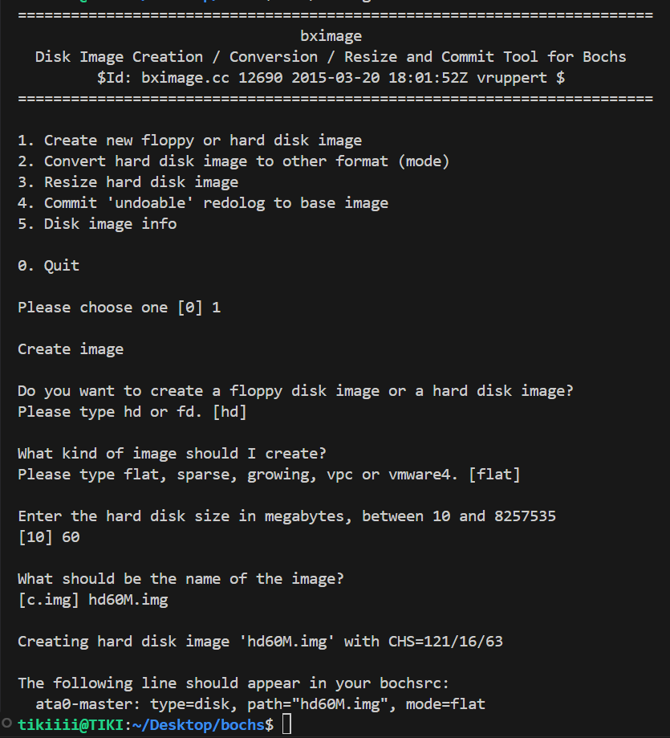
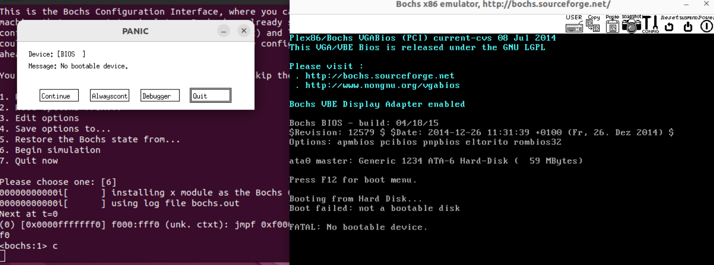

### 0.1 操作系统是什么？
操作系统为了减少重复工作所设计的管理资源的软件

### 0.3 写操作系统，哪些需要我来做？
计算机中有分层概念，每一层都设置对应的功能模板，上一层的模块完成自己的工作并交给下一层的模块
（下游的输入由上游的输出得来），写操作系统需要了解硬件向我们提供的接口（参考硬件手册知道如何通过
计算机指令来控制硬件）

### 0.4 软件是如何访问硬件的？
硬件的更新迭代十分快，我们无法为每个硬件设备编写驱动程序，因此设置一套标准令硬件适配设备，那就是
IO接口。
	计算机和硬件通信有两种方式：
（1）硬件内存映射到计算机内存上一定范围的空间上，当我们访问内存即为访问硬件设备
（2）通过IO接口和IO设备附带的寄存器通信，人为约定的向什么寄存器输入什么就做出什么动作，这也
    就是接口

### 0.5 应用程序是什么，和操作系统是如何配合到一起的？
对于CPU来说，应用程序和操作系统都是软件，是一条条指令，应用程序通过库函数来调用操作系统提供
的系统调用函数，应用程序和操作系统不同，只是CPU在处理两者时的权限不同，应用程序处于3特权级中，当
他需要使用系统调用函数或发生了某些中断，它就陷入了内核态（0特权级），管理系统资源的操
作系统程序进入CPU执行相应的指令。

### 0.7 内存访问为什么要分段？
由于历史遗留问题，分段的目的是（1）为了程序的重定位（2）为了将大内存分成可以任意访问的小段

### 0.8 代码中为什么分为代码段、数据段？这和内存机制中的段是一回事吗？
内容分段原因：（1）可以赋予不同的属性（2）为了提高CPU内部缓存命中率（局部性原理）（3）节省
内存，可以让代码共享
程序中的段是逻辑上的划分，内存中段是用于存放程序中的段并标以属性（这也是为什么它在分页机制中
叫页框的原因）

### 0.9 物理地址、逻辑地址、有效地址、线性地址、虚拟地址的区别
--物理地址：实际物理内存的地址（实模式下 段基址+段偏移）
--线性地址：保护模式下段基址+段偏移所指的地址，这时候的段基址不再是真正的地址，而是全局段描述
符表（GDT）中的选择子（索引），它对应了某段的属性大小、地址等
--有效地址、逻辑地址：程序中设定的数据在段基址的偏移地址，程序会根据段基址重定位，但在编程中不
需要考虑段基址，只要考虑段偏移，这里的段偏移就是我们设定的在一段假设起始为0的逻辑地址
--虚拟地址：分页模式下的线性地址，该地址需要通过查询页表来映射到对应的物理地址而使用

### 0.12 cs、ds这类段寄存器位宽是多少？
无论是保护模式还是实模式位宽都为16位

### 0.13 什么是工程，什么是协议？
工程：开发一套软件所需要的全部文件
协议：用于实现通信、共享、协作的公共约定

### 0.14 为什么linux系统下的应用程序不能在windows上运行？
格式不同：linux的可执行文件是.elf后缀，windows是.pe后缀
API系统调用接口不同

### 0.16 为什么说汇编语言比c语言快？
相比来说，汇编语言更接近机器语言，c语言为了方便牺牲了一定的效率。

### 0.17 先有语言还是先有编译器，第一个编译器怎么产生？
先有的语言才有的编译器，语言是为了方便计算机计算而设计的符号系统，编译器也应运而生，编译器更新的
过程是不断自我迭代的过程。

### 0.19 什么是大端字节序、小端字节序？
小端：数据由数据的低位存到高位
大端：数据由数据的高位存到低位
例如：0x12345678 在小端中为0x78\0x56\0x34\0x12，在大端中为0x12\0x34\0x56\0x78
小端优点：便于强制类型转换
大端优点：便于符号读取

### 0.20 BIOS中断、DOS中断、Linux中断的区别
BIOS和DOS都是在实模式下的程序，他们通过软中断int指令调用中断程序，他们的中断程序建立在CPU原生支持的中断向量表(VIT)中

BIOS在启动时会检查0xc0000到0xe0000这部分内存，当扫到0x55和0xaa就会执行硬件例程填vit对应中断号的中断处理程序（硬件中的rom会以0x55和0xaa开头标识rom存在代码，其第三个字节为硬件自带例程代码的累加和，第四个字节开始就是硬件自带的硬件例程程序）
DOS只占用第0x21个表项，它根据ah寄存器的值来调用子功能

Linux内核进入保护模式后才建立中断例程，这是VIT不存在，有的是中断描述符表IDT，Linux中断通过int 0x80进行中断程序，再根据eax寄存器的值调用子功能

### 0.21 section和segement的区别
--section称为节，是在程序中被关键字section/segement逻辑划分的指令或数据区域，节由会变却生成到目标文件中。

--segement称为段，链接器把多目标文件连接成可执行文件，链接器会把其中属性相同的section合并得到一个section集合也就是段，在可执行代码中的代码段和数据段就是segement

### 0.22 魔数
用于标识某一特殊事物的数字
例如：7f 、45、4c、46标识这是一个elf文件；0x55、0xAA标识程序开始

### 0.26 MBR、EBR、DBR和OBR各是什么？
电脑在启动时首先上CPU的是BIOS，BIOS得找到MBR（主引导记录），它位于起始扇区，它负责建立分区表并检查各分区的情况，活动分区在分区表中的首字节会是0x80（其余都是0x0，没有其他情况），MBR就跳转到该活动分区执行OBR（操作系统引导记录），OBR负责建立操作系统并把程序交给内核，DBR也就是OBR，DBR是历史遗留的磁盘操作系统引导记录，但后来由于使用减少退出了市场；主引导记录下最多有四个分区，但有时候用户需要额外的分区，这就有了拓展分区，拓展分区首个扇区有着和MBR类似作用的记录，他们称之为EBR，他们负责跳转到拓展分区中的操作系统引导记录OBR建立操作系统。

### 1.2 编译器环境
```
gcc version 11.4.0 (Ubuntu 11.4.0-1ubuntu1~22.04) 
NASM version 2.15.05
```

### 1.3 宿主环境
虚拟机：VMware16pro
操作系统：Ubuntu22.04
宿主：bochs
远程连接工具：vscode ssh扩展

#### 1.3.5 bochs安装
1、下载地址：https://sourceforge.net/projects/bochs/files/bochs/2.6.8/bochs-2.6.8.tar.gz/download

2、解压：
```
tar -zxvf bochs-2.6.8.tar.gz
```

3、创建bochs安装到的目录：
我的目录是/bin/Desktop/bochs
```
mkdir bochs
```

4、配置config文件：
```
cd bochs-2.6.8/     
//进入bochs安装目录

//配置安装 prefix修改为要安装的路径
./configure \
--prefix=/home/tikiiii/Desktop/bochs \
--enable-debugger \
--enable-disasm \
--enable-iodebug \
--enable-x86-debugger \
--with-x --with-x11 \
LDFLAGS='-pthread'
```

5、编译安装
``` 
make 

make install
```

### 1.4 配置bochs
在安装好的目录下创建bochs操作系统的相关配置文件：
```
# ~/bochs/bochsrc.disk
# Bochs的内存：32MB。
megs:32 

# 设置对应真实机器的BIOS和 VGA BIOS。
romimage: file=/bochs的路径/bochs/share/bochs/BIOS-bochs-latest
vgaromimage: file=/bochs的路径/bochs/share/bochs/VGABIOS-lgpl-latest

# 选择启动盘符。
#boot: floppy //floppy是软盘
boot: disk 

# 设置输出日志文件
log: bochs.out 

# 开启或关闭某些功能。
# 关闭鼠标，打开键盘
mouse: enabled=0
keyboard: keymap=/bochs的路径/bochs/share/bochs/keymaps/x11-pc-us.map

# 硬盘设置
ata0: enabled=1, ioaddr1=0x1f0, ioaddr2=0x3f0, irq=14

# gdb调试设置
#gdbstub: enabled=1, port=1234, text_base=0, data_base=0, bss_base=0 
```

### 1.5 运行bochs
1、创建启动磁盘
```
bin/bximage
```
如图选择选项:


2、添加语句到配置文件中
```
# 硬盘设置
ata0: enabled=1, ioaddr1=0x1f0, ioaddr2=0x3f0, irq=14
# 新加入代码 
ata0-master: type=disk,path="hd60M.img",mode=flat,cylinders=121,heads=16,spt=63

# gdb调试设置
```
3、启动检验：
```
bin/bochs -f bochsrc.disk
```
进入界面后输入c得到如下界面：

