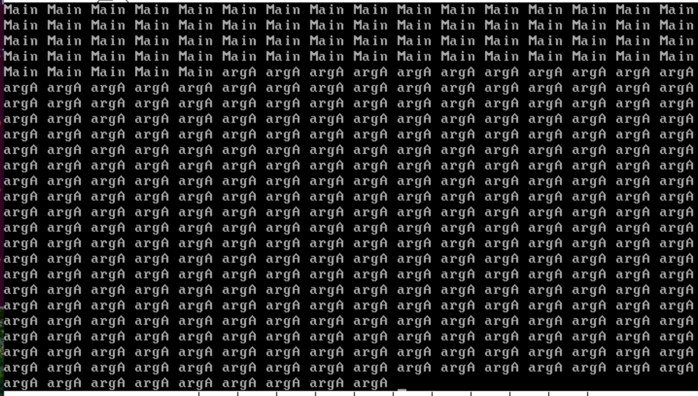

### 10.1 同步机制——锁
在第九章的多线程实现中，还会出现一种情况，那就是字符打印混乱，出现大量空白或是参数混着打印，出现这样的原因是因为在我们执行的put_char函数不是原子性操作，即它分为三步（1）获取光标（2）打印字符（3）移动光标，考虑这样的情况，当我们获取光标之后，切换到另一个线程，其直接打印字符，这就导致了字符打印混乱的问题。本质上问题是我们的显存属性临界区资源，对于临界区资源的访问会出现竞争，如果我们在put_char前关中断，那么这样的问题就会消失
```
;main.c
#include "print.h"
#include "init.h"
#include "thread.h"
#include "interrupt.h"

void k_thread_a(void*);
void k_thread_b(void*);
int main(void) {
   put_str("I am kernel\n");
   init_all();

   thread_start("k_thread_a", 31, k_thread_a, "argA ");
   thread_start("k_thread_b", 8, k_thread_b, "argB ");

   intr_enable();	// 打开中断,使时钟中断起作用
   while(1) {
      intr_disable();
      put_str("Main ");
      intr_enable();
   };
   return 0;
}

/* 在线程中运行的函数 */
void k_thread_a(void* arg) {     
/* 用void*来通用表示参数,被调用的函数知道自己需要什么类型的参数,自己转换再用 */
   char* para = arg;
   while(1) {
      intr_disable();
      put_str(para);
      intr_enable();
   }
}

/* 在线程中运行的函数 */
void k_thread_b(void* arg) {     
/* 用void*来通用表示参数,被调用的函数知道自己需要什么类型的参数,自己转换再用 */
   char* para = arg;
   while(1) {
      intr_disable();
      put_str(para);
      intr_enable();
   }
}
```
此时就没有出现问题了

GP异常也是由于临界区访问显存的高8和低8位导致的，显存的访问是0-2000，但当我们一个线程得到高8位是20另一个线程得到低8位不为0，此时的地址超过正常的范围就报错了

#### 10.1.2 临界区、互斥、竞争
• 公共资源
被所有任务共享的一套资源。
• 临界区
各任务中访问公共资源的指令 代码 组成的区域就称为临界区。
• 互斥 
指某一时刻公共资源只能被1个任务独享，不允许多个任务同时出现在自己的临界区中。其他任务想访问公共资源时，必须等待当前公共资源的访问者完全执行完他自己的临界区代码后（使用完资源后）再开始访问。
• 竞争条件
竞争条件是指多个任务以非互斥的方式同时进入临界区，大家对公共资源的访问是以竞争的方式并行进行的，因此公共资源的最终状态依赖于这些任务的临界区中的微操作执行次序。

#### 10.1.3 信号量
同步：指合作单位之间为协作完成某项工作而共同遵守的工作步调，强调先后顺序
信号量：用于记录资源数量，为了临界区而定义的，P操作表示减少，V操作表示增加
V操作：将信号量增加1，唤醒等待中的某一程序
P操作：检查信号量是否为0，若信号量大于1，减减信号量开始执行，若信号量等于1，自我阻塞开始等待
锁机制就是利用信号量来实现，当一个进程想要使用某种公共资源时，它会先检查信号量是否大于0，信号量表示的是现在公共资源闲置的数量，此时可以分配资源，于是信号量减去1开始执行线程；如果信号量等于0，那么就阻塞自我进入等待。通过这样的机制，使得公共资源一次只能为一个线程服务从而防止出现竞争导致的问题

#### 10.1.4 线程的阻塞与唤醒
线程的阻塞是自己主动阻塞的，在thread.c中加入阻塞函数
线程的唤醒是被动的，由锁的持有者发起（释放锁的时候）
```
;thread/thread.c
/* 当前线程将自己阻塞，标志其状态为 stat. */ 
void thread_block(enum task_status stat) {
    /* stat 取值为 
        TASK_BLOCKED、
        TASK_WAITING、
        TASK_HANGING，
    也就是只有这三种状态才不会被调度*/
    ASSERT(((stat == TASK_BLOCKED) || \
            (stat == TASK_WAITING) || \
            (stat == TASK_HANGING)));
    enum intr_status old_status = intr_disable();
    struct task_struct* cur_thread = running_thread();
    cur_thread->status = stat; // 置其状态为 stat
    schedule(); // 将当前线程换下处理器
    intr_set_status(old_status);
}
/* 将线程 pthread 解除阻塞
    按常理说就绪队列中不会出现已阻塞的线程 
    为防止已经在就绪队列中的线程再次被添加使用了ASSERT来判断，
    但 ASSERT 只是调试期间用的，最后会把它去掉*/
void thread_unblock(struct task_struct* pthread) {
    enum intr_status old_status = intr_disable();
    ASSERT(((pthread->status == TASK_BLOCKED) || \
            (pthread->status == TASK_WAITING) || \
            (pthread->status == TASK_HANGING)));
    if (pthread->status != TASK_READY){
        ASSERT(!elem_find(&thread_ready_list, &pthread->general_tag));
        if (elem_find(&thread_ready_list, &pthread->general_tag)) {
            PANIC("thread_unblock: blocked thread in ready_list\n");
        }
        // 放到队列的最前面，使其尽快得到调度
        list_push(&thread_ready_list, &pthread->general_tag);
        pthread->status = TASK_READY;
    }
    intr_set_status(old_status);
}
```

#### 10.1.5 锁的实现
提一嘴，对锁的操作一定是原子操作，因此在锁的实现过程中一定要关中断，否则会出错
锁的数据结构实现：
```
;thread/sync.h
#ifndef __THREAD_SYNC_H
#define __THREAD_SYNC_H
#include "list.h"
#include "stdint.h"
#include "thread.h"

/* 信号量结构 */
struct semaphore {
   uint8_t value;              //一个信号量肯定有值来表示这个量
   struct list waiters;       //用一个双链表结点来管理所有阻塞在该信号量上的线程
};

/* 锁结构 */
struct lock {
   struct   task_struct* holder;	    //用于记录谁把二元信号量申请走了，而导致了该信号量的锁
   struct   semaphore semaphore;	    //一个锁肯定是来管理信号量的
   uint32_t holder_repeat_nr;		    //有时候线程拿到了信号量，但是线程内部不止一次使用该信号量对应公共资源，就会不止一次申请锁
                                        //内外层函数在释放锁时就会对一个锁释放多次，所以必须要记录重复申请的次数
};

void sema_init(struct semaphore* psema, uint8_t value); 
void sema_down(struct semaphore* psema);
void sema_up(struct semaphore* psema);
void lock_init(struct lock* plock);
void lock_acquire(struct lock* plock);
void lock_release(struct lock* plock);
#endif
```

锁的初始化、p操作和v操作
```
;thread/sync.c
#include "sync.h"
#include "list.h"
#include "global.h"
#include "debug.h"
#include "interrupt.h"

//用于初始化信号量，传入参数就是指向信号量的指针与初值
void sema_init(struct semaphore* psema, uint8_t value) {
   psema->value = value;       // 为信号量赋初值
   list_init(&psema->waiters); //初始化信号量的等待队列
}

//用于初始化锁，传入参数是指向该锁的指针
void lock_init(struct lock* plock) {
   plock->holder = NULL;
   plock->holder_repeat_nr = 0;
   sema_init(&plock->semaphore, 1); //将信号量初始化为1，因为此函数一般处理二元信号量
}

//信号量的down操作，也就是减1操作，传入参数是指向要操作的信号量指针。线程想要申请信号量的时候用此函数
void sema_down(struct semaphore* psema) {
   enum intr_status old_status = intr_disable();         //对于信号量的操作是必须关中断的

   //一个自旋锁，来不断判断是否信号量已经被分配出去了。为什么不用if，见书p450。
    while(psema->value == 0) {	// 若value为0,表示已经被别人持有
        ASSERT(!elem_find(&psema->waiters, &running_thread()->general_tag));
        /* 当前线程不应该已在信号量的waiters队列中 */
        if (elem_find(&psema->waiters, &running_thread()->general_tag)) {
	        PANIC("sema_down: thread blocked has been in waiters_list\n");
        }
        //如果此时信号量为0，那么就将该线程加入阻塞队列,为什么不用判断是否在阻塞队列中呢？因为线程被阻塞后，会加入阻塞队列，除非被唤醒，否则不会
        //分配到处理器资源，自然也不会重复判断是否有信号量，也不会重复加入阻塞队列
        list_append(&psema->waiters, &running_thread()->general_tag); 
        thread_block(TASK_BLOCKED);    // 阻塞线程,直到被唤醒
    }
/* 若value为1或被唤醒后,会执行下面的代码,也就是获得了锁。*/
    psema->value--;
    ASSERT(psema->value == 0);	    
/* 恢复之前的中断状态 */
    intr_set_status(old_status);
}

//信号量的up操作，也就是+1操作，传入参数是指向要操作的信号量的指针。且释放信号量时，应唤醒阻塞在该信号量阻塞队列上的一个进程
void sema_up(struct semaphore* psema) {
/* 关中断,保证原子操作 */
   enum intr_status old_status = intr_disable();
   ASSERT(psema->value == 0);	    
   if (!list_empty(&psema->waiters)) {   //判断信号量阻塞队列应为非空，这样才能执行唤醒操作
      struct task_struct* thread_blocked = elem2entry(struct task_struct, general_tag, list_pop(&psema->waiters));
      thread_unblock(thread_blocked);
   }
   psema->value++;
   ASSERT(psema->value == 1);	    
/* 恢复之前的中断状态 */
   intr_set_status(old_status);
}

//获取锁的函数,传入参数是指向锁的指针
void lock_acquire(struct lock* plock) {
//这是为了排除掉线程自己已经拿到了锁，但是还没有释放就重新申请的情况
   if (plock->holder != running_thread()) { 
        sema_down(&plock->semaphore);    //对信号量进行down操作
        plock->holder = running_thread();
        ASSERT(plock->holder_repeat_nr == 0);
        plock->holder_repeat_nr = 1;    //申请了一次锁
   } else {
        plock->holder_repeat_nr++;
   }
}

//释放锁的函数，参数是指向锁的指针
void lock_release(struct lock* plock) {
   ASSERT(plock->holder == running_thread());
   //如果>1，说明自己多次申请了该锁，现在还不能立即释放锁
   if (plock->holder_repeat_nr > 1) {   
      plock->holder_repeat_nr--;
      return;
   }
   ASSERT(plock->holder_repeat_nr == 1);    //判断现在lock的重复持有数是不是1只有为1，才能释放

   plock->holder = NULL;	   //这句必须放在up操作前，因为现在并不在关中断下运行，有可能会被切换出去，如果在up后面，就可能出现还没有置空，
                                //就切换出去，此时有了信号量，下个进程申请到了，将holder改成下个进程，这个进程切换回来就把holder改成空，就错了
   plock->holder_repeat_nr = 0;
   sema_up(&plock->semaphore);	   // 信号量的V操作,也是原子操作
}
```

### 10.2 用锁实现终端输出
终端又称为控制台，它仅显示内容不提供额外功能，linux的终端就是很好的例子，用户通过输入把命令传送到主机，主机执行完后再把结果显示到终端。
虚拟终端使用显存的不同区域，这样互不干扰，原理图如下：

```
;device/console.c
#include "console.h"
#include "print.h"
#include "stdint.h"
#include "sync.h"
#include "thread.h"
static struct lock console_lock;    // 控制台锁

/* 初始化终端 */
void console_init() {
  lock_init(&console_lock); 
}

/* 获取终端 */
void console_acquire() {
   lock_acquire(&console_lock);
}

/* 释放终端 */
void console_release() {
   lock_release(&console_lock);
}

/* 终端中输出字符串 */
void console_put_str(char* str) {
   console_acquire(); 
   put_str(str); 
   console_release();
}

/* 终端中输出字符 */
void console_put_char(uint8_t char_asci) {
   console_acquire(); 
   put_char(char_asci); 
   console_release();
}

/* 终端中输出16进制整数 */
void console_put_int(uint32_t num) {
   console_acquire(); 
   put_int(num); 
   console_release();
}
```
代码简单，不解释，记得init中加入初始化的调用
```
;main.c
#include "print.h"
#include "init.h"
#include "thread.h"
#include "interrupt.h"
#include "console.h"

void k_thread_a(void*);
void k_thread_b(void*);

int main(void) {
   put_str("I am kernel\n");
   init_all();

   thread_start("k_thread_a", 31, k_thread_a, "argA ");
   thread_start("k_thread_b", 8, k_thread_b, "argB ");

   intr_enable();
   while(1) {
      console_put_str("Main ");
   };
   return 0;
}

/* 在线程中运行的函数 */
void k_thread_a(void* arg) {     
/* 用void*来通用表示参数,被调用的函数知道自己需要什么类型的参数,自己转换再用 */
   char* para = arg;
   while(1) {
      console_put_str(para);
   }
}

/* 在线程中运行的函数 */
void k_thread_b(void* arg) {     
/* 用void*来通用表示参数,被调用的函数知道自己需要什么类型的参数,自己转换再用 */
   char* para = arg;
   while(1) {
      console_put_str(para);
   }
}
```

输出顺序是A -> M -> B -> M -> A -> M

### 10.3 从键盘获取输入
键盘操作也由独立的模块分层实现，键盘内部有个键盘编码器芯片（Intel8048，作用是发生按键操作，它就向键盘控制器报告哪个键被按下，按键是否弹起），它向主机内部的键盘控制器（8042）发送按键信息，键盘控制器进行解码再向中断代理发中断信号，之后CPU再读入按键信息。
按键  --> 键盘编码器 --> 键盘控制器 --> 中断代理  --> 中断信号 --> CPU --> 中断处理程序 --> 读入信息

#### 10.3.2 按键扫描码
按键被按下时的编码叫通码，按键被按住时会不断产生通码
按键被松开弹起产生的编码叫断码
键盘扫描码有三套，分别称为 scan code set 1、scan code set 2、scan code set 3，只关注第一套


断码=0x80+通码

在中断处理程序中得到的并非ASCII码而是扫描码，程序员需要把扫描码转换成对应的ASCII码

#### 10.3.3 8042键盘控制器

8042是 8048 的IO 接口，因此对8042控制即对8048控制
当需要把数据从处理器发到8042（数据传送尚未发生时〉，0x60 端口的作用是输入缓冲区，此时应该用 out 指令写入 0x60 端口
当数据己从 8048 发到 8042 时， 0x60 端口的作用是输出缓冲区，此时应该用 in 指令从 8042 0x60 端口（输出缓冲区寄存器〉读 8048 的输出结果。


8042和8048都可做输入输出缓冲寄存器
输出缓冲寄存器：
8位，只读，作用是供CPU从此寄存器读取8048的扫描码、命令应答以及8042对本身的设置和应答
输入缓冲寄存器：
8位，只写，作用是键盘驱动程序通过 out 指令向此寄存器写入对 8048或8042 的控制命令、 参数
状态寄存器：
8位，只读，反映8042、8048内部工作状态
位 0：置 1 时表示输出缓冲区寄存器已满，处理器通过 in 指令读取后该位自动置 0。
位 1：置 1 时表示输入缓冲区寄存器已满，8042 将值读取后该位自动置 0。
位 2：系统标志位，最初加电时为 0，自检通过后置为 1。
位 3：置 1 时，表示输入缓冲区中的内容是命令，置 0 时，输入缓冲区中的内容是普通数据。
位 4：置 1 时表示键盘启用，置 0 时表示键盘禁用。
位 5：置 1 时表示发送超时。
位 6：置 1 时表示接收超时。
位 7：奇偶校验是否出错。
控制寄存器
8 位只写，用于写入命令控制字
位 0：置 1 时启用键盘中断。
位 1：置 1 时启用鼠标中断。
位 2：设置状态寄存器的位 2。
位 3：置 1 时，状态寄存器的位 4 无效。
位 4：置 1 时禁止键盘。
位 5：置 1 时禁止鼠标。
位 6：将第二套键盘扫描码转换为第一套键盘扫描码。
位 7：保留位，默认为 0。

#### 10.3.4 键盘中断处理程序
```
;kernel.asm
VECTOR 0x20,ZERO ;时钟中断对应的入口
VECTOR 0x21,ZERO ;键盘中断对应的入口
VECTOR 0x22,ZERO ;级联用的
VECTOR 0x23,ZERO ;串口 2 对应的入口
VECTOR 0x24,ZERO ;串口 1 对应的入口
VECTOR 0x25,ZERO ;并口 2 对应的入口
VECTOR 0x26,ZERO ;软盘对应的入口
VECTOR 0x27,ZERO ;并口 1 对应的入口
VECTOR 0x28,ZERO ;实时时钟对应的入口
VECTOR 0x29,ZERO ;重定向
VECTOR 0x2a,ZERO ;保留
VECTOR 0x2b,ZERO ;保留
VECTOR 0x2c,ZERO ;ps/2 鼠标
VECTOR 0x2d,ZERO ;fpu 浮点单元异常
VECTOR 0x2e,ZERO ;硬盘
VECTOR 0x2f,ZERO ;保留
```
同时修改interrupt.c中的各参数
```
;interrupt.c
#define IDT_DESC_CNT 0x30	   //支持的中断描述符个数48

outb (PIC_S_DATA, 0x01);	// ICW4: 8086模式, 正常EOI

/*测试键盘，只打开键盘中断，其他全部关闭*/
outb (PIC_M_DATA, 0xfd);
outb (PIC_S_DATA, 0xff);

put_str("   pic_init done\n");
```
```
;main.c
#include "print.h"
#include "init.h"
#include "thread.h"
#include "interrupt.h"
#include "console.h"

void k_thread_a(void*);
void k_thread_b(void*);

int main(void) {
   put_str("I am kernel\n");
   init_all();

   // thread_start("k_thread_a", 31, k_thread_a, "argA ");
   // thread_start("k_thread_b", 8, k_thread_b, "argB ");

   intr_enable();
   while(1) ;//{
   //    console_put_str("Main ");
   // };
   return 0;
}

/* 在线程中运行的函数 */
void k_thread_a(void* arg) {     
/* 用void*来通用表示参数,被调用的函数知道自己需要什么类型的参数,自己转换再用 */
   char* para = arg;
   while(1) {
      console_put_str(para);
   }
}

/* 在线程中运行的函数 */
void k_thread_b(void* arg) {     
/* 用void*来通用表示参数,被调用的函数知道自己需要什么类型的参数,自己转换再用 */
   char* para = arg;
   while(1) {
      console_put_str(para);
   }
}
```
```
// device/keyboard.c
#include "keyboard.h"
#include "print.h"
#include "interrupt.h"
#include "io.h"
#include "global.h"

#define KBD_BUF_PORT 0x60	   // 键盘buffer寄存器端口号为0x60

/* 键盘中断处理程序 */
static void intr_keyboard_handler(void) {
    uint8_t scancode = inb (KBD_BUF_PORT);
    put_int(scancode);
    //每次必须要从8042读走键盘8048传递过来的数据，否则8042不会接收后续8048传递过来的数据
    // inb(KBD_BUF_PORT);
    return;
}

/* 键盘初始化 */
void keyboard_init() {
   put_str("keyboard init start\n");
   register_handler(0x21, intr_keyboard_handler);       //注册键盘中断处理函数
   put_str("keyboard init done\n");
}
```
键入数字后的结果：


### 10.4 键盘驱动的编写
```
;device/keyboard.c
#include "keyboard.h"
#include "print.h"
#include "interrupt.h"
#include "io.h"
#include "global.h"
#include <stdbool.h>
#define KBD_BUF_PORT 0x60   //键盘buffer寄存器端口号为0x60

#define esc '\033'		    //esc 和 delete都没有\转义字符这种形式，用8进制代替
#define delete '\0177'
#define enter '\r'
#define tab '\t'
#define backspace '\b'

#define char_invisible 0    //功能性 不可见字符均设置为0
#define ctrl_l_char char_invisible
#define ctrl_r_char char_invisible 
#define shift_l_char char_invisible
#define shift_r_char char_invisible
#define alt_l_char char_invisible
#define alt_r_char char_invisible
#define caps_lock_char char_invisible

///定义控制字符的通码和断码
#define shift_l_make 0x2a
#define shift_r_make 0x36
#define alt_l_make 0x38
#define alt_r_make 0xe038
#define alt_r_break 0xe0b8
#define ctrl_l_make 0x1d
#define ctrl_r_make 0xe01d
#define ctrl_r_break 0xe09d
#define caps_lock_make 0x3a


//二维数组，用于记录从0x00到0x3a通码对应的按键的两种情况（如0x02，不加shift表示1，加了shift表示！）的ascii码值
//如果没有，则用ascii0替代
char keymap[][2] = {
/* 0x00 */	{0,	0},		
/* 0x01 */	{esc,	esc},		
/* 0x02 */	{'1',	'!'},		
/* 0x03 */	{'2',	'@'},		
/* 0x04 */	{'3',	'#'},		
/* 0x05 */	{'4',	'$'},		
/* 0x06 */	{'5',	'%'},		
/* 0x07 */	{'6',	'^'},		
/* 0x08 */	{'7',	'&'},		
/* 0x09 */	{'8',	'*'},		
/* 0x0A */	{'9',	'('},		
/* 0x0B */	{'0',	')'},		
/* 0x0C */	{'-',	'_'},		
/* 0x0D */	{'=',	'+'},		
/* 0x0E */	{backspace, backspace},	
/* 0x0F */	{tab,	tab},		
/* 0x10 */	{'q',	'Q'},		
/* 0x11 */	{'w',	'W'},		
/* 0x12 */	{'e',	'E'},		
/* 0x13 */	{'r',	'R'},		
/* 0x14 */	{'t',	'T'},		
/* 0x15 */	{'y',	'Y'},		
/* 0x16 */	{'u',	'U'},		
/* 0x17 */	{'i',	'I'},		
/* 0x18 */	{'o',	'O'},		
/* 0x19 */	{'p',	'P'},		
/* 0x1A */	{'[',	'{'},		
/* 0x1B */	{']',	'}'},		
/* 0x1C */	{enter,  enter},
/* 0x1D */	{ctrl_l_char, ctrl_l_char},
/* 0x1E */	{'a',	'A'},		
/* 0x1F */	{'s',	'S'},		
/* 0x20 */	{'d',	'D'},		
/* 0x21 */	{'f',	'F'},		
/* 0x22 */	{'g',	'G'},		
/* 0x23 */	{'h',	'H'},		
/* 0x24 */	{'j',	'J'},		
/* 0x25 */	{'k',	'K'},		
/* 0x26 */	{'l',	'L'},		
/* 0x27 */	{';',	':'},		
/* 0x28 */	{'\'',	'"'},		
/* 0x29 */	{'`',	'~'},		
/* 0x2A */	{shift_l_char, shift_l_char},	
/* 0x2B */	{'\\',	'|'},		
/* 0x2C */	{'z',	'Z'},		
/* 0x2D */	{'x',	'X'},		
/* 0x2E */	{'c',	'C'},		
/* 0x2F */	{'v',	'V'},		
/* 0x30 */	{'b',	'B'},		
/* 0x31 */	{'n',	'N'},		
/* 0x32 */	{'m',	'M'},		
/* 0x33 */	{',',	'<'},		
/* 0x34 */	{'.',	'>'},		
/* 0x35 */	{'/',	'?'},
/* 0x36	*/	{shift_r_char, shift_r_char},	
/* 0x37 */	{'*',	'*'},    	
/* 0x38 */	{alt_l_char, alt_l_char},
/* 0x39 */	{' ',	' '},		
/* 0x3A */	{caps_lock_char, caps_lock_char}
};

int ctrl_status = 0;        //用于记录是否按下ctrl键
int shift_status = 0;       //用于记录是否按下shift
int alt_status = 0;         //用于记录是否按下alt键
int caps_lock_status = 0;   //用于记录是否按下大写锁定
int ext_scancode = 0;       //用于记录是否是扩展码

static void intr_keyboard_handler(void)
{
    int break_code;     //用于判断传入值是否是断码
    uint16_t scancode = inb(KBD_BUF_PORT);  //从8042的0x60取出码值
    if(scancode == 0xe0)	//如果传入是0xe0，说明是处理两字节按键的扫描码，那么就应该立即退出去取出下一个字节
    {
    	ext_scancode = 1;   //打开标记，记录传入的是两字节扫描码
    	return;     //退出
    }
    if(ext_scancode)    //如果能进入这个if，那么ext_scancode==1，说明上次传入的是两字节按键扫描码的第一个字节
    {
        scancode =( (0xe000) | (scancode) );    //合并扫描码，这样两字节的按键的扫描码就得到了完整取出
        ext_scancode = 0;   //关闭记录两字节扫描码的标志
    }

    break_code =( (scancode & 0x0080) != 0);  //断码=通码+0x80，如果是断码，那么&出来结果！=0，那么break_code值为1
    if(break_code)  //如果是断码，就要判断是否是控制按键的断码，如果是，就要将表示他们按下的标志清零，如果不是，就不处理。最后都要退出程序
    {
    	uint16_t make_code = (scancode &= 0xff7f); //将扫描码(现在是断码)还原成通码
    	if(make_code == ctrl_l_make || make_code == ctrl_r_make) 
            ctrl_status = 0;           //判断是否松开了ctrl
    	else if(make_code == shift_l_make || make_code == shift_r_make) 
            shift_status = 0;   //判断是否松开了shift
    	else if(make_code == alt_l_make || make_code == alt_r_make) 
            alt_status = 0;         //判断是否松开了alt
    	return;
    }
    //来到这里，说明不是断码，而是通码，这里的判断是保证我们只处理这些数组中定义了的键，以及右alt和ctrl。
    else if((scancode > 0x00 && scancode < 0x3b) || (scancode == alt_r_make) || (scancode == ctrl_r_make))
    {
    	int shift = 0; //确定是否开启shift的标志，先默认设置成0
    	uint8_t index = (scancode & 0x00ff);    //将扫描码留下低字节，这就是在数组中对应的索引
    
	    if(scancode == ctrl_l_make || scancode == ctrl_r_make)  //如果扫描码是ctrl_l_make，或者ctrl_r_make，说明按下了ctrl    	
	    {
            ctrl_status = 1;
            return;
        }
	    else if(scancode == shift_l_make || scancode == shift_r_make)
        {
            shift_status = 1;
            return;
        }
	    else if(scancode == alt_l_make || scancode == alt_r_make)
        {
            alt_status = 1;
            return;
        }
	    else if(scancode == caps_lock_make) //大写锁定键是按一次，然后取反
        {
            caps_lock_status = !caps_lock_status;
            return;
        }

		if ((scancode < 0x0e) || (scancode == 0x29) || (scancode == 0x1a) || \
			(scancode == 0x1b) || (scancode == 0x2b) || (scancode == 0x27) || \
			(scancode == 0x28) || (scancode == 0x33) || (scancode == 0x34) || (scancode == 0x35)) {  
			/*代表两个字母的键 0x0e 数字'0'~'9',字符'-',字符'='
                           0x29 字符'`'
                           0x1a 字符'['
                           0x1b 字符']'
                           0x2b 字符'\\'
                           0x27 字符';'
                           0x28 字符'\''
                           0x33 字符','
                           0x34 字符'.'
                           0x35 字符'/' 
            */
         	if (shift_status)// 如果同时按下了shift键
            	shift = true;
      	} 
      	else {	  // 默认为字母键
			if(shift_status + caps_lock_status == 1)
            	shift = 1;   //shift和大写锁定，那么判断是否按下了一个，而且不能是同时按下，那么就能确定是要开启shift
      	}

		put_char(keymap[index][shift]); //打印字符
	    return;
    }
    else 
		put_str("unknown key\n");
    return;
}

/* 键盘初始化 */
void keyboard_init() {
   put_str("keyboard init start\n");
   register_handler(0x21, intr_keyboard_handler);
   put_str("keyboard init done\n");
}
```
7-33行定义了一些需要使用到的控制字符和ctrl shift等
keymap定义了得shift+键盘的键的对应映射关系
使用ctrl_status、shift_status = 0、alt_status = 0、caps_lock_status = 0、ext_scancode全局量来记录按键的状态   

intr_keyboard_handler首先判断是否输入的是0xe0来判断是否是两字节的扫描码，如果是，置ext_scancode为1来标记；接着判断得到的码是否是断码，如果是断码，则判断是否是控制键段，如果是，就要将表示他们按下的标志清零，如果不是，就不处理；如果既不是断码也不是通码，首先确定是否按下ctrl和shift等键，若是，标志对应的全局变量为1，然后根据扫描码来转化为对应的值，打印后退出


### 10.5 环形输入缓冲区
#### 10.5.1 同步问题（生产者与消费者问题）
同步指多个线程协同工作的模型，缓冲区是多个钱程共同使用的共享内存
有1个或多个生产者、1个或多个消费者和1个固定大小的缓冲区，所有生产者和消费者共享这同一个缓冲区。生产者某种类型的数据，每次放 个到缓冲区中，消费者消费这种数据，每次从缓冲区中消费一个。同一时刻，缓冲区只能被 10 23 生产者与 费者个生产者或消费者使用。当缓冲区已满时，生产者不能继续往缓冲区中添加数据，当缓冲区为空时，消费者不能在缓冲区中消费数据。
我们需要保证生产者消费者互斥访问缓冲区资源并且消费者要在生产者生产之后再去拿取资源。

#### 10.5.2 环形缓冲区的实现
环形缓冲区本质上依然是线性缓冲区，通常编程手段使其在逻辑上控制头指针和尾指针始终在该段地址内即可。
```
;device/ioqueue.h
#ifndef __DEVICE_IOQUEUE_H
#define __DEVICE_IOQUEUE_H
#include "stdint.h"
#include "thread.h"
#include "sync.h"

#define bufsize 64  //定义缓冲区大小.

/* 环形队列 */
struct ioqueue {
// 生产者消费者问题
    struct lock lock;
 /* 生产者,缓冲区不满时就继续往里面放数据,
  * 否则就睡眠,此项记录哪个生产者在此缓冲区上睡眠。*/
    struct task_struct* producer;

 /* 消费者,缓冲区不空时就继续从往里面拿数据,
  * 否则就睡眠,此项记录哪个消费者在此缓冲区上睡眠。*/
    struct task_struct* consumer;
    char buf[bufsize];			    // 缓冲区大小
    int32_t head;			        // 队首,数据往队首处写入
    int32_t tail;			        // 队尾,数据从队尾处读出
};
void ioqueue_init(struct ioqueue* ioq);
bool ioq_full(struct ioqueue* ioq);
bool ioq_empty(struct ioqueue* ioq);
char ioq_getchar(struct ioqueue* ioq);
void ioq_putchar(struct ioqueue* ioq, char byte);
#endif
```
```
//device/ioqueue.c
#include "ioqueue.h"
#include "interrupt.h"
#include "global.h"
#include "debug.h"

/* 初始化io队列ioq */
void ioqueue_init(struct ioqueue* ioq) {
   lock_init(&ioq->lock);     // 初始化io队列的锁
   ioq->producer = ioq->consumer = NULL;  // 生产者和消费者置空
   ioq->head = ioq->tail = 0; // 队列的首尾指针指向缓冲区数组第0个位置
}

/* 返回pos在缓冲区中的下一个位置值 */
static int32_t next_pos(int32_t pos) {
   return (pos + 1) % bufsize;      //这样取得的下一个位置将会形成绕着环形缓冲区这个圈走的效果
}

/* 判断队列是否已满 */
bool ioq_full(struct ioqueue* ioq) {
   ASSERT(intr_get_status() == INTR_OFF);
   return next_pos(ioq->head) == ioq->tail;
}

/* 判断队列是否已空 */
bool ioq_empty(struct ioqueue* ioq) {
   ASSERT(intr_get_status() == INTR_OFF);
   return ioq->head == ioq->tail;
}

/* 使当前生产者或消费者在此缓冲区上等待 */
static void ioq_wait(struct task_struct** waiter) {
   ASSERT(*waiter == NULL && waiter != NULL);
   *waiter = running_thread();
   thread_block(TASK_BLOCKED);
}

/* 唤醒waiter */
static void wakeup(struct task_struct** waiter) {
   ASSERT(*waiter != NULL);
   thread_unblock(*waiter); 
   *waiter = NULL;
}

/* 消费者从ioq队列中获取一个字符 */
char ioq_getchar(struct ioqueue* ioq) {
   ASSERT(intr_get_status() == INTR_OFF);

/* 若缓冲区(队列)为空,把消费者ioq->consumer记为当前线程自己,
 * 目的是将来生产者往缓冲区里装商品后,生产者知道唤醒哪个消费者,
 * 也就是唤醒当前线程自己*/
   while (ioq_empty(ioq)) {         //判断缓冲区是不是空的，如果是空的，就把自己阻塞起来
      lock_acquire(&ioq->lock);	 
      ioq_wait(&ioq->consumer);
      lock_release(&ioq->lock);
   }

   char byte = ioq->buf[ioq->tail];	  // 从缓冲区中取出
   ioq->tail = next_pos(ioq->tail);	  // 把读游标移到下一位置

   if (ioq->producer != NULL) {
      wakeup(&ioq->producer);		  // 唤醒生产者
   }

   return byte; 
}

/* 生产者往ioq队列中写入一个字符byte */
void ioq_putchar(struct ioqueue* ioq, char byte) {
   ASSERT(intr_get_status() == INTR_OFF);

/* 若缓冲区(队列)已经满了,把生产者ioq->producer记为自己,
 * 为的是当缓冲区里的东西被消费者取完后让消费者知道唤醒哪个生产者,
 * 也就是唤醒当前线程自己*/
   while (ioq_full(ioq)) {
      lock_acquire(&ioq->lock);
      ioq_wait(&ioq->producer);
      lock_release(&ioq->lock);
   }
   ioq->buf[ioq->head] = byte;      // 把字节放入缓冲区中
   ioq->head = next_pos(ioq->head); // 把写游标移到下一位置

   if (ioq->consumer != NULL) {
      wakeup(&ioq->consumer);          // 唤醒消费者
   }
}
```
见注释
```
;keyboard.c
struct ioqueue kbd_buf;	   // 定义键盘缓冲区
if (cur_char) {
            /*****************  快捷键ctrl+l和ctrl+u的处理 *********************
             * 下面是把ctrl+l和ctrl+u这两种组合键产生的字符置为:
             * cur_char的asc码-字符a的asc码, 此差值比较小,
             * 属于asc码表中不可见的字符部分.故不会产生可见字符.
             * 我们在shell中将ascii值为l-a和u-a的分别处理为清屏和删除输入的快捷键*/
	        if ((ctrl_status && cur_char == 'l') || (ctrl_status && cur_char == 'u')) {
	            cur_char -= 'a';
	        }
            if (!ioq_full(&kbd_buf)) {
                put_char(cur_char);	    // 临时的
                ioq_putchar(&kbd_buf, cur_char);
            }
	        return;
        }
void keyboard_init() {
   put_str("keyboard init start\n");
   ioqueue_init(&kbd_buf);
   register_handler(0x21, intr_keyboard_handler);
   put_str("keyboard init done\n");
}
```
```
//interrupt.c
//只打开键盘中断
outb (PIC_M_DATA, 0xfc); 
outb (PIC_S_DATA, 0xff);
```
```
//keyboard.h加入声明
extern struct ioqueue kbd_buf;
```
```
//main.c:
#include "print.h"
#include "init.h"
#include "thread.h"
#include "interrupt.h"
#include "console.h"

/* 临时为测试添加 */
#include "ioqueue.h"
#include "keyboard.h"

void k_thread_a(void*);
void k_thread_b(void*);

int main(void) {
   put_str("I am kernel\n");
   init_all();
   thread_start("consumer_a", 31, k_thread_a, " A_");
   thread_start("consumer_b", 31, k_thread_b, " B_");
   intr_enable();
   while(1); 
   return 0;
}

/* 在线程中运行的函数 */
void k_thread_a(void* arg) {     
   while(1) {
      enum intr_status old_status = intr_disable();
      if (!ioq_empty(&kbd_buf)) {
         console_put_str(arg);
         char byte = ioq_getchar(&kbd_buf);
         console_put_char(byte);
      }
      intr_set_status(old_status);
   }
}

/* 在线程中运行的函数 */
void k_thread_b(void* arg) {     
   while(1) {
      enum intr_status old_status = intr_disable();
      if (!ioq_empty(&kbd_buf)) {
         console_put_str(arg);
         char byte = ioq_getchar(&kbd_buf);
         console_put_char(byte);
      }
      intr_set_status(old_status);
   }
}
```
记得加入ioqueue.h的makefile编译
运行结果，一直按着k
