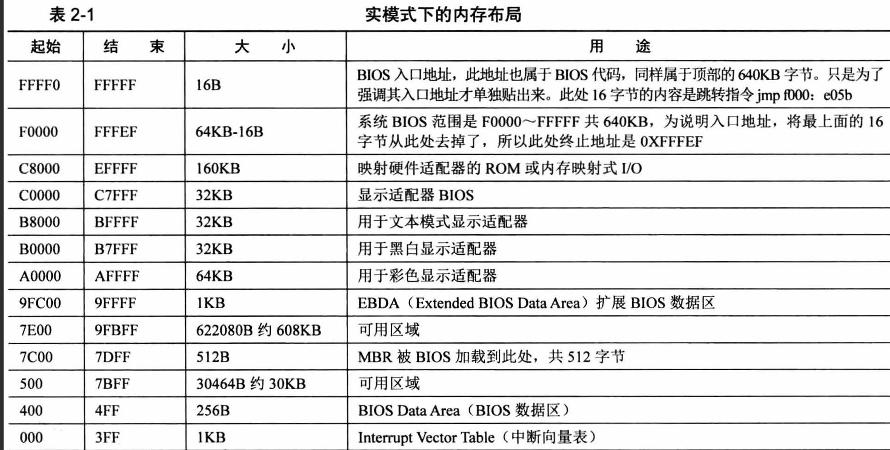
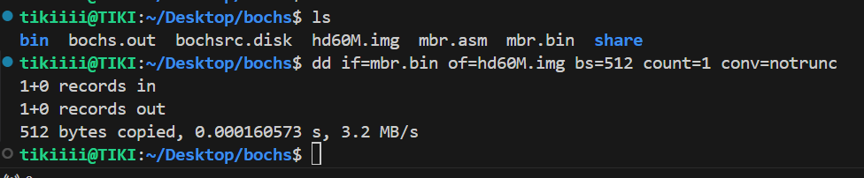
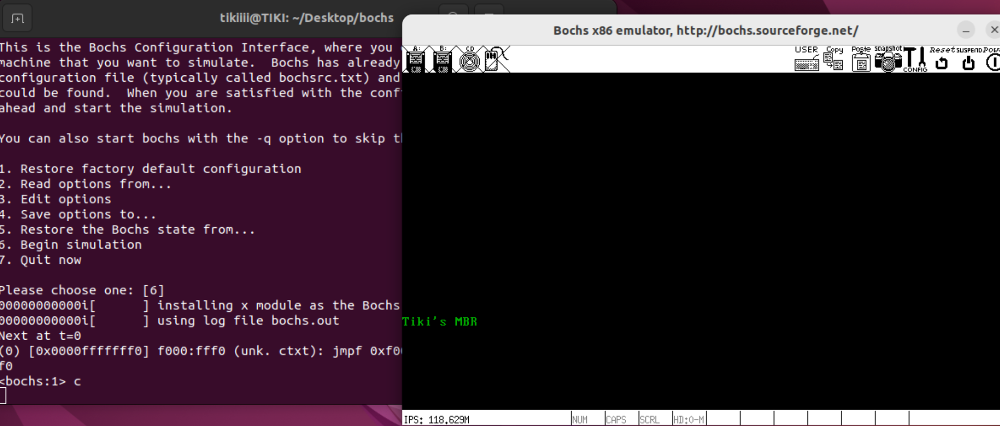

### 2.2 软件接力第一棒，BIOS
#### 2.2.1 实模式下的1MB内存
Intel 8086有20条地址线，可访问2^20^B=1MB的内存空间。
其内存布局如下图所示：


0x0-0x9FFFF地址对应DRAM，它的内容需要通电刷新，其中0x0-0x3ff为IVT中断向量表
0x0—0x9FFFF地址对应于BIOS，它不可被擦除永久保存于，其入口地址就是0xFFFF0；

#### 2.2.2 BIOS是如何苏醒的？
BIOS是电脑开机时第一个运行的软件，它主要负责以下内容：
（1）检测并初始化硬件设备
（2）建立中断向量表IVT
（3）扫描MBR，把MBR读入内存

开机瞬间，CPU的cs:ip寄存器就被附上0xF000:0xFFF0跳到BIOS的入口地址处，在0xFFFF0-0xFFFFF处是一条跳转指令 jmp far 0xf000:e05b 该地址是BIOS程序真正的地址，执行完（1）（2）后，BIOS开始扫描MBR的结束标志0x55、0xaa，若检测到就把它读入到0x7c00处

#### 2.2.3 为什么是0x7c00？
MBR的大小固定为512B，在内存中0x0-0x3FF为IVT，我们希望能尽量避免它过早被别的程序刷到，因此我们需要另选内存中的另一块地址放入mbr，而DOS1.0的最小内存要求为32KB(0x8000)，于是就把MBR设置到最后一块区域0x7c00

### 2.3 MBR
#### 2.3.1神奇好用的$和$$，令人迷惑的section
$ $$ section都是nasm编译器预留的关键字
section节名后若未加以vstart=xxxx修饰
    $表示$所在位置距离程序开头的偏移
    $$表示$所在section开头距离程序开头的偏移
若加以vstart=xxxx，则以xxxx为初始计算

#### 2.3.2 nasm用法
```
nasm -f <format> <filename> -o <output>
```
-f指定格式，默认是二进制文件bin 可用elf(只用得到这两个)
-o指定输出文件的名字

#### 2.3.3 mbr.S
```
; MBR主引导程序
; 注意是小端字节序
section MBR vstart=0x7c00
	mov ax,cs
	mov ds,ax
	mov es,ax
	mov ss,ax
	mov fs,ax
	mov sp,0x7c00
	
;调用 int 0x10 功能号 0x06 清屏
	mov ah,0x06     ;ah 功能号
                    ;al 上卷行数（0未写）
	mov bh,0x07     ;bh 上卷行属性
	mov bl,0x00     
	mov cx,0x0000       ;ch,cl 窗口左上角
	mov dx,0x184f       ;dh,dl 窗口右下角
	int 0x10            ;
	
;调用 int 0x10 功能号 0x03 获取光标的位置
	mov ah,0x03     ;功能号
	mov bh,0x00     ;待获取的页号：第几页
	int 0x10

;调用 int 0x10 功能号 0x13号 打印字符串
	mov ax,message      
	mov bp,ax           ;待打印字符串起始地址
	mov cx,0x0b         ;字符串长度
	mov ah,0x13         ;功能号
	mov al,0x01         ;写字符形式
	mov bx,0x0002       ;bh:输出页号 bl:字符属性黑底绿字（02）
	int 0x10

jmp $   ;循环在此处

message db "Tiki's MBR"
times 510 - ($-$$) db 0
db 0x55, 0xaa
```

磁盘操作命令dd的使用
>dd指令
>>if=FILE         //待读取文件
of=FILE         //待输出文件
bs=BYTES        //指定块大小
count=BLOCKS    //指定块数
seek= BLOCKS    //跳过块数开始输出
conv=CONVS      //如何转换文件，追加数据时最好用notrunc，即不打断文件。

编译后写入硬盘中：
```
nasm mbr.asm -o mbr.bin
dd if=mbr.bin of=hd60M.img bs=512 count=1 conv=notrunc 
```


执行虚拟机：
