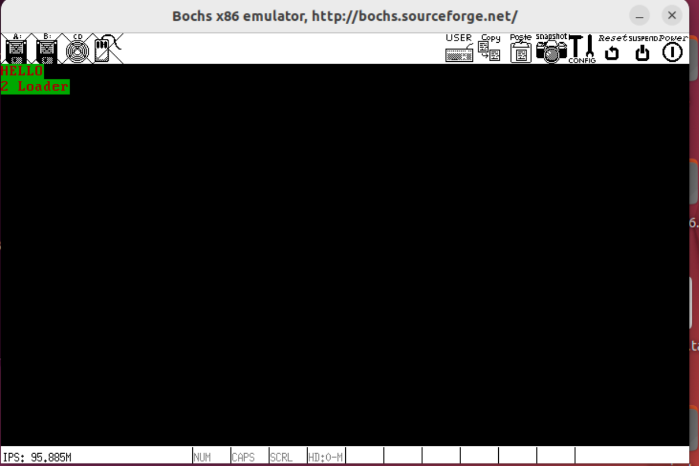

### 地址、section、vstart浅尝辄止
#### 3.1.1 什么是地址？
地址是描述各种符号在源程序中的位置，也是该符号相对于文件开头的偏移量

上图是反汇编ndisasm的结果，可以证实结论

#### 3.1.2 什么是section?
section是nasm提供给程序员逻辑划分程序的伪指令
详见0.21

#### 3.1.3 什么是vstart？
section 用 vstart= 来修饰后，可以被赋予一个虚拟起始地址，该地址是为了程序员在程序中定位用，在编译器编入程序后还需要被重定位。

如图，编译器只是把地址起始变为了0x7c00，而实际地址并未出现0x7c00，在程序中还会重定位。

### 3.2 CPU的实模式
什么是实模式？
实模式是指CPU的工作环境、工作方式、工作状态等是CPU使用的处于某环境如何工作的概念。

#### 3.2.1 CPU的工作原理
本节属于计算机组成原理的内容，感兴趣可以自行搜素。

简述：取指令->译指令->取操作数->运算->进入下一条指令
详述：
【控制单元】取下一条待执行的指令，该指令的地址在【程序计数器PC】中，在x86中程序基础其就是cs:ip。将地址送入地址总线，cpu从该地址得到了指令，存放在【指令寄存器IR】中。【指令译码器】根据指令格式检查指令寄存器中的指令，根据指令类型进行不同的取
【操作控制器】给【运算单元】下令，【运算单元】开始执行指令。【IP寄存器】的值被加上当前指令大小，ip指向下一条指令，以此往复。

#### 3.2.2 实模式下的寄存器
寄存器分为两类：
不可见寄存器：用户无法访问和使用，但部分需要用户初始化。如全局描述符表寄存GDTR、中断描述符表寄存器IDTR、局部描述符表寄存器LDTR、任务寄存器TR、控制寄存器CRO～3、指令指针寄存器四、标志寄存器flags、调试寄存器DRO～7。

可见寄存器：能直接操作的寄存器，如通用寄存器、段寄存器、IP寄存器、flag寄存器
段寄存器：也称为段基址寄存器，位宽为16为，其作用是指定一片内存的起始地址。

代码段寄存器：指向内存中指令的起始地址
数据段寄存器：指向数据段起始地址
栈段寄存器：栈位于内存中供程序使用的数据结构，栈段在硬盘中没有
附加段寄存器：在16位cpu仅有es一个附加段寄存器，fs和gs是32位寄存器增加的
IP寄存器：cs:ip 跨段不跨段
通用寄存器：

其功能如下：


#### 3.2.3 实模式下内存分段的由来
见前文0.7：为了降低程序对地址的过度依赖

#### 3.2.4 实模式下CPU内存寻址方式
寻址方式大致分为（1）寄存器寻址（2）立即数寻址（3）内存寻址

寄存器寻址：
数据在寄存器中，直接拿取。

立即数寻址：
立即数就是常数，直接使用该数。

内存寻址——直接寻址
将直接在操作数中给出的数字作为内存地址，通过中括号的形式告诉 CPU，取此地
址中的值作为操作数。
```
mov ax,[0x1234] //将内存地址DS:0x1234处的值写入寄存器
```

内存寻址——基址寻址
以bx或bp寄存器为基址，变化该操作数后寻址（实模式下限制必须为bx或bp，保护模式没有限制）
bx默认段寄存器是ds，bp默认段寄存器是ss
```
mov [bx],0x1234 //将0x1234加上内存地址ds:bx处的值后再存入内存地址ds:bx 
```

内存寻址——变址寻址
以si或di寄存器为基址，变化该操作数后寻址，si是源索引寄存器，di是目的索引寄存器，他们的默认段寄存器都是ds
```
mov [di],ax				;将寄存器ax的值存放在ds:di指向的内存中
mov [si+0x1234],ax			;变址中也可以加个偏移量
```

内存寻址——基址变址寻址
基址寄存器bx或bp加一个变址寄存器si或di
```
mov [bx+di],ax
mov [bx+si],ax
```

#### 3.2.5 栈到底是什么？
栈是位于内存中一种向下生长的后进先出的线性数据结构
ss寄存器表示栈底地址，sp寄存器表示栈顶地址

push操作：先 sp- 数据长度，再取出数据
```
mov bp,sp
sub bp,2
mov [bp],ax
```
pop操作：先取出数据再 sp+数据长度
```
mov ax,[bp]
add bp,2
```

#### 3.2.6 实模式下的ret
ret指令是和call指令搭配使用的返回调用处的指令，它弹出栈顶的字节来替换cs:ip寄存器来控制程序的走向
ret用于不跨段的近返回：弹出两个字节替换ip寄存器
retf用于跨段的远返回：弹出四个字节替换cs:ip寄存器

#### 3.2.7 实模式下的call
call是改变程序流程的指令之一，但call是调用，会返回，需要把当前指令的cs:ip压栈后再替换
以下四种方式是call的分类，根据名字有以下特性：
近调用：调用程序在同段内
远调用：调用程序不在同段内
相对：给出的是相对于当前cs:ip位置的距离
绝对：给出绝对距离
间接：通过间接寻址的方式，需要通过寄存器或内存等
直接：使用直接数作为地址
（1）16位实模式相对近调用
```
call near 立即数地址
```
（2）16位实模式间接绝对近调用
```
call 寄存器寻址/内存寻址
```

（3）16位实模式直接绝对远调用
```
call far 段基址(立即数):段偏移(立即数)
```
（4）16位实模式间接绝对远调用
```
call far 内存寻址
```

#### 3.2.8 实模式下的jmp
jmp也是改变程序流程的一个指令，但它不会返回，仅需更新cs:ip寄存器
（1）16位实模式相对短转移
```
jmp short 立即数地址
```
（2）16位实模式相对近转移
本jmp和前一个jmp的区别在于前者范围是-128-127，若加上jmp short自身的指令长度(2)有可能超出范围(128)等，这时候就使用short范围更大(-32768-32767)

```
jmp near 立即数地址
```
（3）16位实模式间接绝对近转移
```
jmp near 内存/寄存器寻址  
```
（4）16位实模式直接绝对远转移
```
jmp far 段基址：段偏移 （都是立即数）  
```

（5）16位实模式间接绝对远转移
```
jmp far 段基址：段偏移 （都是内存/寄存器寻址）  
```

#### 3.2.9 标志寄存器flags
flags是一组寄存器，它在实模式下是16位，但在保护模式扩充到了32位，用于辅助有条件转，以及记录一些操作系统的设置。

其作用如下表：
| 位号 | 位名 | 作用 | 置1条件/说明 | 置0说明 |
| ---- | ---- | ---- | ---- | ---- |
| 0 | CF | 进位 | 进位/借位 |  |
| 2 | PE | 奇偶 | 偶数 |  |
| 4 | AF | 辅助进位 | 低四位借位进位 |  |
| 6 | ZF | 零标志位 | 计算结构为0 |  |
| 7 | SF | 符号标志 | 运算结果为负 |  |
| 8 | TF | 陷阱标志 | 若为1，CPU单步运行 | 连续工作 |
| 9 | IF | 中断标志 | 若为1，中断开启 | 中断关闭 |
| 10 | DF | 方向标志 | 若为1，操作数地址自动-1 | 自动+1 |
| 11 | OF | 溢出标志 | 存在溢出 |  |
| 12-13 | IOPL | 特权级标志 |  |  |
| 14 | NT | 任务嵌套标志 | 8088支持多任务，任务嵌套另一个任务进程 |  |
| 16 | RF | 恢复标志 | 忽略调试程序时调试故障 | 接受调试故障 |
| 17 | VM | 虚拟8086模式 | 允许保护模式下允许实模式的程序 | 不允许 |
| 18 | AC | 对齐检查 | 检查自动对齐数据 | 不检查 |
| 19 | VIF | 虚拟中断 | 虚拟模式的中断标志 |  |
| 20 | VIP | 虚拟中断挂起 | 多任务下提供虚拟中断挂起信息，配合VIF |  |
| 21 | ID | 识别标志 | 支持CPU id指令，获取CPU型号、厂商信息等 | 不支持 |
| 22-31 |  | 无用途 | 占位，未来拓展 |  |

#### 3.2.10 有条件转移
有条件转移借flags标志位辅助，指令为jxx


#### 3.2.11 实模式的小结
实模式下，CPU访问的都是真实的物理地址，保护性很差，存在大量的安全隐患，因此保护模式很快就取代了实模式

### 3.3 让我们直接对显示器说点什么吧
#### 3.3.1 CPU如何与外设通信——IO接口
IO 接口是连接CPU与外部设备的逻辑控制部件，其功能是协调 CPU和外设之间的种种不匹配，为了简化CPU访问外部设备的工作，约定好IO接口的功能如下：
（1） 设置数据缓冲，解决CPU与外设的速度不匹配
（2） 设置信号电平转换电路：CPU是TTL电平驱动，外设大多是电机设备
（3）设置数据格式转换
（4）设置时序控制电路来同步CPU和外设
（5）提供地址译码

在同一时刻，CPU只能和一个IO设备进行通信，想要和多个IO设备通信，就需要输入输出控制中心，也就是南桥芯片。（北桥用于连接高速设备，如内存。南桥用于连接pci、pci-express、AGP等低速设备）。PCI接口是用于拓展的接口，即插即用。其结构如下：


为了区别于CPU 内部的寄存器， IO接口中的寄存器就称为端口。

端口的映射方式：
（1）端口映射到内存某一区域
（2）端口独立编址

如何访问端口：
当使用（1）时，端口可以直接用mov指令
当使用（2）时，需要CPU提供额外的in和out指令

intel指令形式是 操作码 目的操作码 源操作码，在下面的指令中，dx只作端口号用
in 指令用于从端口中读取数据
(1) in al, dx: 
(2) in ax, dx。

out 指令用于往端口中写数据
(1) out dx, al: 
(2) out dx, ax：
(3) out 立即数, al:
(4) out 立即数, ax

注意：
(1)在指令中，dx只作端口号
(2)用 al 寄存器存储8位宽度数据，用 ax 寄存器存储16位宽度数据,它要和端口寄存器的位宽保持一致，不能丢失数据精度。
(3)in指令中，端口号只能用dx寄存器。
(4)out指令中，可以选用dx寄存器或立即数充当端口号

#### 3.3.3 显存、显卡、显示器
显存是显卡内部的内存，显示器通过不断读取显存来显示内容。

颜色处理：使用某一位来表示某一种颜色，例如24位真彩色表示用24bit表示一种颜色，那么可用表示2^24^种颜色。

显示处理：显示器不区分图像和文字，只负责显示内容。为了表示某个字符，用ASCII来表示。

显存地址分布：

如图所示，显存支持不同模式的显示，只要往里面写东西就能显示出来，本书主要讨论文本模式操作 0xB8000 ~ 0xBFFFF。
每个字符低字节由ASCII表示，高字节表示字符的属性（低4位字符颜色，高4位字符背景）
字符属性如下表：


从0xB8000到0xBFFFF，范围为32KB，一屏可以显示2000B，每个字符占2B，每屏字符实际占用4000B，则显存可用容纳32KB/4000B≈8屏数据。


#### 3.3.4 改进mbr，直接操作显卡
前面的mbr是在实模式下通过中断号int 10进行打印的，但实模式很快就会消失，IVT表是会不复存在，因此我们改进mbr，让他直接操作显卡
```
;bochs/mbr.asm
; MBR主引导程序
; 注意是小端字节序
section MBR vstart=0x7c00
	mov ax,cs
	mov ds,ax
	mov es,ax
	mov ss,ax
	mov fs,ax
	mov sp,0x7c00
;显存地址写入gs
	mov ax,0xb800
	mov gs,ax
	
;调用 int 0x10 功能号 0x06 清屏
	mov ah,0x06     ;ah 功能号
                    ;al 上卷行数（0未写）
	mov bh,0x07     ;bh 上卷行属性
	mov bl,0x00     
	mov cx,0x0000       ;ch,cl 窗口左上角
	mov dx,0x184f       ;dh,dl 窗口右下角
	int 0x10            ;

; 设置显存
; 背景绿色,字体红色,字体闪烁
	mov byte [gs:0x00],'H'
	mov byte [gs:0x01],0xA4

	mov byte [gs:0x02],'E'
	mov byte [gs:0x03],0xA4

	mov byte [gs:0x04],'L'
	mov byte [gs:0x05],0xA4

	mov byte [gs:0x06],'L'
	mov byte [gs:0x07],0xA4

	mov byte [gs:0x08],'O'
	mov byte [gs:0x09],0xA4

jmp $   ;循环在此处

times 510 - ($-$$) db 0
db 0x55, 0xaa
```
 


### 3.4 bochs调试方法
```
help ;显示帮助信息
help+命令 ;显示命令简略信息
```

CPU and memory contents类
```
x+[/nuf]+线性地址 
xp+[/nuf]+物理地址 ;查看内存内容
;参数：/n指定显示的显示单元数量  /u指定显示单元的大小,b:1B h:2B w:4B g:8B 默认w /f指定以哪种进制表示
setpmem [phy_addr] [size] [val] ;设置以phy_addr为起始,连续size个字节为内容的val
r | reg | regs | registers ;显示8个通用寄存器的值+eflags寄存器+eip寄存器
ptime ;显示总执行指令数
print-stack [num] ;显示堆栈,num为打印的栈条目数,默认16
? | calc ;计算器
info pb | pbreak | b | break ;查看断点信息
info CPU ;显示CPU所有寄存器的值
info idt ;显示中断向量表 IDT
info gdt [num] ;显示全局描述符表 GDT
info ldt ;显示局部描述符表 LDT
info tss ;显示任务状态段 TSS
info ivt [num] ;显示中断向量表 IVRT
info flags | eflags ;显示状态寄存器
sreg ;显示所有段寄存器值
dreg ;显示所有调试寄存器值
creg ;显示所有控制寄存器的值
info tab ;显示页表中线性地址到物理地址的映射
page line_addr ;显示线性地址到物理地址的映射
```

Debugger control类
```
u+地址 ;把地址内容反汇编成指令
q|quit|exit ;退出调试，关闭虚拟机
set reg=val ;把reg寄存器值设为val
set u on/off ;每次停止执行时反汇编
show mode ;变换模式时提示
show int ;中断时提示三种中断类型“softint”、“extint”和“iret”,可单独显示
show call ;函数调用发生时提示。
traceon | off ;on每执行一条指令都会将反汇编代码打印
```

Execution control类
```
c|cont|continue ;继续执行
s|step [count] ;执行count条指令
p|n|next ;执行1条指令
```

Breakpoint management类
```
;以地址打断点：
vb | vbreak [seg: off] ;以虚拟地址增加断点
lb | lbreak [addr] ;以线性地址添加断点
pb | pbreak | b | break [addr] ;以物理地址添加断点
;以指令数打断点：
sb [delta] ;d再执行delta条指令就中断
sba [time] ;执行time条指令就中断
;以读写IO打断点：
watch ;显示所有读写断点
watch r|read [phy_addr] ;设置读断点，如果物理地址phy_addr有读操作停止运行。
watch w|write [phy_addr] ;设置些断点，如果物理地址phy_addr有写操作停止运行。
unwatch ;清除所有断点
unwatch [phy_addr] ;清除在此地址上的读写断点
blist ;显示所有断点信息
bpd | bpe [n] ;禁用断点 / 启用断点，n是断点号。
d|del|delete [n] ;删除某断点，n是断点号
```

### 3.5 硬盘介绍
#### 3.5.2 硬盘工作原理

主轴转动带动盘片转动，转速是7200转／分。
盘片的上下盘面与磁头是一一对应的关系，故用磁头号来表示盘面。
磁头臂带动磁头作弧线运动。
盘面被划分为多个同心环，称为磁道。
磁道上的弧状区域，称为扇区，它作为我们向硬盘存储数据的最基本单位，大小512B。
不同盘面的同一磁道，称为柱面，为了减少寻道时间，数据按柱面存取。
CPU是通过硬盘控制器与支持硬盘的。

#### 3.5.3 硬盘控制器端口

两类：
Command Block registers 用于向硬盘驱动器写入命令宇或者从硬盘控制器获得硬盘状态， ControlBlock registers用于控制硬盘工作状态。

各端口的作用：
| 端口 | 位数 | 读操作 | 写操作 |
|----|----|----|----|
|0x1F0|16|读写数据|
|0x1F1|8|错误信息|指定额外参数|
|0x1F2|8|待读扇区数|待写扇区数|
|0x1F3|8|LBA 的0-7位|
|0x1F4|8|LBA 的8-15位|
|0x1F5|8|LBA 的16-23位|

device寄存器和读操作时0x1F7寄存器作用如下所示：

在写操作时，0x1F7寄存器为command寄存器 ，当寄存器内容为0xEC时表示硬盘识别命令，当为0x20时表示读扇区，当为0x30时表示写扇区

LBA（逻辑块地址）：
硬盘中的扇区在物理上用”柱面-磁头-扇区“来定位（CylinderHead Sector），简称为CHS，但需要我们事先算出在哪个盘面，哪个柱面上。这很不方便，因此引入LBA这种逻辑上计算扇区地址的方法，LBA分为两种，LBA28用28bit来描述一 个扇区的地址，LBA48则用48位。

#### 3.5.4 常用硬盘操作方法
硬盘操作顺序：
1. 选择通道，向sector count要写入待操作的扇区数。
2. 将LBA寄存器 0 - 27 位补充完整。
3. device第6位置1开启LBA 模式。第4位选择硬盘（master/slave）。
4. 向command寄存器写入命令。
5. 读取该通道上status寄存器，判断工作是否完成。
6. 如果以上是读硬盘，进入第7步。否则结束。
7. 将硬盘数据读出，结束

数据传送方式：
1. 无条件传送方式（内存设备直接存取）
2. 查询传送方式（程序检测设备状态后存取）
3. 中断传送方式（使用中断信号驱动存取）
4. 直接存储器存取（DMA）方式（引入专门负责存取数据的硬件）
5. I/O处理机传送方式（引入专门负责处理IO的处理器）

### 3.6 让MBR使用硬盘
MBR大小为512B，无法载入内核，我们把载入内核的程序写入loader.asm，并让mbr加载内核到内存。

loader程序地址的选择为什么是0x900？
由内存布局可知，在实模式下目前可用地址为0x500-0x7bff 和0x7e00-0x9fbff，我们选择靠近0x500的一块，为什么不选择0x500呢，为了保险起见，我们预留一些空间，选择0x900。
```
;配置文件
LOADER_BASE_ADDR    equ 0x900   ;loader起始地址
LOADER_START_SECTOR equ 0x2     ;loader起始扇区
```
```
; mbr.asm
; MBR主引导程序
; 注意是小端字节序
%boot.inc
section MBR vstart=0x7c00
	mov ax,cs
	mov ds,ax
	mov es,ax
	mov ss,ax
	mov fs,ax
	mov sp,0x7c00
;显存地址写入gs
	mov ax,0xb800
	mov gs,ax
	
;调用 int 0x10 功能号 0x06 清屏
	mov ah,0x06     ;ah 功能号
    mov al,0x00     ;al 上卷行数（0未写）
	mov bh,0x07     ;bh 上卷行属性
	mov bl,0x00     
	mov cx,0x0000       ;ch,cl 窗口左上角
	mov dx,0x184f       ;dh,dl 窗口右下角
	int 0x10            

; 设置显存
; 背景绿色,字体红色,字体闪烁
	mov byte [gs:0x00],'H'
	mov byte [gs:0x01],0xA4

	mov byte [gs:0x02],'E'
	mov byte [gs:0x03],0xA4

	mov byte [gs:0x04],'L'
	mov byte [gs:0x05],0xA4

	mov byte [gs:0x06],'L'
	mov byte [gs:0x07],0xA4

	mov byte [gs:0x08],'O'
	mov byte [gs:0x09],0xA4

	mov eax, LOADER_START_SECTOR	;起始扇区地址
	mov bx, LOADER_BASE_ADDR		;写入地址
	mov cx, 1						;待读入扇区数
	call rd_disk_m_16				;调用函数

	jmp LOADER_BASE_ADDR			;跳到加载程序处

;读取硬盘n个扇区 n是cx寄存器的值：1
rd_disk_m_16:
	mov esi,eax		;备份eax（原LBA扇区号）
	mov di,cx		;备份cx

	;磁盘操作的7个步骤
	mov dx,0x1f2	;1.选择通道
	mov al,cl 		;1.设置待读取扇区数
	out dx,al		

	mov eax,esi 	;恢复ax
	;2.填写LBA 0-23位
	mov dx,0x1f3
	out dx,al 
	mov cl,8
	shr eax,cl
	mov dx,0x1f4
	out dx,al
	shr eax,cl 
	mov dx,0x1f5
	out dx,al

	;2.填写LBA 24-27
	shr eax,cl 
	and al,0000_1111b
	;3.device选择硬盘，开启LBA模式，选择主盘
	or  al,1110_0000b 
	mov dx,0x1f6
	out dx,al 

	;4.向端口写入读命令0x20
	mov dx,0x1f7
	mov al,0x20
	out dx,al 

	;5.检测硬盘状态
.not_ready:
	nop 	;停顿等待一会
	in al,dx 
	and al,1000_1000b ;第4位1表示准备好，第7位1表示忙碌
	cmp al,0000_1000b
	jnz .not_ready	;循环检查

	;6.读数据
	mov ax,di	;读取扇区数
	mov dx,256  ;每次读2B，需要512/2=256次
	mul dx 		;8位乘法，结果在ax种
	mov cx,ax 	;得到要读取的总次数
	mov dx,0x1f0
.go_on_read:
	in ax,dx 
	mov [bx],ax 
	add bx,2
	loop .go_on_read

	ret

	times 510 - ($-$$) db 0
	db 0x55, 0xaa
```

loader的内容是简单的打印2 loader后续再实现完整内容：
```
;loader.asm
%include "boot.inc"

section loader vstart=LOADER_BASE_ADDR
    mov byte [gs:160],'2'
    mov byte [gs:161],0x24
    mov byte [gs:162],' '
    mov byte [gs:163],0x24
    mov byte [gs:164],'L'
    mov byte [gs:165],0x24
    mov byte [gs:166],'o'
    mov byte [gs:167],0x24
    mov byte [gs:168],'a'
    mov byte [gs:169],0x24
    mov byte [gs:170],'d'
    mov byte [gs:171],0x24
    mov byte [gs:172],'e'
    mov byte [gs:173],0x24
    mov byte [gs:174],'r'
    mov byte [gs:175],0x24
jmp $
```
编译并写入磁盘：
```
nasm -I include/ -o loader.bin loader.asm
nasm -I include/ -o mbr.bin mbr.asm
dd if=mbr.bin of=hd60M.img bs=512 count=1 conv=notrunc
dd if=loader.bin of=hd60M.img bs=512 count=1 seek=2 conv=notrunc
```
运行结果:
