### 5.1 获取物理内存容量
#### 5.1.1 学习 Linux 获取内存的方法
在实模式下利用BIOS中断0x15的3个子功能：
EAX=0xE820：遍历主机上全部内存
AX=0xE801：分别检测出低15M和16MB~4GB的内存，最大支持4GB
AH=0x88：最多检测出64MB内存，实际内存超过该容量也按64MB返回

步骤：
1. 向寄存器写入调用参数
2. 执行中断调用int 0x15
3. 在CF=0时，从输出寄存器得到结果

#### 5.1.2 利用BIOS中断0x15子功能0xe820获取内存
该方式迭代查询不同类型属性的系统内存区，返回地址范围描述符ARDS这种数据结构：
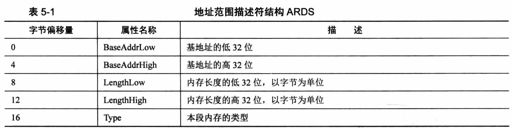
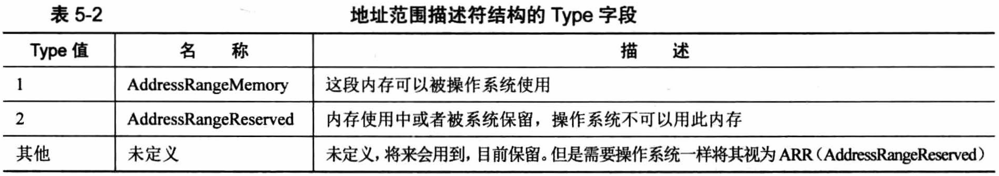
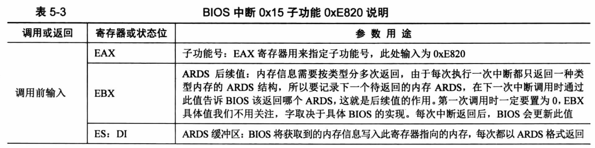
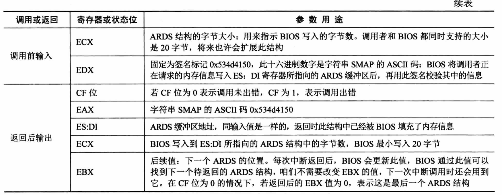

#### 5.1.3 利用BIOS中断0x15子功能0xe801获取内存
低于15MB的内存以1KB为单位，数量在AX，CX中记录。
16MB~4GB以64KB为单位，数量在BX，DX中记录。
15-16MB的部分由于历史留给了ISA设备，无法使用，统计时成了memory hole。
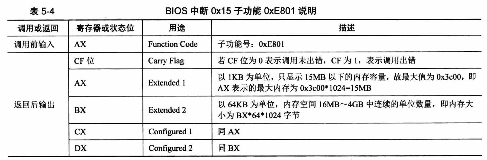

#### 5.1.4 利用BIOS中断0x15子功能0x88获取内存
不统计1MB以下的内存，即使内存容量大于64MB，也只会显示63MB。
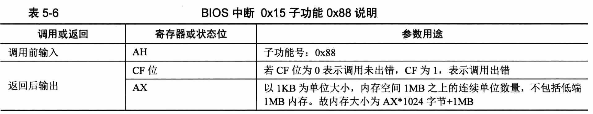

#### 5.1.5 内存容量检测
```
;loader.asm
%include "boot.inc"
section loader vstart=LOADER_BASE_ADDR
;jmp loader_start 

;构建gdt及其内部的描述符
GDT_BASE:           dd 0x00000000
                    dd 0x00000000

CODE_DESC:          dd 0x0000FFFF
                    dd DESC_CODE_HIGH4

DATA_STACK_DESK:    dd 0x0000FFFF
                    dd DESC_DATA_HIGH4

VIDEO_DESC:         dd 0x80000007               
                    dd DESC_VIDEO_HIGH4

GDT_SIZE            equ $-GDT_BASE
GDT_LIMIT           equ GDT_SIZE-1
times 60 dq 0       ;预留60个段描述符

SELECTOR_CODE       equ (0x0001<<3)+TI_GDT+RPL0  ;相当于 (CODE_DESC-GDT_BASE)/8+TI_GDT+RPL0
SELECTOR_DATA       equ (0x0002<<3)+TI_GDT+RPL0
SELECTOR_VIDEO      equ (0x0003<<3)+TI_GDT+RPL0 

total_mem_bytes     dd 0 ;存放内存大小

gdt_ptr             dw GDT_LIMIT
                    dd GDT_BASE

; 记录 ARDS 结构体数
ards_buf            times   244 db 0
ards_nr             dw      0

loader_start:  
    mov byte[gs:640],'L'
    mov byte[gs:642],'O'
    mov byte[gs:644],'A'
    mov byte[gs:646],'D'
    mov byte[gs:648],'E'
    mov byte[gs:650],'R'
    mov byte[gs:652],'_'
    mov byte[gs:654],'S'
    mov byte[gs:656],'T'
    mov byte[gs:658],'A'
    mov byte[gs:660],'R'
    mov byte[gs:662],'T'   

    ; 调用参数设置，获取内存布局 
    xor ebx, ebx
    mov edx, 0x534d4150
    mov di, ards_buf

.e820_mem_get_loop:
    mov eax, 0x0000e820     ;执行中断调用
    mov ecx,20
    int 0x15
    jc .e820_failed_so_try_e801     ;根据cd判断成功否，失败使用e801

    add di,cx
    inc word [ards_nr]
    cmp ebx, 0

jnz .e820_mem_get_loop
    ;找到ards中 base_add_low+length_low的最大值即为内存最大值
    mov cx, [ards_nr]
    mov ebx, ards_buf
    xor edx,edx
.find_max_mem_area:
    mov eax,[ebx]
    add eax,[ebx+8]
    add ebx, 20
    cmp edx,eax

    ;冒泡排序
    jge .next_ards
    mov edx,eax
.next_ards:
    loop .find_max_mem_area
    jmp .mem_get_ok

;e801方法
.e820_failed_so_try_e801:
    mov ax,0xe801
    int 0x15
    jc .e801_failed_so_try88 ;失败尝试0x88
    
    ;计算低15MB内存
    mov cx,0x400
    mul cx
    shl edx,16
    and eax,0x0000FFFF
    or edx,eax
    add edx, 0x100000
    mov esi,edx
    
    ;计算16MB以上内存，并单位转换
    xor eax,eax
    mov ax,bx
    mov ecx,0x10000
    mul ecx

    add esi,eax
    mov edx,esi
    jmp .mem_get_ok

;0x88 同理
.e801_failed_so_try88:
    mov ah,0x88
    int 0x15
    jc .error_hlt
    and eax,0x0000FFFF

    mov cx,0x400
    mul cx
    shl edx,16
    or edx,eax
    add edx,0x100000

.mem_get_ok:
    mov [total_mem_bytes],edx

    ;---准备进入保护模式---
    ;---打开A20---
    in al,0x92
    or al,0000_0010B
    out 0x92,al
   
    ;---加载GDT---
    lgdt [gdt_ptr]
    
    ;---cr0第0个位置1
    mov eax,cr0 
    or eax,0x00000001
    mov cr0,eax 

    jmp dword SELECTOR_CODE:p_mode_start ;刷新流水线

.error_hlt
hlt

[bits 32]
p_mode_start:
    mov ax,SELECTOR_DATA
    mov ds,ax
    mov es,ax
    mov ss,ax 
    mov esp,LOADER_STACK_TOP
    mov ax,SELECTOR_VIDEO
    mov gs,ax

    mov byte [gs:800], 'P'
    jmp $
```
```
;mbr.asm
; mbr.asm
; MBR主引导程序
; 注意是小端字节序
%include "boot.inc"
section MBR vstart=0x7c00
	mov ax,cs
	mov ds,ax
	mov es,ax
	mov ss,ax
	mov fs,ax
	mov sp,0x7c00
	mov ax,0xb800
	mov gs,ax
	
    ;清屏
	mov ah,0x06     
	mov bh,0x07     
	mov cx,0x0      
	mov dx,0x184f       
	int 0x10            

	mov byte [gs:0x00],'H'
	mov byte [gs:0x01],0xA4

	mov byte [gs:0x02],'E'
	mov byte [gs:0x03],0xA4

	mov byte [gs:0x04],'L'
	mov byte [gs:0x05],0xA4

	mov byte [gs:0x06],'L'
	mov byte [gs:0x07],0xA4

	mov byte [gs:0x08],'O'
	mov byte [gs:0x09],0xA4

	mov eax, LOADER_START_SECTOR	
	mov bx, LOADER_BASE_ADDR		
	mov cx, 4						
	call rd_disk_m_16

	jmp LOADER_BASE_ADDR+0x300			;跳到加载程序处

;读取硬盘n个扇区 n是cx寄存器的值：1
rd_disk_m_16:
	mov esi,eax		;备份eax（原LBA扇区号）
	mov di,cx		;备份cx

	;磁盘操作的7个步骤
	mov dx,0x1f2	;1.选择通道
	mov al,cl 		;1.设置待读取扇区数
	out dx,al		

	mov eax,esi 	;恢复ax
	;2.填写LBA 0-23位
	mov dx,0x1f3
	out dx,al 
	mov cl,8
	shr eax,cl
	mov dx,0x1f4
	out dx,al
	shr eax,cl 
	mov dx,0x1f5
	out dx,al

	;2.填写LBA 24-27
	shr eax,cl 
	and al,0000_1111b
	;3.device选择硬盘，开启LBA模式，选择主盘
	or  al,1110_0000b 
	mov dx,0x1f6
	out dx,al 

	;4.向端口写入读命令0x20
	mov dx,0x1f7
	mov al,0x20
	out dx,al 

	;5.检测硬盘状态
.not_ready:
	nop 	;停顿等待一会
	in al,dx 
	and al,1000_1000b ;第4位1表示准备好，第7位1表示忙碌
	cmp al,0000_1000b
	jnz .not_ready	;循环检查

	;6.读数据
	mov ax,di	;读取扇区数
	mov dx,256  ;每次读2B，需要512/2=256次
	mul dx 		;8位乘法，结果在ax种
	mov cx,ax 	;得到要读取的总次数
	mov dx,0x1f0
.go_on_read:
	in ax,dx 
	mov [bx],ax 
	add bx,2
	loop .go_on_read

	ret

	times 510 - ($-$$) db 0
	db 0x55, 0xaa
```
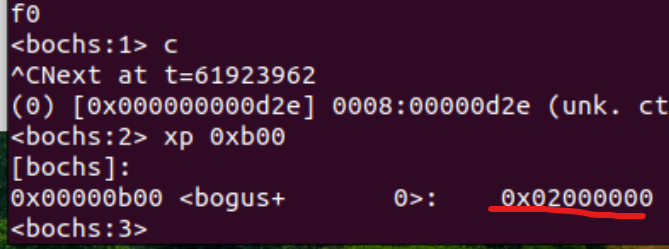

### 5.2 启用内存分页机制，畅游虚拟空间
#### 5.2.1 为什么分页
为了让碎片内存也得以利用。
为了让不连续的碎片内存也得以连续。

#### 5.2.2 一级页表
分页机制在分段机制的前提下，必须先分段再分页。
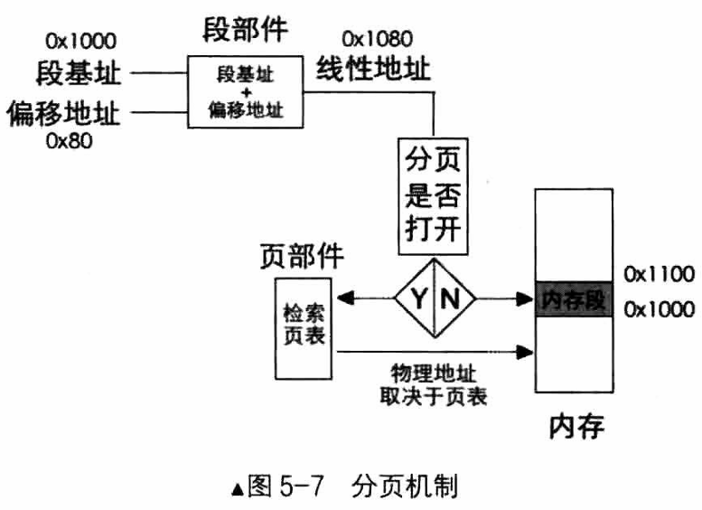

分页机制的作用：
将线性地址转换成物理地址。
用大小相等的页代替大小不等的段。
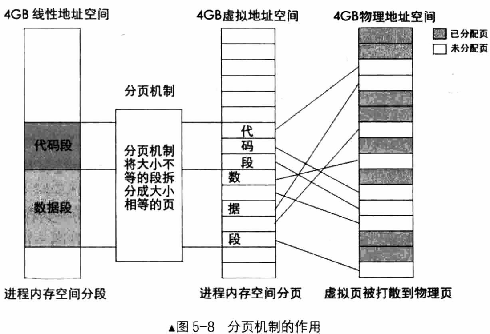

页或物理块的大小：
若逐字节对应，页表大小为16G，得不偿失。
把32位=内存块数量（20位）*内存块大小4KB（12位），每页有1M个页表项。
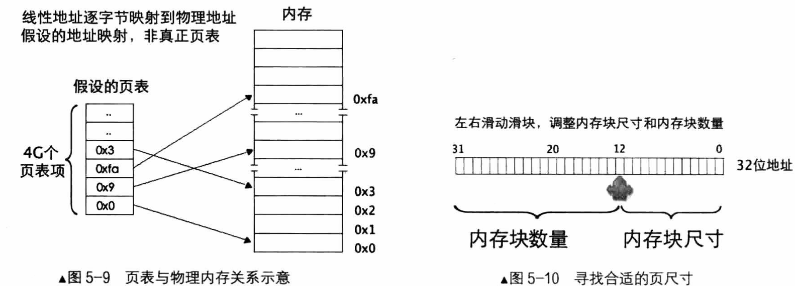

如何查找页表项：
1. 页表地址放到控制寄存器CR3中
2. 每个页表项4B，查找页表项用cr3地址+高20位索引*4
3. 从2得到的地址+低12位即为内存地址
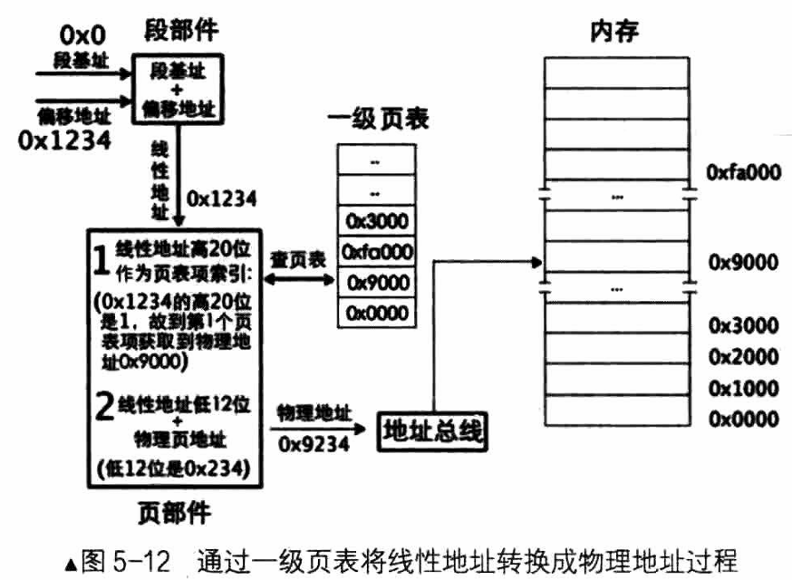

#### 5.2.3 二级页表
为什么要建二级页表？
1. 一级页表需要提前建好，二级页表可以动态建立
2. 一级页表只能容纳4MB，二级可以更多
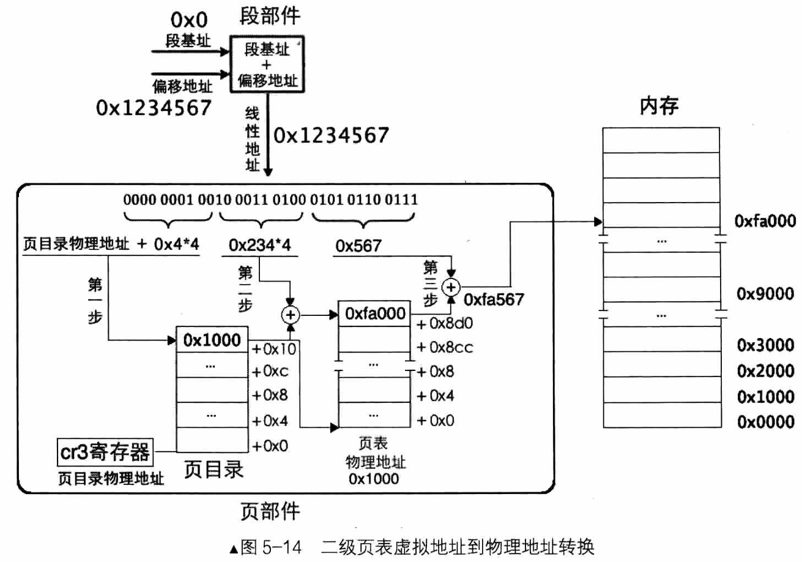

页目录项PDE和页表项PTE
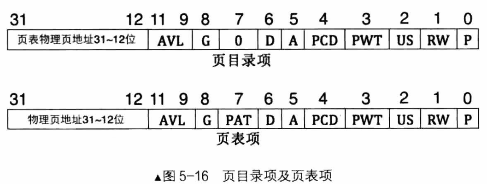
| 位名 | 作用 | 说明 |
| P | 存在位 | 表示是否在物理内存 |
| RW	| 读写 | 1：可读可写，0：可读不可写 |
| US | 普通用户/超级用户 | 该页等级，若为1说明是普通用户，任意特权级可访问；若为0只允许等级为0，1，2的程序访问 |
| PWT | 页级通写位 | 1：此项采用通写方式，表示该页不仅是普通内存，还是高速缓存；书中认为在此填0就好了 |
| PCD | 页级告诉缓存禁止位 | 1：启用高速缓存，0：禁止将该页缓存 |
| A | 访问位 | 表示该页是否被访问过 |
| D | 脏页位 | 表示该页是否被修改过 |
| G | 全局位 | 表示该页是否是全局页 |
| AVL	 | 表示可用 | 表示软件可以用 |

启动分页：
1. 准备好页目录表以及页表
2. 页表地址写入cr3
3. 寄存器cr0置PG为1

#### 5.2.4 页表地址的安排
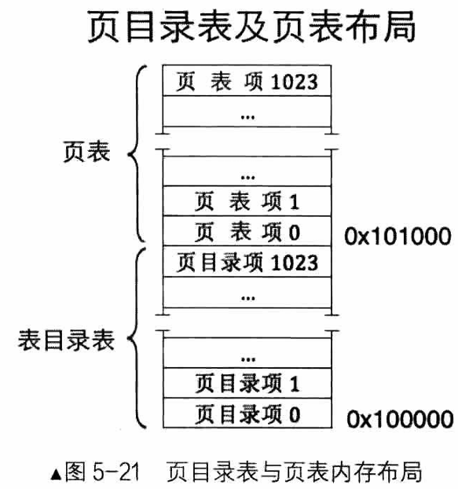

#### 5.2.5 启动分页
```
;boot.inc增加
; 页目录表基地址
PAGE_DIR_TABLE_POS	equ	0x100000

; 页表相关属性
PG_P 		equ	1b
PG_RW_R		equ 00b
PG_RW_W		equ	10b
PG_US_S		equ	000b
PG_US_U		equ	100b
```
```
;loader.asm

    mov byte [gs:800], 'P'
    ;jmp $

; 创建页目录、页表 初始化内存位图 
    call setup_page
    sgdt[gdt_ptr]
    mov ebx,[gdt_ptr + 2]
    or dword [ebx + 0x18 + 4], 0xc0000000
    add dword [gdt_ptr + 2],   0xc0000000

    add esp,0xc0000000
    ;页目录地址赋cr3
    mov eax, PAGE_DIR_TABLE_POS
    mov cr3,eax

    ;打开cr0的pg位
    mov eax,cr0
    or eax,0x80000000
    mov cr0,eax

    ;gdt地址重新加载
    lgdt[gdt_ptr]
    mov byte [gs:960],'V'

    jmp $

setup_page:
    ; 页目录清零
    mov ecx,4096 
    mov esi,0
.clear_page_dir:
    mov byte [PAGE_DIR_TABLE_POS + esi], 0
    inc esi
    loop .clear_page_dir

;创建PDE
.create_pde:
    mov eax,PAGE_DIR_TABLE_POS
    add eax,0x1000
    mov ebx,eax

    or eax,PG_US_U | PG_RW_W | PG_P
    mov [PAGE_DIR_TABLE_POS + 0x0],eax      ;写入第一个页表地址0x101000和属性
    mov [PAGE_DIR_TABLE_POS + 0xc00],eax    ;第768个页目录项同样写入0x101000。为了实现操作系统高3GB以上的虚拟地址对应到低端1MB.

    sub eax,0x1000
    mov [PAGE_DIR_TABLE_POS + 4092],eax     ;最后一个页目录项写入页目录基址。

; 创建PTE
    mov ecx,256
    mov esi,0
    mov edx, PG_US_U | PG_RW_W | PG_P
.create_pte:
    mov [ebx+esi*4],edx                     ;第一个页表，指向的是1MB——0~0xfffff，所以是8位。
    add edx,4096                        
    inc esi
    loop .create_pte

; 创建内核页目录项(PDE) 剩下的254个页目录项从0x102000开始
    mov eax,PAGE_DIR_TABLE_POS
    add eax, 0x2000                         ;第一个页表为+0x1000，这里是第二个页表的位置+0x2000
    or eax, PG_US_U | PG_RW_W | PG_P 
    mov ebx, PAGE_DIR_TABLE_POS
    mov ecx,254
    mov esi,769                            
.create_kernel_pde:
    mov [ebx+esi*4],eax
    inc esi
    add eax,0x1000
    loop .create_kernel_pde
    ret
```
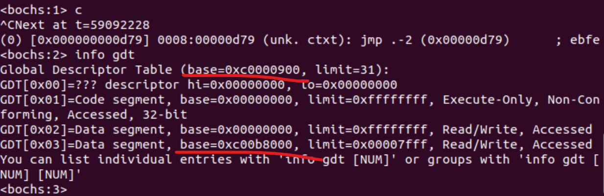

#### 5.2.6 用虚拟地址访问页表
页表是动态的数据结构，需要动态增删。
·申请内存时，需要增加页表项或是页目录项。
·释放内存时，需要清零页表项或是页目录项。
修改页表需要访问页表，如何用虚拟地址访问到页表自身？
虚拟内存映射如下：
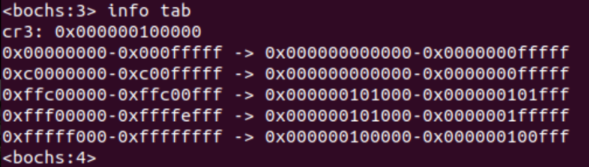
| 行数 | 虚拟地址 | 映射地址 |
| ---- | ---- | ---- | ---- |
| 1 | 0x0000 0000~0x000F FFFF | 虚拟空间低端1MB内存 |
| 2 | 0xC000 0000~0xC00F FFFF | 第768个页表，被我们设置成和1一样 |
| 3 | 0xFFC0 0000~0xFFC0 0FFF | 最后1个页目录项指向页目录的基址 |
| 4 | 0xFFF0 0000~0xFFF0 0FFF | 第768个页目录项，和3一致 |
| 5 | 0xFFFF F000~0xFFFF FFFF | 先找最后一个页目录项，然后找该目录指向的页表，再找页表最后一项。最后的低12位为0x000,所以得到本目录的基址 |

总结下用虚拟地址获取页表中各种数据类型的方法
获取页目录表物理地址：让虚拟地址的高20位0xFFFFF，低12位为0x000，即0xFFFF F000,这也是页目录表中的第0个页目录项自身的物理地址。
访问页目录中的页目录项，即获取页表物理地址：要使虚拟地址为0xFFFF FXXX，其中XXX是页目录项的索引乘以4的积。
访问页表中的页表项：使虚拟地址高10位为0x3FF，目的是获取页目录表物理地址。中间10位页表索引，最后12位也表内偏移地址。
公式为：0x3FF<<22+中间10位<<12+低12位。

#### 5.2.7 快表TLB
TLB存放虚拟地址页框与物理地址页框的映射关系的缓存。
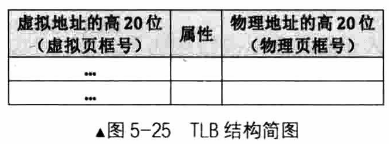

### 5.3 加载内核
#### 5.3.1 
编译c文件：
gcc 目标名 源文件
-c：生成目标文件，不进行链接
-o：指定文件名
-m32：在64位编译32位文件

file 文件名
查看文件情况
relocatable 待重定位 executable 可执行

nm 文件名
查看文件情况，显示main地址

ld 文件名 
-Ttext 指定起始地址
-e 指定入口函数
-o 指定目标文件名
-m 指定转化为32位

程序的默认入口地址是_start,c语言库替我们自动加入了不少东西。

#### 5.3.2 二进制程序的运行方法
程序头用来描述程序的布局信息，属于元数据
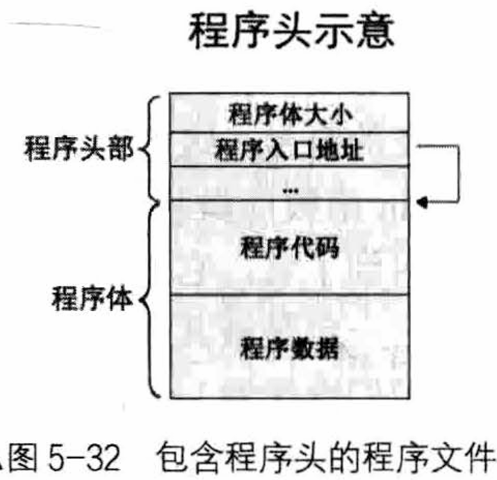

#### 5.3.3 elf格式的二进制文件
Linux下可执行文件格式是ELF，ELF文件是经过编译链接后的二进制可执行文件。
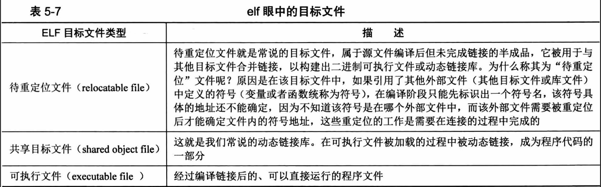
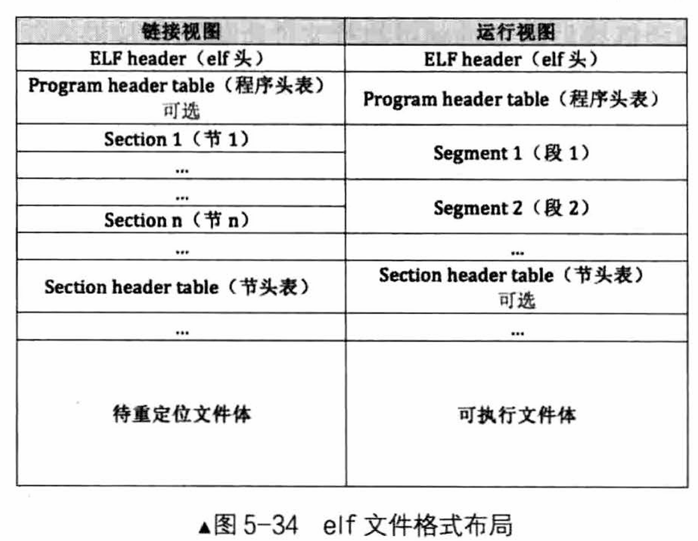
elf header 结构：
```
struct Elf32_Ehdr{
    unsigned char e_ident[16];
    Elf32_Half e_type;
    Elf32_Half e_machine;
    Elf32_Word e_version;
    Elf32_Addr e_entry;
    Elf32_Off e_phoff;
    Elf32_Off e_shoff;
    Elf32_Word e_flags;
    Elf32_Half e_ehsize;
    Elf32_Half e_phentsize;
    Elf32_Half e_phnum;
    Elf32_Half e_shentsize;
    Elf32_Half e_shnum;
    Elf32_Half e_shstrndx;
}
```
类型：
| 名称 | 字节 | 对齐 | 意义 |
| ---- | ---- | ---- | ---- |
| Elf32_Half | 2 | 2 | 无符号中等大小的整数 |
| Elf32_Word | 4 | 4 | 无符号大整数 |
| Elf32_Addr | 4 | 4 | 无符号程序运行地址 |
| Elf32_Off | 4 | 4 | 无符号的文件偏移量 |

e_ident[16]:
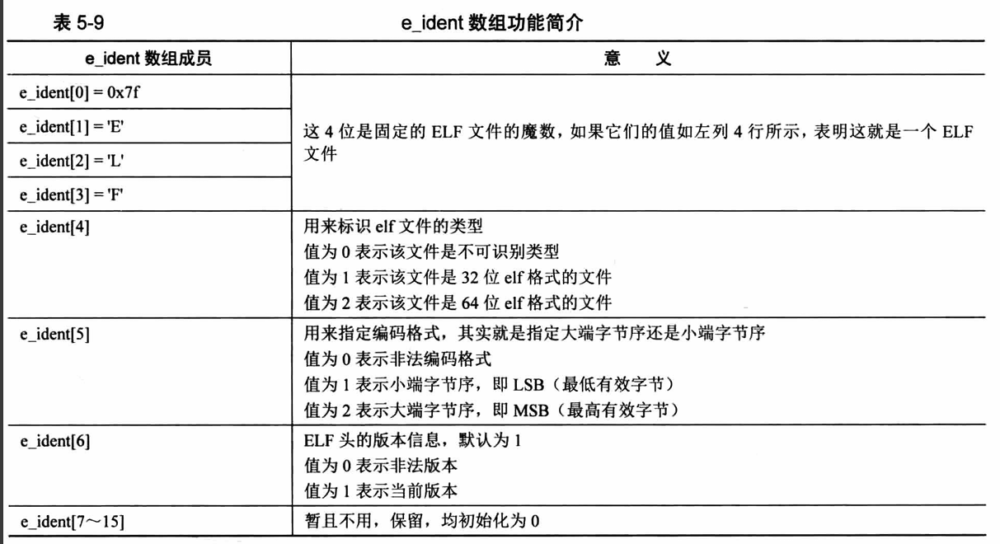
e_type:
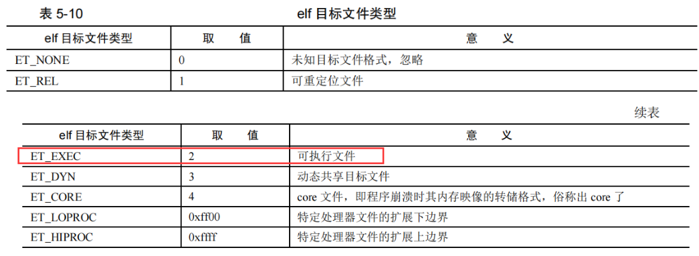
e_machine:
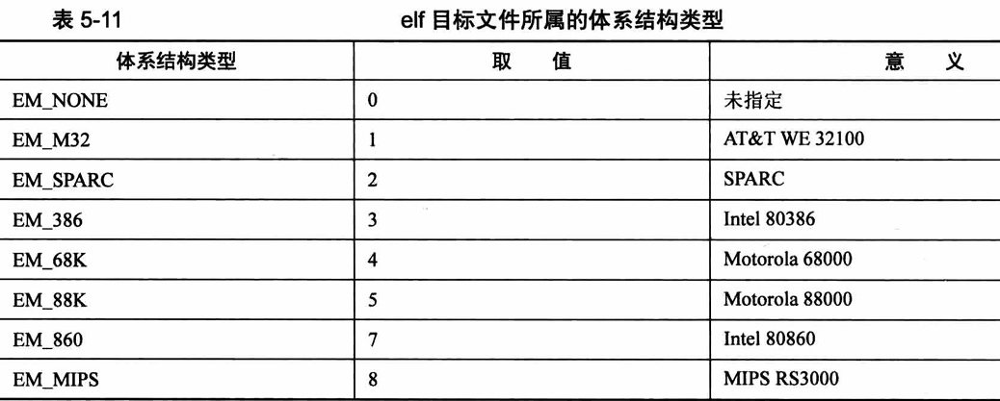
| 结构名 | 字节 | 作用 |
| ---- | ---- | ---- |
| e_version | 4 | 版本信息 |
| e_entry | 4 | 指明操作系统运行该程序时，控制权交给虚拟地址 |
| e_phoff | 4 | 指明程序头表在文件中的字节偏移量，没有表则为0 |
| e_shoff | 4 | 指明节头表在文件内的字节偏移量，没有表则为0 |
| e_flags | 4 | 指明和处理器相关的标志 |
| e_ehsize | 4 | 指明elf header的字节大小 |
| e_phentsize | 2 | 指明程序头表中条目的字节大小，即用来描述段信息的struct Elf32_Phdr的字节大小 |
| e_phnum | 2 | 指明程序头表中每个条目的数量，即段的个数。 |
| e_shentsize | 2 | 指明节头表中条目的字节大小，每个用来描述节信息的数据结构的字节大小 |
| e_shnum | 2 | 指明节头表中条目的数量，即节的个数 |
| e_shstrndx | 2 | 用来指明string name table在节头表中的索引index |

```
struct Elf32_Phdr{
    Elf32_Word p_type;
    Elf32_Off p_offset;
    Elf32_Addr p_vaddr;
    Elf32_Addr p_paddr;
    Elf32_Word p_filesz;
    Elf32_Word p_memsz;
    Elf32_Word p_flags;
    Elf32_Word p_align;
}
```
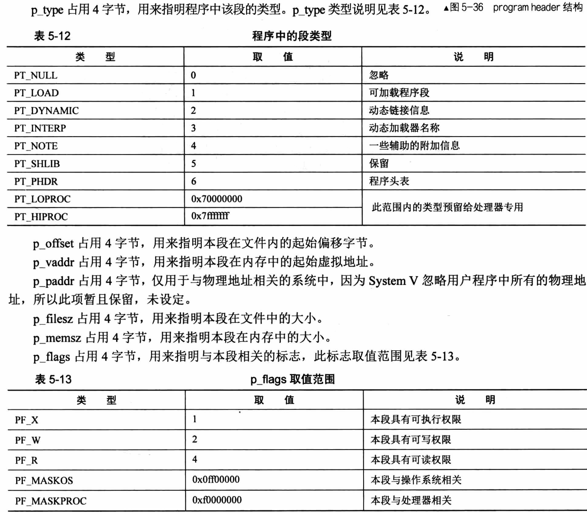

#### 5.3.5 将内核载入内存
```
; boot.inc
; kernel
KERNEL_START_SECTOR		equ	0x9
KERNEL_BIN_BASE_ADDR	equ	0x70000
KERNEL_ENTRY_POINT 		equ 0xc0001500

; program type 
PT_NULL					equ 0
```
```
;loader.asm line 153
 mov byte [gs:800], 'P'
    ;jmp $

; 加载内核kernel
    mov byte[gs:664],'k'
    mov byte[gs:666],'e'
    mov byte[gs:668],'r'
    mov byte[gs:670],'n'
    mov byte[gs:672],'e'
    mov byte[gs:674],'l'
    
    mov eax,KERNEL_START_SECTOR
    mov ebx,KERNEL_BIN_BASE_ADDR
    mov ecx,200

    call rd_disk_m_32

; 创建页目录、页表 初始化内存位图 
    call setup_page

; line 191
    jmp SELECTOR_CODE:enter_kernel
enter_kernel:
    call kernel_init
    mov esp,0xc009f000
    jmp KERNEL_ENTRY_POINT
;  将kernel.bin中的segment拷贝到编译的地址 
kernel_init:
   xor eax, eax
   xor ebx, ebx     ;ebx记录程序头表地址
   xor ecx, ecx     ;cx记录程序头表中的program header数量
   xor edx, edx     ;dx 记录program header尺寸,即e_phentsize

   mov dx, [KERNEL_BIN_BASE_ADDR + 42]    ; 偏移文件42字节处的属性是e_phentsize,表示program header大小
   mov ebx, [KERNEL_BIN_BASE_ADDR + 28]   ; 偏移文件开始部分28字节的地方是e_phoff,表示第1 个program header在文件中的偏移量
                      ; 其实该值是0x34,不过还是谨慎一点，这里来读取实际值
   add ebx, KERNEL_BIN_BASE_ADDR
   mov cx, [KERNEL_BIN_BASE_ADDR + 44]    ; 偏移文件开始部分44字节的地方是e_phnum,表示有几个program header
.each_segment:
   cmp byte [ebx + 0], PT_NULL        ; 若p_type等于 PT_NULL,说明此program header未使用。
   je .PTNULL

   ;为函数memcpy压入参数,参数是从右往左依然压入.函数原型类似于 memcpy(dst,src,size)
   push dword [ebx + 16]          ; program header中偏移16字节的地方是p_filesz,压入函数memcpy的第三个参数:size
   mov eax, [ebx + 4]             ; 距程序头偏移量为4字节的位置是p_offset
   add eax, KERNEL_BIN_BASE_ADDR      ; 加上kernel.bin被加载到的物理地址,eax为该段的物理地址
   push eax               ; 压入函数memcpy的第二个参数:源地址
   push dword [ebx + 8]           ; 压入函数memcpy的第一个参数:目的地址,偏移程序头8字节的位置是p_vaddr，这就是目的地址
   call mem_cpy               ; 调用mem_cpy完成段复制
   add esp,12                 ; 清理栈中压入的三个参数
.PTNULL:
   add ebx, edx               ; edx为program header大小,即e_phentsize,在此ebx指向下一个program header 
   loop .each_segment
   ret

; 逐字节拷贝 mem_cpy(dst,src,size)
;输入:(dst,src,size)
;输出:无

mem_cpy:              
   cld
   push ebp
   mov ebp, esp
   push ecx        ; rep指令用到了ecx，但ecx对于外层段的循环还有用，故先入栈备份
   mov edi, [ebp + 8]      ; dst
   mov esi, [ebp + 12]     ; src
   mov ecx, [ebp + 16]     ; size
   rep movsb           ; 逐字节拷贝

   ;恢复环境
   pop ecx      
   pop ebp
   ret

;line 310
```
```
;kernel/main.c
int main(void){
    while(1);
    return 0;
}
```
```
gcc -m32 -c -o kernel/main.o kernel/main.c
ld -m elf_i386 -Ttext 0xc0001500 -e main -o kernel.bin kernel/main.o
nasm -I include/ -o mbr.bin mbr.asm
nasm -I include/ -o loader.bin loader.asm
dd if=mbr.bin of=hd60M.img bs=512 count=1 conv=notrunc
dd if=loader.bin of=hd60M.img bs=512 count=4 seek=2 conv=notrunc
dd if=kernel.bin of=hd60M.img bs=512 count=200 seek=9 conv=notrunc
```
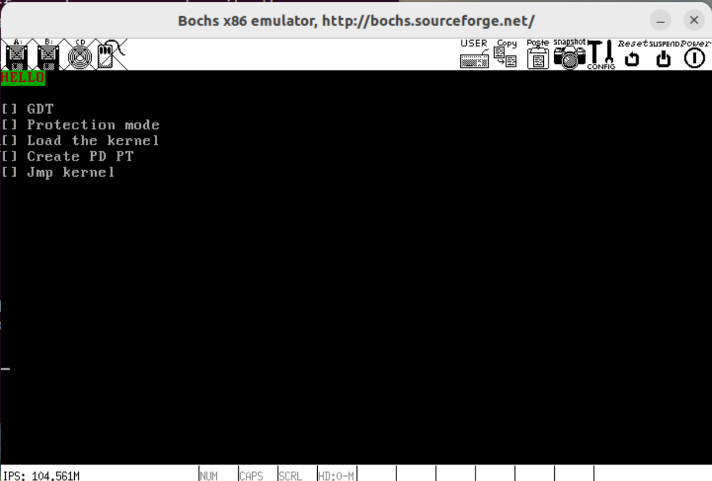

### 5.4 特权级
#### 5.4.2 TSS
TSS是用于存储任务环境的数据结构，最小位104B，它至多有4个特权级栈。


特权级转移：
1、由中断门、调用门等手段实现从低到高特权级的转移
2、由调用返回指令从高转移到低特权级
处理器只能由低向高特权级转移， TSS中所记录的栈是转移后的高特权级目标栈，TSS 中不需要记录3特权级的栈，因为3特权级是最低的，没有更低的特权级会向它转移。处理器由高向低的转移一定是在由高向低转移之前的，因此最初的栈地址一定是最低级的。

#### 5.4. CPL和DPL入门
CPL：CPU当前运行指令所属代码段中的DPL标签，即为当前特权级（CPL），任意时刻CPL在CS选择子的RPL部分。

受访者为数据段：只有访问者DPL权限 ≥ 被访问者DPL权限才能继续访问。
受访问者为代码段：只有访问者DPL权限== 被访问DPL权限才能访问，即平级访问。
唯一的特殊情况：中断发生后，处理器从中断处理程序中返回到用户态。这是由高特权到低特权的。

在数值上，CPL ≥一致性代码段的DPL
转移后的特权级不会被DPL替换，而是保持原本的CPL，并未提升。
代码段可以有一直和非一致，但数据段只有非一致。

#### 5.4.4  门、调用门与RPL序
门结构是基于段描述符的记录一段程序起始地址的描述符。除了任务门外，其他三种门对应一段函数，存放的是段选择子和偏移量.
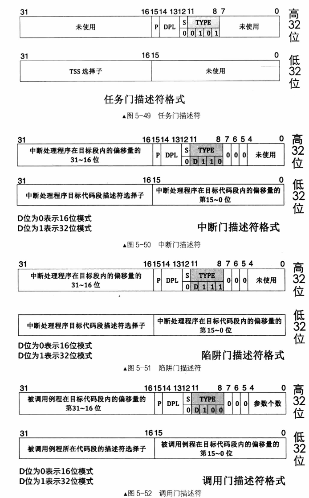

门结构的存放位置：
1. 任务门可以放在GDT、 LDT和IDT 中
2. 位于GDT、LDT中
3. 中断门和陷阱门仅位于IDT中。

提供的四种门都可以实现从低特权级的代码段到高特权级的代码段。
1. 调用门：call/jmp 后接调用门选择子
2. 中断门：int指令主动发中断。linux系统调用此中断门实现。
3. 陷阱门：int3指令主动发中断。编译器调试时
4. 任务门：任务以任务状态段TSS为单位，用来实现任务切换，可用同中断门、调用门方式使用

5.4.5 调用门的过程保护
调用门存的是内核服务程序所在代码段的选择子及在代码段中的偏移地址。
用户程序需要系统服务时可以调用该调用门以获得内核帮助:
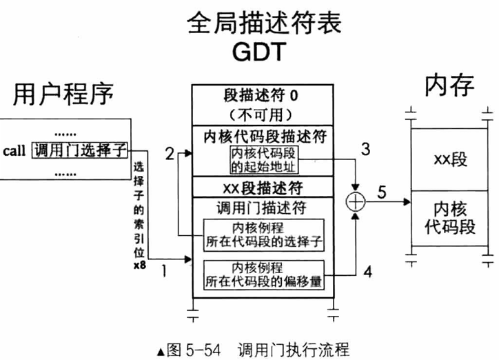

其过程如下（假设从3特权级到0特权级）：
1、在3特权级栈压入所需参数
2、根据目标代码段DPL（0特权级），TSS寻找合适的段选择子SS和栈指针ESP，记SS_new和ESP_new
3、检查新栈段DPL和type，未达标报异常
4、若新DPL≥CPL，暂存SS old和SS new；切换新栈后把SS old和SS new入新栈
5、将ss_old和esp_old压入新栈中，ss old的高16位充0.
6、根据调用门描述符中的参数个数决定复制几个参数。
7、使用调用门调用后，将旧的cs，eip加载到栈中。
8、加载调用门中的代码段选择子到cs，将偏移量加载到eip。
若果是平级转移，直接跨过中间到第7步

retf指令从调用门返回的过程：
1、检查cs选择子的rpl位。
2、栈中弹出eip_old到eip，弹出cs_old到cs中。
3、跳开参数，让esp_new指向esp_old.
4、将esp_old加载到esp寄存器和ss_old加载到ss寄存器。

#### 5.4.6 RPL
RPL是为了防止有意为止的人利用调用门非法破坏系统资源
RPL是请求特权级，是请求的程序的特权级
当发生转移时，要求RPL和CPL的特权必须同时大于等于受访者的特权DPL

#### 5.4.7 IO特权级
IO读写特权是由标志寄存器eflags中的IOPL位和TSS中的IO位图决定的，它们用来指定执行IO操作的最小特权级。 
当CPL ≥ IOPL时 可以指向IO指令，访问所有IO端口
当CPL < IOPL时 可以通过设置IO位图来管理某些端口的权限（IO位图仅在此时生效）
IO位图在TSS中，如果IO位图的偏移地址大于等于TSS段界限，则表明没有IO位图，此时表示系统不支持某些端口开发，当CPL < IOPL时默认全部端口关闭。
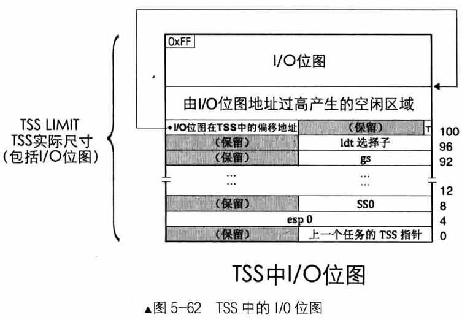

IO位图最后一字节为0xFF，作用：
1. 作边界，避免越界
2. 允许IO位图不映射所有端口