### 4.2 初见保护模式
实模式的弊端：
1. 最大可用内存1MB
2. 用户程序可以随意修改段基址:段偏移访问到任何物理地址
3. CPU利用率低，一次只能运行一个程序

保护模式的CPU运行环境从实模式的16位变成32位

#### 4.2.1 寄存器扩展
除段寄存器外，通用寄存器、指令指针寄存器、标志寄存器都由原来的16位扩展到了32位。
为了向下兼容，寄存器低16位可单独使用，但高16位仅能在低16位生效时才能使用。
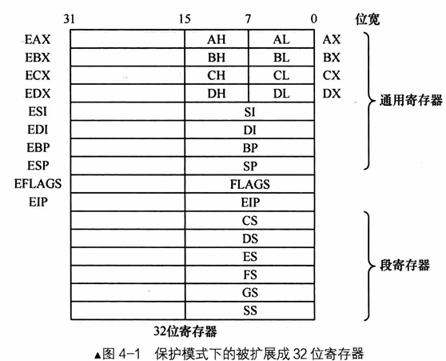

为什么段寄存器仍是16位？
段寄存器在保护模式下存储的已经不再是段基址，是段选择子，详见4.3节

#### 4.2.2 寻址扩展
保护模式下，基址变址的寄存器没有限制，可以使用任意通用寄存器，并且还可对变址寄存器乘以比例因子（1、2、4、8）：
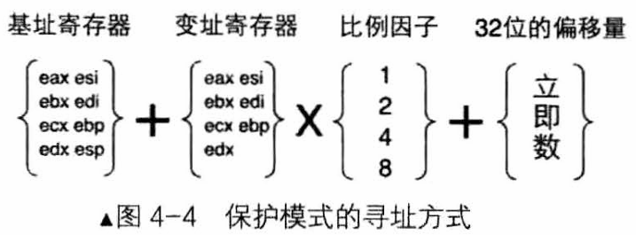

#### 4.2.3 运行模式反转
实模式可以使用32位的资源。同样保护模式也可以使用16位的资源。在某个模式下，可以使用另一模式下的资源，为了区分指令属于哪一模式使用bits指令指定编译模式：
[bits 16］16位的机器码
[bits 32］32位的机器码
bits的作用域：从当前bits标签直到下一bits标签

反转前缀0x66：
在指令中添加了0x66反转前缀之后，指令的操作码就会变为另一种模式的操作码，只在当前指令有效。
寻址方式反转前缀0x67：
同上，寻址模式变化。

#### 4.2.4 指令扩展
mul指令/imul指令：相乘指令
指令格式：mul/imul 寄存器／内存
如果乘数是8位，al作另一个乘数，结果16位，在寄存器ax。
如果乘数是16位，ax作另一个乘数，结果32位，在寄存器eax。
如果乘数是32位，eax 作另一个乘数，结果64位，存入edx(高32位):eax(低32位)

div:无符号数除法指令
如果除数是8位，被除数就是ax(16位)。结果：al(商) ah(余数)
如果除数是16位，被除数就是dx(高16位):ax(低16位)。结果：ax(商) dx(余数)
如果除数是32位，被除数就是edx(高32位):eax(低32位)。结果：eax(商) edx(余数)

push指令：
无论实模式还是保护模式
push 16位数据 栈指针-2
push 32位数据 栈指针-4
实模式：
push 8位数据 将其扩展为16位后再将入栈，栈指针-2
保护模式：
push 8位数据 将其扩展为32位后再将入栈，栈指针-4

### 4.3 全局描述符表 GDT
全局描述符表GDT是保护模式下等级内存段的段基址、段属性的数据结构，它能保证一定的安全性。

#### 4.3.1 段描述符
保护模式下，段基址被等记在GDT的段描述符中，段描述符还可以登记段权限、段界限等内容，大小为64bit
段描述符结构如下：
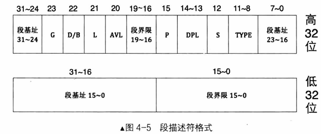
段描述符各字段作用：
| 段名 | 长度/位 | 功能 | 说明 |
| ---- | ---- | ---- | ---- |
| 段基址 | 32 | 段的起始地址 | |
| G | 1 |  描述段界限的粒度 | 0:1B,1:4KB |
| 段界限 | 20 | 描述段的界限 | 段界限边界值=（描述符中段界限+1）*（段界限的粒度大小：4KB或是1B）-1 |
| S | 1 | 描述段的类型 | 0:系统段,1:数据段 |
| type | 4 | 配合S使用，标记段的类型 | 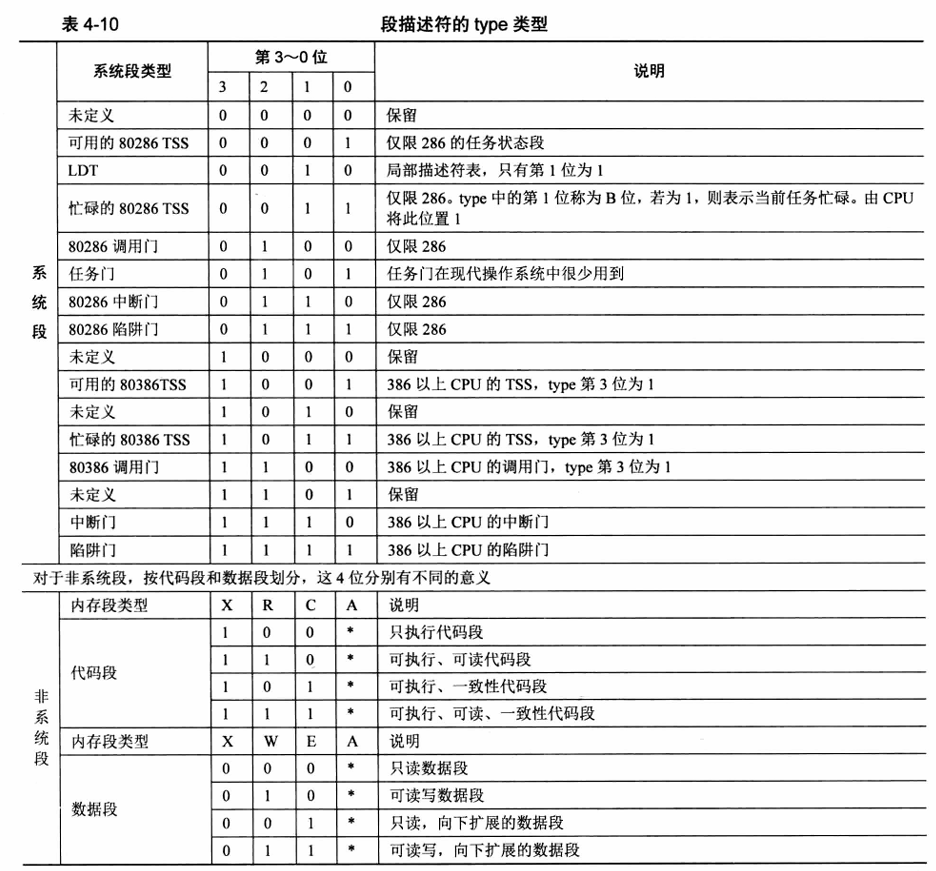 |

这里的S=1时，表示该段为非系统段，A置0，CPU访问后会置1；C表示一致性代码段，0表示非一致性；RW表示是否可读写；X表示是否可执行。
| 段名 | 长度/位 | 功能 | 说明 |
| ---- | ---- | ---- | ---- |
| DPL | 2 | 特权级  | 操作系统是0特权级，用户程序是3特权级 |
| P | 1 |  段是否存在于内存中 | 0:不存在,1:存在 |
| AVL | 1 | 没有专门用途 |  |
| L | 1 | 代码段模式 | 1:64位,0:32位 |
| D/B | 1 | 对于代码段D：0/1,有效地址和操作数为16bit/32bit，指令有效地址用IP/EIP寄存器 | 对于栈段B：涉及到栈指针的选择和栈地址上限；0/1使用的是sp/esp寄存器，也就是栈的起始位置是16/32位寄存器的最大寻址范围。0xFFFF/0xFFFFFFFF |

#### 4.3.2 GDT、局部描述符表LDT、选择子
GDT是存储段描述符的数组结构，它的地址由GDTR寄存器存储
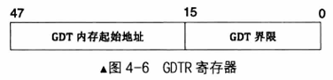
访问gdtr需要用lgdt指令，其格式：lgdt 48位内存数据
GDT的第0个描述符表不可用：避免用户未初始化选择子导致选择GDT第0段。

如何使用描述符表和段描述符？
段寄存器之所以不扩展成32位的的原因，是因为它存着所要访问的段在GDT的索引——段选择子，所以保护模式访问地址的方法是"段选择子:段内偏移"的方式。段描述符与内存段的关系以及选择子的结构如下所示：
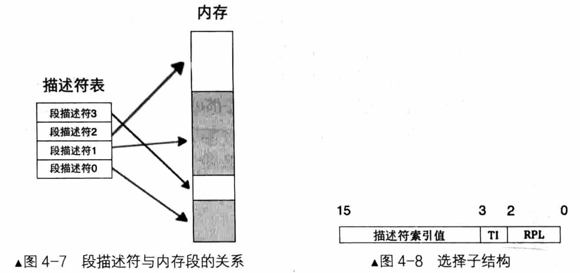
| 名称 | 位序 | 作用 |
| ---- | ---- | ---- |
| RPL | 0-1 | 表示请求特权级 |
| TI | 2 | 区分是GDT还是LDT，0:GDT,1:LDT |
| index | 3 | 索引，最多为2^13^=8192个段 |

在保护模式，任一寄存器都能够访问到所有空间，因此访问地址不再像以前那样段基址x4+段偏移，直接从段描述符表得到的段基址+段偏移得到地址。

LDT：CPU厂商为支持多任务而创建的表，一个任务对应一个LDT，LDTR和lldt同上。

#### 4.3.3 打开A20地址线
地址回绕：在实模式下，当段基址：段偏移超出最大范围时，会重新从0开始，相当于取余，这是由于进位的A20的信号丢弃导致的（计算机组成原理）：
如果A20Gate被打开，当访问0x100000-0x10FFEF之间的地址时， CPU将真正访问这块物理内存。
如果A20Gate被禁止，当访问0x100000-0x10FFEF之间的地址时， CPU将采8086/8088 的地址回绕。
打开方法：
```
;端口0x92置1
in  al,   0x92
or  al,   0000_0010B
out 0x92, al
```

#### 4.3.4 保护模式的开关，CR0寄存器的PE0
控制寄存器CRx是展示CPU的内部状态，用于控制CPU运行机制的寄存器：
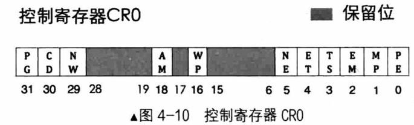
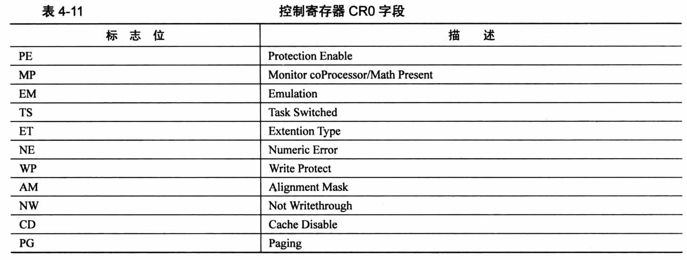
```
;打开PE
mov eax, cr0
or  eax, 0000_0001B
mov cr0, eax
```

#### 4.3.5 进入保护模式
步骤：
(1)打开A20
(2)加载gdt
(3)cr0置pe为1

```
;更新boot.inc
;loader 和 kernel
LOADER_BASE_ADDR    equ 0x900
LOADER_START_SECTOR equ 0x2
LOADER_STACK_TOP    equ LOADER_BASE_ADDR
;gdt描述符属性 
DESC_G_4K           equ 100000000000000000000000b
DESC_D_32           equ  10000000000000000000000b
DESC_L              equ   0000000000000000000000b 
DESC_AVL            equ    000000000000000000000b 
DESC_LIMIT_CODE2    equ     11110000000000000000b
DESC_LIMIT_DATA2    equ     DESC_LIMIT_CODE2
DESC_LIMIT_VIDEO2   equ      0000000000000000000b 
DESC_P              equ         1000000000000000b 
DESC_DPL_0          equ          000000000000000b 
DESC_DPL_1          equ          010000000000000b 
DESC_DPL_2          equ          100000000000000b 
DESC_DPL_3          equ          110000000000000b
DESC_S_CODE         equ            1000000000000b 
DESC_S_DATA         equ             DESC_S_CODE
DESC_S_sys          equ            0000000000000b 
DESC_TYPE_CODE      equ             100000000000b
;x=1,c=0,r=0,a=0 代码段是可执行的，非一致性，不可读，巳访问位a清零
DESC_TYPE_DATA      equ             001000000000b 
;x=0,e=0,w=1,a=0 数据段是不可执行的，向上扩展的，可写，己访问位a清零

DESC_CODE_HIGH4     equ           (0x00<<24) + DESC_G_4K + DESC_D_32 + \
DESC_L + DESC_AVL + DESC_LIMIT_CODE2 + \
DESC_P + DESC_DPL_0 + DESC_S_CODE + \
DESC_TYPE_CODE + 0x00

DESC_DATA_HIGH4     equ           (0x00<<24) + DESC_G_4K + DESC_D_32 + \
DESC_L + DESC_AVL + DESC_LIMIT_DATA2 + \
DESC_P + DESC_DPL_0 + DESC_S_DATA + \
DESC_TYPE_DATA + 0x00

DESC_VIDEO_HIGH4    equ           (0x00<<24) + DESC_G_4K + DESC_D_32 + \
DESC_L + DESC_AVL + DESC_LIMIT_VIDEO2 + \
DESC_P + DESC_DPL_0 + DESC_S_DATA + \
DESC_TYPE_DATA + 0x0b

;选择子属性
RPL0    equ 00b 
RPL1    equ 01b 
RPL2    equ 10b 
RPL3    equ 11b 
TI_GDT   equ 000b
TI_LDT   equ 100b
```
```
;修改mbr读入扇区
;mbr.asm
mov cx ,4             ;从1修改为4
call rd_disk_m_16
```
```
;修改loader
%include "boot.inc"
section loader vstart=LOADER_BASE_ADDR
jmp loader_start 

;构建gdt及其内部的描述符
GDT_BASE:           dd 0x00000000
                    dd 0x00000000

CODE_DESC:          dd 0x0000FFFF
                    dd DESC_CODE_HIGH4

DATA_STACK_DESK:    dd 0x0000FFFF
                    dd DESC_DATA_HIGH4

VIDEO_DESC:         dd 0x80000007               ;limit=(0xbffff-0xb8000)/4k=0x7
                    dd DESC_VIDEO_HIGH4         ;此时dp1为0

GDT_SIZE            equ $-GDT_BASE
GDT_LIMIT           equ GDT_SIZE-1
times 60 dq 0       ;预留60个段描述符

SELECTOR_CODE       equ (0x0001<<3)+TI_GDT+RPL0  ;相当于 (CODE_DESC-GDT_BASE)/8+TI_GDT+RPL0
SELECTOR_DATA       equ (0x0002<<3)+TI_GDT+RPL0
SELECTOR_VIDEO      equ (0x0003<<3)+TI_GDT+RPL0 

gdt_ptr             dw GDT_LIMIT
                    dd GDT_BASE

loadermsg           db '2 loader in real.'

loader_start: 
    ;打印字符串
    mov byte[gs:640],'L'
    mov byte[gs:642],'O'
    mov byte[gs:644],'A'
    mov byte[gs:646],'D'
    mov byte[gs:648],'E'
    mov byte[gs:650],'R'
    mov byte[gs:652],'_'
    mov byte[gs:654],'S'
    mov byte[gs:656],'T'
    mov byte[gs:658],'A'
    mov byte[gs:660],'R'
    mov byte[gs:662],'T'

;子功能号13打印字符串
    mov sp,LOADER_BASE_ADDR
    mov bp,loadermsg
    mov cx,17
    mov ax,0x1301
    mov bx,0x001f
    mov dx,0x1800
    int 0x10

    ;---准备进入保护模式---
    ;---打开A20---
    in al,0x92
    or al,0000_0010B
    out 0x92,al
   
    ;---加载GDT---
    lgdt [gdt_ptr]
    
    ;---cr0第0个位置1
    mov eax,cr0 
    or eax,0x00000001
    mov cr0,eax 

    jmp dword SELECTOR_CODE:p_mode_start ;刷新流水线

[bits 32]
p_mode_start:
    mov ax,SELECTOR_DATA
    mov ds,ax
    mov es,ax
    mov ss,ax 
    mov esp,LOADER_STACK_TOP
    mov ax,SELECTOR_VIDEO
    mov gs,ax

    mov byte [gs:800], 'P'
    jmp $
```
```
nasm -I include/ -o mbr.bin mbr.asm
nasm -I include/ -o loader.bin loader.asm
dd if=mbr.bin of=hd60M.img bs=512 count=1 conv=notrunc
dd if=loader.bin of=hd60M.img bs=512 count=4 seek=2 conv=notrunc
```
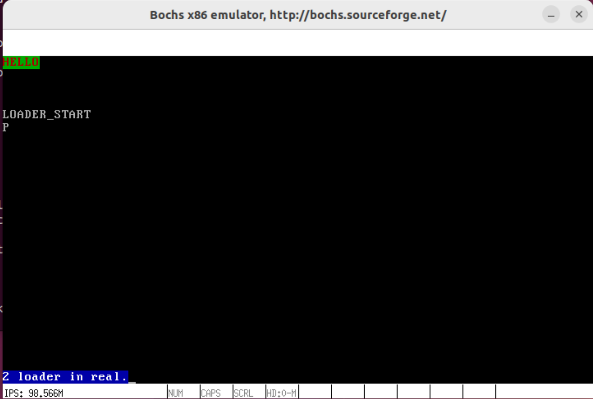

### 4.4 处理器微架构
流水线：
处理器为了缓和高速设备和低速IO设备的矛盾，提高CPU效率提出的方法:
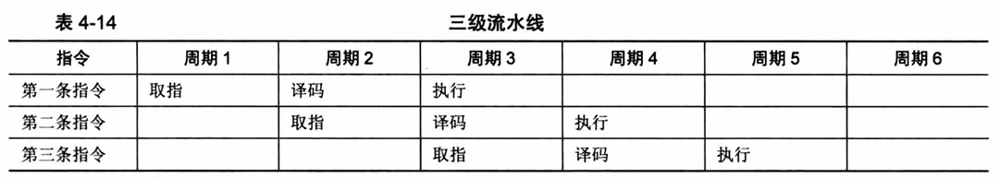

乱序执行：
指令的执行顺序不影响结果，就可以利用流水线提高效率
不能乱序执行：
```
mov eax,[0x1234]
mov eax,ebx
```
更改后可乱序执行：
```
mov eax,[0x1234]
mov ecx,ebx
```

缓存：
根据局部性原理，把最近访问过用较高速的设备存储起来，可以提高效率
在保护模式下，多了段描述符缓冲寄存器，它记录最近访问的段基址和权限等，提高效率用。

分支预测：
分支语句会决定程序走向，无法使用流水线提高效率，加入分支预测部件，预测下次将会执行的语句，提高效率。
分支目标缓冲器BTB：
BTB 中记录着分支指令地址， CPU 遇到分支指令时，先用分支指令的地址在 BTB 中查找，若找到相同地址的指令，根据跳转统计信息判断是否把相应的预测分支地址上的指令送上流水线。在真正执行时，根据实际分支流向，更新BTB中跳转统计信息。但BTB无相同记录时，使用Static Predictor静态预测器（它是由人们经过大量统计之后，根据某些特征总结出来的）若向上跳转则转移会发生，若向下跳转则转移不发生。

### 4.5 远跳转指令清空流水线，更新段描述符缓冲寄存器
jmp dword SELECTOR_CODE:p_mode_start 
在进入保护模式前，段描述符缓冲寄存器是实模式下的地址会导致段基址错误，同时会导致进行保护模式的CPU译实模式之前流水线的码出现错误，使用jmp远跳转指令可以刷新段描述符缓冲寄存器并刷新流水线。

### 4.6 保护模式的保护
#### 4.6.1 向段寄存器加载选择子时的保护
越界保护：
处理器先检查TI的值，如果TI是0，从全局描述符表寄存器gdtr中拿到GDT表基址和表界限。如果TI是1，则从局部描述符表寄存器IDT中拿到LDT表基址和表界限。比较段选择子的索引是否越表界限。
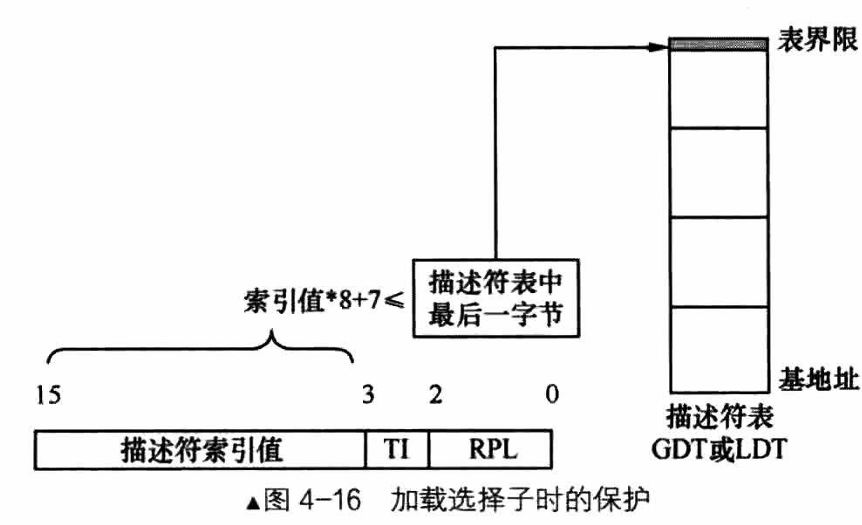

类型保护：
只有具备可执行属性的段（代码段〉才能加载到cs段寄存器中。
只具备执行属性的段（代码段〉不允许加载到除cs外的段寄存器中。
只有具备可写属性的段（数据段）才能加载到SS栈段寄存器中。
至少具备可读属性的段才能加载到DS、ES、FS、GS段寄存器中。
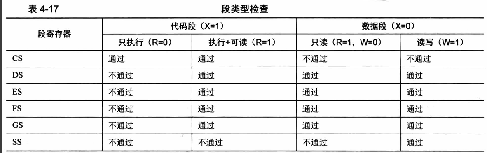

#### 4.6.2 代码段和数据段的保护
越界检查：
EIP中的偏移地址＋指令长度-1 ≤ 实际段界限大小

#### 4.6.3 栈段的保护
对于向上扩展的段，实际的段界限是段内可以访问的最后一字节。
对于向下扩展的段，实际的段界限是段内不可以访问的第一个字节。
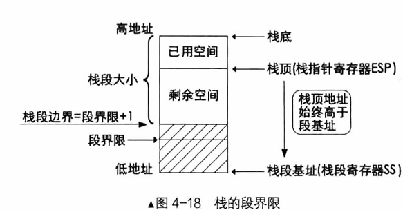
如果G为0，实际的段界限大小＝描述符中的段界限。
如果G为1，实际的段界限大小＝描述符中段界限*0x1000+0xFFF。
实际段界限+l ≤ esp-操作数大小 ≤ 0xFFFFFFFF