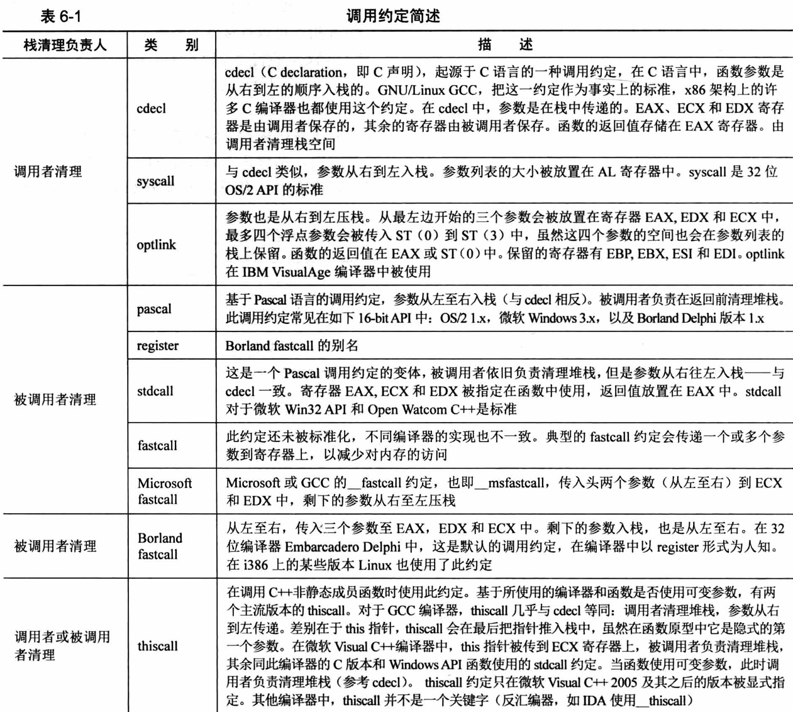
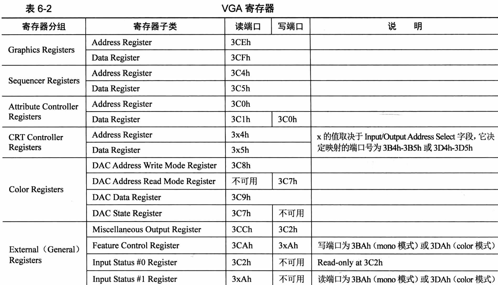
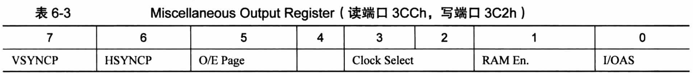
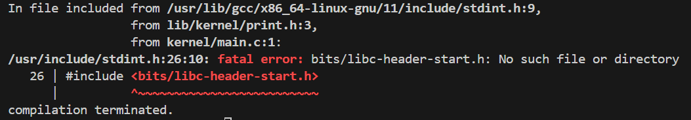
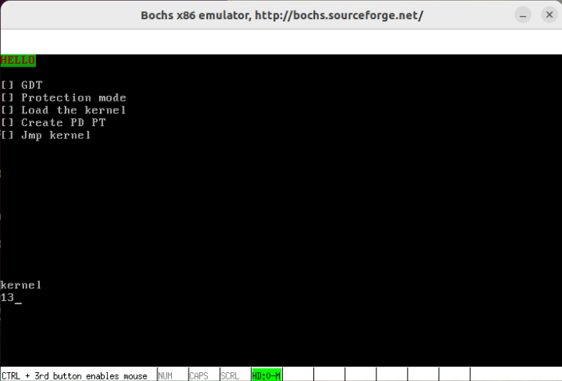
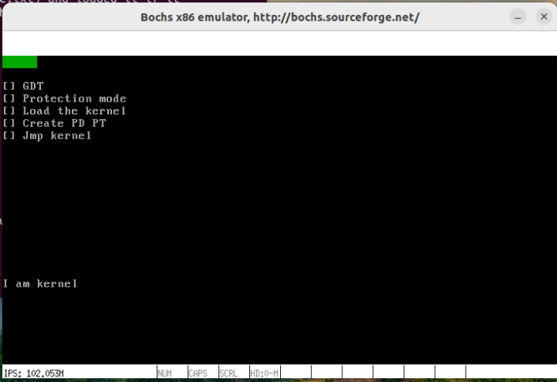
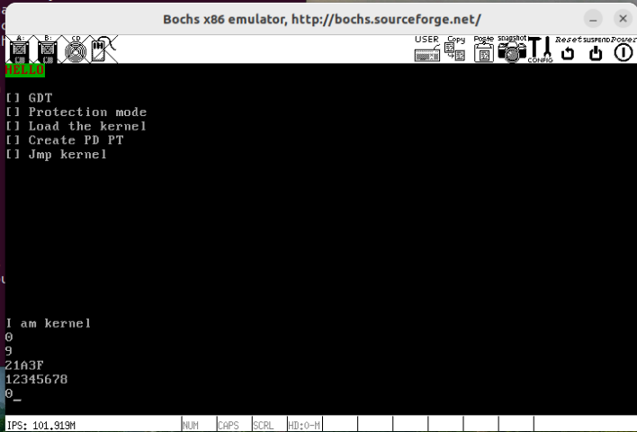

### 6.1 调用约定

主要使用cdecl和stdcall，他们都约定调用者将参数从右向左入栈，区别在于cdecl要求调用者清理栈空间，stdcall要求被调用者清理栈空间

### 6.2 汇编语言和C语言混合编程
#### 6.2.1 C库函数和系统调用
系统调用方法：
1. 将系统调用指令封装为c库函数，通过库函数进行系统调用，操作简单。
2. 不依赖任何库函数，直接通过汇编指令int与操作系统通信。

#### 6.2.2 汇编语言和 C语言共同协作
1. 混合编程：单独的汇编文件+单独的C语言文件分别编译后成为目标文件后，一起链接成为可执行程序。
2. 内嵌汇编：在C语言中嵌入汇编代码，直接编译成为可执行程序。
3. c代码和汇编代码可以相互调用：
>   汇编提供外部引用关键字global,引用外部符号关键字extern
>   C代码中符号定义为全局便可以被外部引用，引用外部符号使用extern声明

### 6.3 实现自己的打印函数
#### 6.3.1 显卡的端口控制

图中端口号有x的端口由Miscellaneous Output Register 寄存器中的 Input/Output Address Select（IOAS）字段决定。

当IOAS=0时,x=B
当IOAS=1时,x=D
Miscellaneous Output Register 默认为 0x67，即IOAS=1。

#### 6.3.2 实现单字符打印
```
;lib/stdint.h
#ifndef __LIB_STDINT_H
#define __LIB_STDINT_H
typedef signed char 			int8_t;
typedef signed short int 		int16_t;
typedef signed int 				int32_t;
typedef signed long long int 	int64_t;
typedef unsigned char 			uint8_t;
typedef unsigned short int 		uint16_t;
typedef unsigned int 			uint32_t;
typedef unsigned long long int 	uint64_t;
#endif
```
```
;lib/kernel/print.asm
TI_GDT  equ 0
RPL0    equ 0
SELECTOR_VIDEO  equ (0x0003 << 3) + TI_GDT + RPL0

[bits 32]
section .text

;----------------- put_char ------------------
;功能描述：把栈中一个字符写入光标处
;---------------------------------------------
global put_char
put_char:
    pushad
    mov ax,SELECTOR_VIDEO
    mov gs,ax

    ;;;;;;;;;;获取当前光标位置;;;;;;;;;
    ;高8位
    mov dx,0x03d4
    mov al,0x0e
    out dx,al
    mov dx,0x03d5
    in al,dx
    mov ah,al

    ;低8位
    mov dx,0x03d4
    mov al,0x0f
    out dx,al
    mov dx,0x03d5
    in al,dx
    
    ;光标放入 bx
    mov bx,ax
    ;放入待打印的字符
    mov ecx,[esp + 36] ;因为pushad压入4*8=32字节,还要跳过4字节的返回地址。
    cmp cl,0xd ;回车符号
    jz .is_carriage_return 
    cmp cl,0xa ;换行符号
    jz .is_line_feed

    cmp cl,0x8 ;Backspace的ascll码是0x8
    jz .is_backspace
    jmp .put_other

.is_backspace:
    dec bx
    shl bx,1 ;坐标左移1位,并将等待删除的字节补上0或空格
    mov byte [gs:bx],0x20
    inc bx
    mov byte [gs:bx],0x07
    shr bx,1
    jmp .set_cursor

.put_other:
    shl bx,1
    mov [gs:bx],cl
    inc bx
    mov byte [gs:bx],0x07
    shr bx,1
    inc bx
    cmp bx,2000
    jl .set_cursor

.is_line_feed:          ;换行符 LF(\n)
.is_carriage_return:    ;回车符 CR(\r)
    xor dx,dx
    mov ax,bx
    mov si,80
    div si
    sub bx,dx

.is_carriage_return_end:
    add bx,80
    cmp bx,2000
.is_line_feed_end:      ;若是LF(\n),将光标移+80即可
    jl .set_cursor

;滚屏，把屏幕的 1-24行搬运到第 0-23 行
;再将第 24 行用空格填充。
.roll_screen:
    cld
    mov ecx,960
    mov esi,0xc00b80a0;第一行首部
    mov edi,0xc00b8000;第零行首部
    rep movsd

    ;空白填充最后一行
    mov ebx,3840
    mov ecx,80

.cls:
    mov word [gs:ebx], 0x0720;黑底白字空格键
    add ebx,2
    loop .cls
    mov bx,1920

.set_cursor:
;设置光标为 bx 值
;高8位
    mov dx,0x03d4
    mov al,0x0e
    out dx,al
    mov dx,0x03d5
    mov al,bh
    out dx,al
;低8位
    mov dx,0x03d4
    mov al,0x0f
    out dx,al
    mov dx,0x03d5
    mov al,bl
    out dx,al
.put_char_done:
    popad
    ret
```
```
;lib/kernel/print.h
#ifndef __LIB_KERNEL_PRINT_H
#define __LIB_KERNEL_PRINT_H
#include "stdint.h"
void put_char(uint8_t char_asci);
#endif
```
```
;main.c
#include "print.h"
void main(void){
    put_char('k');
    put_char('e');
    put_char('r');
    put_char('n');
    put_char('e');
    put_char('l');
    put_char('\n');
    put_char('1');
    put_char('2');
    put_char('\b');
    put_char('3');
}
```
```
nasm -f elf -o lib/kernel/print.o lib/kernel/print.asm
gcc -m32 -I lib/kernel -c -o kernel/main.o kernel/main.c
```
报错：

解决方法：
```
sudo apt-get install gcc-multilib
```
```
ld -m elf_i386 -Ttext 0xc0001500 -e main -o kernel.bin kernel/main.o lib/kernel/print.o
dd if=kernel.bin of=hd60M.img bs=512 count=200 seek=9 conv=notrunc
```


#### 6.3.3 实现字符串打印
```
;添加lib/kernel/print.asm
section .text
;------------- put_str ----------------------
global put_str
put_str:
    push ebx
    push ecx
    xor ecx,ecx
    mov ebx, [esp+12]
.goon:
    mov cl,[ebx]
    cmp cl,0
    jz .str_over
    push ecx
    call put_char
    add esp,4
    inc ebx
    jmp .goon
.str_over:
    pop ecx
    pop ebx
    ret
;----------------- put_char ------------------
```
```
;print.h添加声明
void put_str(char *message);
```
```
;main.c
#include "print.h"
void main(void){
    put_str("I am kernel\n"); 
    while(1);
}
```
同6.3.2编译：


#### 6.3.4 实现整数打印
```
;print.asm
;line 5
section .data 
put_int_buffer dq   0
;line 139
;----------------- put_int ------------------
global put_int
put_int:
    pushad
    mov ebp,esp
    mov eax,[ebp+4*9]
    mov edx,eax
    mov edi,7
    mov ecx,8
    mov ebx,put_int_buffer
;将32位数字按照16进制的形式从低到高位逐个处理
;共处理8个十六进制数字
.16based_4bits:
    and edx,0x0000000F
    cmp edx,9
    jg .is_A2F
    add edx,'0'
    jmp .store 
.is_A2F:
    sub edx,10
    add edx,'A'
.store:
    mov [ebx+edi],dl 
    dec edi 
    shr eax,4 
    mov edx,eax 
    loop .16based_4bits
.ready_to_print:
    inc edi 
.skip_prefix_0:
    cmp edi,8
    je .full0
.go_on_skip:
    mov cl,[put_int_buffer+edi]
    inc edi 
    cmp cl,'0'
    je .skip_prefix_0;判断继续下一个字符是否是字符0
    dec edi 
    jmp .put_each_num 

.full0:
    mov cl,'0'
.put_each_num:
    push ecx
    call put_char 
    add esp,4 
    inc edi 
    mov cl,[put_int_buffer+edi]
    cmp edi,8
    jl .put_each_num
    popad 
    ret
```
```
;print.h增加声明
void put_int(uint32_t num);
```
```
;main.c
#include "print.h"
int main(void){
    put_str("I am kernel\n");
    put_int(0); 
    put_char('\n'); 
    put_int(9); 
    put_char('\n'); 
    put_int(0x00021a3f); 
    put_char('\n'); 
    put_int(0x12345678); 
    put_char('\n'); 
    put_int(0x00000000);

    while(1);
    return 0;
}
```
编译同上


### 6.4 内联汇编
#### 6.4.2 汇编语言AT&T
内联汇编使用的语言是AT&T语法。

AT&T以数字表示内存地址，$数字表示立即数
AT&T内存寻址：segreg(段基址) : base_address(offset_address,index,size)
其表示:base_address+ offset_address+ index*size

#### 6.4.3 基本内联汇编
格式：
```
asm [volatile] ("assembly code")  
```
gcc中有宏：
#define __asm__ asm
#define __volatile__ volatile
assembly code规则：
1. 双引号不能少
2. 双引号不跨行，跨行用'\'
3. 指令分隔符';'、'\n'、'\t'等
4. 若要引用c变量，变量需要定义为全局变量

#### 6.4.4 扩展内联汇编
内联汇编如何让C变量称为操作码？
```
asm [volatile] ("assembly code":output:intput:clobber/modify) 
```
output用于指定汇编代码数据输出到C代码
格式："操作数修饰符 约束名"(C变量名)
input用于指定C数据输入到汇编代码中
格式："[操作数修饰符] 约束名"(C变量名)
[]为可选项，""()不可省略，多个操作数用','分隔

寄存器约束：
a:寄存器eax/ax/al
b:寄存器ebx/bx/bl
c:寄存器ecx/cx/cl
d:寄存器edx/dx/dl
D:寄存器edi/di
S:寄存器esi/si
q:表示任意这4个通用寄存器之一：eax/ebx/ecx/edx
r:表示任意这6个通用寄存器之一: eax/ebx/ecx/edx/esi/edi
g:表示可以存放到任意地点（寄存器和内存）
A:把eax和edx组合成64位整数
f:表示浮点寄存器
t:表示第 1 个浮点寄存器
u:表示第 2 个浮点寄存器
内存约束：
m:表示操作数可用任意形式内存
o:操作数为内存变量
立即数约束：
i:整数立即数
F:浮点数立即数
I:0-31的立即数
J:0-63的立即数
N:0-255的立即数
O:0-32的立即数
X:任何类型立即数
通用约束：
0-9:仅用于input部分
在内嵌汇编中表示寄存器为"%%eax"，原因是%作为了占位符

序号占位符:%+0-9的数字 表示从output开始的第零个引用变量
在数字前插入h表示操作高8位，插入b表示操作低8位
名称占位符:
在内联汇编语句声明操作符时这样 [名称]"约束名"(c变量) 可以给变量取别名
可以用%名称表示引用该变量的别名

操作数修饰符：
'=':只写
'+':可读性
'&':只供output使用，独占寄存器

clobber\modify用于告诉编译器可能造成寄存器/内存破坏，告诉编译器进行保存。