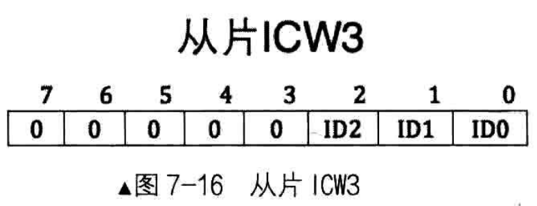
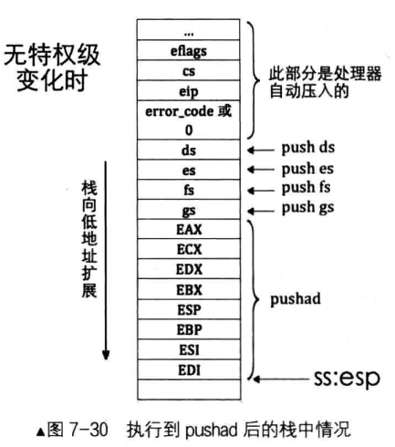
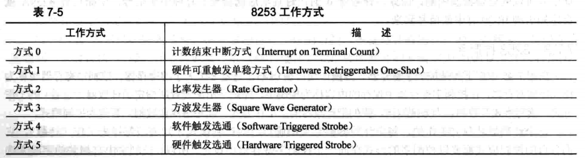

### 7.3 中断分类
中断分为内部中断和外部中断（来自CPU内或外），外部中断被分为可屏蔽中断和不可屏蔽中断，内部中断被分为软中断和异常

#### 7.3.1 外部中断
CPU设置了两条信号线：INTR和NMI

外部中断来自硬件，又称硬件中断
可屏蔽中断：来自INTR引脚的中断信号不一定会造成系统损害，它可以根据eflags寄存器的IF位选择屏蔽或不屏蔽。
不可屏蔽中断：来自NMI引脚进入CPU的中断信号，表示系统发生了致命的错误，需要立即处理

#### 7.3.2 内部中断
内部中断分为软中断和异常
软中断来自软件，由软件主动发起

可发起的中断的指令：
- int 8位立即数：系统调用
- int3：调试断点，触发中断向量号3
- into：中断溢出，触发中断向量号4
- bound：数组索引越界，触发中断向量号5
- ud2：未定义，触发中断向量号6，无实际用途用于软件测试

异常：指令执行期间CPU内部产生的错误引起的。（上述除了系统调用都是异常）
异常影响到用户程序的中断异常，因此不受IF位影响，不可屏蔽
异常的三个等级：
（1）faul(故障)：有益中断，易修复，如缺页故障
（2）trap(陷阱)：调试用
（3）abort(终止)：错误无法修复
异常会有错误码error code，CPU会压入栈


中断向量号的作用类似于段选择子，用于在中断描述符表找到相应的中断处理程序

异常和不可屏蔽中断的中断向量号是由 CPU 自动提供
可屏蔽中断号是由中断代理（8259A）提供的
软中断是由软件提供的

### 7.4 中断描述符表(IDT)
计算机中用门来表示一段程序的入口。
IDT是保护模式下用于存储各种门的表，包括中断描述符、任务门描述符、陷阱门描述符，他们的本质都是相应程序的起始地址。


门的S字段都等于0，都属于系统段，大小都为8字节

1. 任务门：Intel 处理器在硬件一级提供的任务切换机制，大多数OS未使用该门，可以存在于GDT、LDT、IDT
2. 中断门：进入中断后会将eflags的IF位置0（也就是关中断），仅存在于IDT
3. 陷阱门：同上，但不会关中断
4. 调用门：提供给用户进程进入特权0级的方式，存在于GDT、LDT

IDTR存储IDT地址和界限，其最大有64KB/8B=8192个中断向量、
IDT不同于GDT，第0个向量
加载IDTR指令：lidt 48位内存

#### 7.4.1 中断处理过程及中断保护
中断过程分为CPU外和CPU内
CPU外：由中断代理芯片接收中断信号并把中断向量号发送给CPU
CPU内：CPU执行相应的中断处理程序

CPU内处理步骤：
（1）根据中断向量号定位中断门描述符：中断向量号*8+IDTR
（2）处理器进行特权级检查：a. 若是软中断，则要求权限 CPL ≥ 门描述符DPL以及 CPL ≤ 目标代码段DPL b.若是外部设备和异常，则只要求CPL ≤ 目标代码段DPL
（3）执行中断处理程序：加载门描述符中的段选择子

中断发生后，会置NT位和TF位为0，若是中断门，还会置iF位为0
IF位避免中断嵌套
TF位用于调试表示禁止单步执行 
NT位用来标记任务嵌套调用的情况，iret指令会根据NT位呈现不同的功能，当NT=0时从中断返回，当NT=1时返回到调用自己执行的那个旧任务

#### 7.4.2 中断发生时的压钱
涉及特权级变化，寄存器入栈情况及顺序：

A. 保存旧栈SS_old和ESP_old
B. 压栈EFLAGS寄存器
C. 备份CS:IP
D. 根据异常是否有错误码压入错误码

未设计特权级变化，栈无变化：


中断中的错误码需要手动弹出栈，返回时页要检查特权级 CPL要小于等于数据段DPL

#### 7.4.3 中断错误码
用于指明错误发生的段

EXT字段：指明中断源是否来自CPU外
IDT字段：选择子是否指向中断描述符表 IDT
TI字段：为0时指明选择子是从 GDT 检索描述符，为1时是从 LDT 检索描述符。

### 7.5 可编程中断控制器8259A
#### 7.5.1 8259A
8259A 用于管理和控制可屏蔽中断，可通过编程设置功能
单片8259A仅有8个中断请求信号线，每个中断源通过一个IRQ发送中断信号，也就是只能支持8个中断，但Intel支持256个中断，因此需要级联8259A

| 寄存器名 | 作用 | 说明 |
| ---- | ---- | ---- |
| INT | 选出优先级最高的IRQ | |
| INTA | 中断响应信号 | 接收CPU的中断响应信号 |
| IMR | 中断屏蔽寄存器 | 1表示中断屏蔽 0表示中断放行 |
| IRR | 中断请求寄存器 | 锁存IMR过滤后的中断请求 |
| PR | 优先级仲裁器 | 找出优先级更高的中断 |
| ISR | 中断服务寄存器 | 当某个中断正在被处理时，保存在此寄存器中 |

8259A工作流程（中断的CPU外流程）：
1. 中断发出信号通过中断请求接口IRQ
2. 检查IMR是否屏蔽该IRQ接口，若是丢弃，若否置对应IRR对应的IRQ位为1
3. PR选择最高优先级中断（IRQ 接口号越低，优先级越大）送入INT
4. INT向CPU发生INTR信号
5. CPU回复INTA信号
6. 8259A设置ISR对应IRQ位为1，表示政治处理中断，同时删去IRR对应位
7. CPU再次发送INTA信号，请求中断向量号
8. 8259A回复起始中断向量号+IRQ接口号给CPU
当执行完中断处理程序后，EOI若为非自动模式，CPU得向8259A发生EOI代码令8259A清空ISR对应位。若为自动模式8259A会自动清0


#### 7.5.2 8259A的编程
IR0-IR7被BIOS的0x8-0xf的中断向量号占据

ICW寄存器组用于初始化8259A，OCW寄存器组用于操控8259A
ICW1：

其作用是初始化连接方式和中断信号触发方式，需要写入主片的0x20端口和从片的0xA0端口
IC4：表示是否要写入ICW4
SNGL：表示是否级联，1：单片，0：级联
ADI：设置 8085 的调用时间间隔， x86 不需要设置
LTIM：设置中断检测方式，0：边沿触发，1：电平触发

ICW2：

其作用是设置起始中断向量号，需要写入到主片的0x21端口和从片的0xA1端口，只填写高 位

ICW3：


仅在级联的方式使用，其作用是设置主片和从片以哪个IRQ接口互连，需要写入主片的 0x21 端口及从片的 0xA1 端口
主片：置1位表示连接从片，置0位表示连接外设
从片：低三位表示连接主片的接口

ICW4：

SFNM：表示特殊全嵌套模式，0表示全嵌套，1表示特殊全嵌套
BUF：是否工作在缓冲模式
M/S：当BUF=1时M/S=1表示主片0表示从片，当BUF=0无效
AEOI：表示自动结束中断，上文介绍的自动模式
µPM：用于兼容老处理器，表示微处理器模型

OCW1：

用于屏蔽外部中断信号，需要写入到主片的0x21端口和从片的0xA1端口

OCW2：

用来设置中断结束方式和优先级模式，需要写入到主片的0x20端口和从片的0xA0端


OCW3：
作用时设定特殊屏蔽方式和查询方式，需要写入到主片的0x20端口和从片的0xA0端口

### 7.6 编写中断处理程序
#### 7.6.1 中断处理程序
								    
启动中断流程： 1）init_all()---调用---> idt_init() 2.1）idt_init()---调用--->pic_init() :初始化8259A  2.2）idt_init()---调用--->idt_desc_init() :初始化IDT 3）	---最后--->lidt		    

汇编宏指令：
```
%macro 宏名字 参数个数
宏代码体
%endmacro

;例如：
%macro mult_add 3
mov eax,%1
add eax,%2
add eax,%3
%endmacro
;%+数字用于引用参数
```
```
;kernel/kernel.asm
[bits 32]
;用于处理错误码的情况
%define ERROR_CODE nop
%define ZERO	push 0

extern put_str

section .data
intr_str db "interrupt occur!", 0xa, 0
global intr_entry_table
intr_entry_table:

%macro VECTOR	2
section .text
intr%lentry:
	%2
	push intr_str
	call put_str
	add esp,4
	;如果是从从片上进入的中断，除了往从片发送EOI，主片也发送EOI
	mov al,0x20	;中断结束命令EOI
	out 0xa0,al ;向从片发送
	out 0x20,al ;向主片发送
	add esp,4
	iret
section .data
	dd	intr%1entry
%endmacro

;定义了33个中断处理程序，其内容都是打印字符串”interrupt occur!”后退出
VECTOR 0x00,ZERO
VECTOR 0x01,ZERO
VECTOR 0x02,ZERO
VECTOR 0x03,ZERO
VECTOR 0x04,ZERO
VECTOR 0x05,ZERO
VECTOR 0x06,ZERO
VECTOR 0x07,ZERO
VECTOR 0x08,ZERO
VECTOR 0x09,ZERO
VECTOR 0x0a,ZERO
VECTOR 0x0b,ZERO
VECTOR 0x0c,ZERO
VECTOR 0x0d,ZERO
VECTOR 0x0e,ZERO
VECTOR 0x0f,ZERO
VECTOR 0x10,ZERO
VECTOR 0x11,ZERO
VECTOR 0x12,ZERO
VECTOR 0x13,ZERO
VECTOR 0x14,ZERO
VECTOR 0x15,ZERO
VECTOR 0x16,ZERO
VECTOR 0x17,ZERO
VECTOR 0x18,ZERO
VECTOR 0x19,ZERO
VECTOR 0x1a,ZERO
VECTOR 0x1b,ZERO
VECTOR 0x1c,ZERO
VECTOR 0x1d,ZERO
VECTOR 0x1e,ERROR_CODE
VECTOR 0x1f,ZERO
VECTOR 0x20,ZERO
```
创建中断描述符表 IDT ，安装中断处理程序
```
;kernel/interrupt.c
#include "interrupt.h"
#include "stdint.h"
#include "global.h"

//略

#define IDT_DESC_CNT	0x21	//支持的中断数目

// 中断门描述符结构体
struct gate_desc{
    uint16_t    func_offset_low_word;
    uint16_t    selector;
    uint8_t     dcount;
    uint8_t     attribute;
    uint16_t    func_offset_high_word;
};

//静态函数声明 非必须
static void make_idt_desc(struct gate_desc* p_gdesc, uint8_t attr, intr_handler function);
static struct gate_desc idt[IDT_DESC_CNT]; // idt 是中断描述符表
// 声明引用定义在 kernel.S 中的中断处理函数入口数组
extern intr_handler intr_entry_table[IDT_DESC_CNT]; 

//略

/*创建中断门描述符*/
static void make_idt_desc(struct gate_desc* p_gdesc, uint8_t attr, intr_handler function) { 
    p_gdesc->func_offset_low_word = (int32_t)function & 0x0000FFFF;
    p_gdesc->selector = SELECTOR_K_CODE;
    p_gdesc->dcount = 0;
    p_gdesc->attribute = attr;
    p_gdesc->func_offset_high_word = ((uint32_t)function & 0xFFFF0000) >> 16;
}
/*初始化中断描述符表*/
static void idt_desc_init(void){
    int i;
    for(i = 0; i < IDT_DESC_CNT; ++i){
        make_idt_desc(&idt[i], IDT_DESC_ATTR_DPL0, intr_entry_table[i]);
    }
    put_str("   idt_desc_init done\n");
}

 /*完成有关中断的所有初始化工作*/
 void idt_init(){
    put_str("idt_init start\n");
    idt_desc_init();    // 初始化中断描述符表
    pic_init();         //初始化8259A

    /*加载 idt*/
    uint64_t idt_operand = ((sizeof(idt) - 1) | ((uint64_t)((uint32_t)idt << 16))); 
    asm volatile("lidt %0"::"m"(idt_operand));
    put_str("idt_init done\n");
 }
```
```
;interrupt.h
typedef void * intr_handler;
```
```
;global.h
#ifndef __KERNEL_GLOBAL_H
#define __KERNEL_GLOBAL_H
#include "stdint.h"

#define RPL0    0
#define RPL1    1
#define RPL2    2
#define RPL3    3

#define TI_GDT  0
#define TI_LDT  1

#define SELECTOR_K_CODE ((1<<3)+(TI_GDT<<2)+RPL0)
#define SELECTOR_K_DATA ((2<<3)+(TI_GDT<<2)+RPL0)
#define SELECTOR_K_STACK SELECTOR_K_DATA
#define SELECTOR_K_GS   ((3<<3)+(TI_GDT<<2)+RPL0)

/*********** IDT 描述符属性 ************/
#define IDT_DESC_P      1
#define IDT_DESC_DPL0   0
#define IDT_DESC_DPL3   3
#define IDT_DESC_32_TYPE    0xE // 32 位的门
#define IDT_DESC_16_TYPE    0x6 // 16 位的门,不会用到
// 定义它只为和 32 位门区分

#define IDT_DESC_ATTR_DPL0  \
    ((IDT_DESC_P << 7) + (IDT_DESC_DPL0 << 5) + IDT_DESC_32_TYPE)
#define IDT_DESC_ATTR_DPL3  \
    ((IDT_DESC_P << 7) + (IDT_DESC_DPL3 << 5) + IDT_DESC_32_TYPE)

#endif
```
用内联汇编实现端口 I/O 函数
```
;lib/kernel/io.h
/******************机器模式 ******************* 
  * b -- 输出寄存器 QImode 名称，即寄存器中的最低 8 位:[a-d]l 
  * w -- 输出寄存器 HImode 名称，即寄存器中 2 个字节的部分,如[a-d]x
  * HImode
  * "Half-Integer"模式，表示一个两字节的整数
  * QImode
  * "Quarter-Integer"模式，表示一个一字节的整数
 ******************************************************/

#ifndef __LIB_IO_H
#define __LIB_IO_H
#include "stdint.h"

/* 向端口 port 写入一个字节*/
static inline void outb(uint16_t port, uint8_t data){
    /*对端口指定 N 表示 0～255, d 表示用 dx 存储端口号,
        %b0 表示对应 al,%w1 表示对应 dx */
    asm volatile ( "outb %b0, %w1" : : "a" (data), "Nd" (port)); 
}

/* 将 addr 处起始的 word_cnt 个字写入端口 port */
static inline void outsw(uint16_t port, const void* addr, uint32_t word_cnt) { 
/********************************************************* 
    +表示此限制即做输入,又做输出. 
    outsw 是把 ds:esi 处的 16 位的内容写入 port 端口，我们在设置段描述符时, 
    已经将 ds,es,ss 段的选择子都设置为相同的值了，此时不用担心数据错乱｡ */ 
    asm volatile ("cld; rep outsw":"+S"(addr), "+c" (word_cnt):"d"(port));
}
/* 将从端口 port 读入的一个字节返回 */
static inline uint8_t inb(uint16_t port){
    uint8_t data;
    asm volatile ("inb %wl, %b0":"=a"(data):"Nd"(port));
    return data;
}

/* 将从端口 port 读入的 word_cnt 个字写入 addr */ 
static inline void insw(uint16_t port, void* addr, uint32_t word_cnt) { 
/****************************************************** 
    insw 是将从端口 port 处读入的 16 位内容写入 es:edi 指向的内存, 
    我们在设置段描述符时，已经将 ds,es,ss 段的选择子都设置为相同的值了, 
    此时不用担心数据错乱｡ */ 
    asm volatile ("cld; rep insw" : "+D" (addr), "+c" (word_cnt) : "d" (port) : "memory"); 
} 

#endif
```
设置 8259A并加载IDT
```
//略
#include "io.h"
#include "interrupt.h"
#include "stdint.h"
#include "global.h"
//略
#define IDT_DESC_CNT	0x21	//支持的中断数目
#define PIC_M_CTRL  0x20    // 主片的控制端口是 0x20 
#define PIC_M_DATA  0x21    // 主片的数据端口是 0x21
#define PIC_S_CTRL  0xa0    // 从片的控制端口是 0xa0
#define PIC_S_DATA  0xa1    // 从片的数据端口是 0xa1
//略
// 中断门描述符结构体
struct gate_desc{
    uint16_t    func_offset_low_word;
    uint16_t    selector;
    uint8_t     dcount;
    uint8_t     attribute;
    uint16_t    func_offset_high_word;
};

//静态函数声明 非必须
static void make_idt_desc(struct gate_desc* p_gdesc, uint8_t attr, intr_handler function);
static struct gate_desc idt[IDT_DESC_CNT]; // idt 是中断描述符表
// 声明引用定义在 kernel.S 中的中断处理函数入口数组
extern intr_handler intr_entry_table[IDT_DESC_CNT]; 

/*初始化可编程中断处理器 8259A*/
static void pic_init(void) {
    /*初始化主片 */ 
    outb (PIC_M_CTRL, 0x11); // ICW1: 边沿触发,级联 8259, 需要 ICW4 
    outb (PIC_M_DATA, 0x20); // ICW2: 起始中断向量号为 0x20 
    // 也就是 IR[0-7] 为 0x20 ～ 0x27 
    outb (PIC_M_DATA, 0x04); // ICW3: IR2 接从片
    outb (PIC_M_DATA, 0x01); // ICW4: 8086 模式, 正常 EOI 

    /*初始化从片 */ 
    outb (PIC_S_CTRL, 0x11); // ICW1: 边沿触发,级联 8259, 需要 ICW4 
    outb (PIC_S_DATA, 0x28); // ICW2: 起始中断向量号为 0x28 
    // 也就是 IR[8-15]为 0x28 ~ 0x2F 
    outb (PIC_S_DATA, 0x02); // ICW3: 设置从片连接到主片的 IR2 引脚
    outb (PIC_S_DATA, 0x01); // ICW4: 8086 模式, 正常 EOI 

    /*打开主片上 IR0,也就是目前只接受时钟产生的中断 */ 
    outb (PIC_M_DATA, 0xfe); //1111 1110
    outb (PIC_S_DATA, 0xff); 

    put_str(" pic_init done\n"); 
}

/*创建中断门描述符*/
static void make_idt_desc(struct gate_desc* p_gdesc, uint8_t attr, intr_handler function) { 
    p_gdesc->func_offset_low_word = (int32_t)function & 0x0000FFFF;
    p_gdesc->selector = SELECTOR_K_CODE;
    p_gdesc->dcount = 0;
    p_gdesc->attribute = attr;
    p_gdesc->func_offset_high_word = ((uint32_t)function & 0xFFFF0000) >> 16;
}
/*初始化中断描述符表*/
static void idt_desc_init(void){
    int i;
    for(i = 0; i < IDT_DESC_CNT; ++i){
        make_idt_desc(&idt[i], IDT_DESC_ATTR_DPL0, intr_entry_table[i]);
    }
    put_str("   idt_desc_init done\n");
}

/*完成有关中断的所有初始化工作*/
void idt_init(){
    put_str("idt_init start\n");
    idt_desc_init();    // 初始化中断描述符表
    pic_init();         //初始化8259A

    /*加载 idt*/
    uint64_t idt_operand = ((sizeof(idt) - 1) | ((uint64_t)((uint32_t)idt << 16))); 
    asm volatile("lidt %0"::"m"(idt_operand));
    put_str("idt_init done\n");
}
```
```
;kernel/init.c
#include "init.h"
#include "print.h"
#include "interrupt.h"

/*负责初始化所有模块*/
void init_all()
{
    put_str("init_all\n");
    idt_init(); //初始化中断
}
```
```
;kernel/main.c
#include "print.h"
#include "init.h"
int main(void){
    put_str("I am kernel\n");
    
    init_all();
    asm volatile("sti");

    while(1);
    return 0;
}
```
建立了build目录用于存放生成的文件
```
nasm -I include/ -o build/mbr.bin mbr.asm
nasm -I include/ -o build/loader.bin loader.asm
gcc -I lib/kernel/ -I lib/ -I kernel/ -m32 -s -w -c -fno-builtin -o build/main.o kernel/main.c -fno-stack-protector
nasm -f elf -o build/print.o lib/kernel/print.asm
nasm -f elf -o build/kernel.o kernel/kernel.asm
gcc -I lib/kernel/ -I lib/ -I kernel/ -m32 -s -w -c -fno-builtin -o build/interrupt.o kernel/interrupt.c -fno-stack-protector
gcc -I lib/kernel/ -I lib/ -I kernel/ -m32 -s -w -c -fno-builtin -o build/init.o kernel/init.c -fno-stack-protector
ld -m elf_i386 -Ttext 0xc0001500 -e main -o build/kernel.bin build/main.o build/init.o build/interrupt.o build/print.o build/kernel.o
dd if=build/mbr.bin of=hd60M.img bs=512 count=1 conv=notrunc
dd if=build/loader.bin of=hd60M.img bs=512 count=4 seek=2 conv=notrunc
dd if=build/kernel.bin of=hd60M.img bs=512 count=200 seek=9 conv=notrunc
```
运行结果：


#### 7.6.2 改进中断处理程序
```
;kernel/interrupt.c  line 26
extern intr_handler intr_entry_table[IDT_DESC_CNT]; 
char *intr_name[IDT_DESC_CNT];  //保存异常的名字
/*定义中断处理程序数组，在kernel.asm中定义的intrXXentry
    只是中断处理程序的入口，最终调用的是 ide_table 中的处理程序*/
intr_handler idt_table[IDT_DESC_CNT];

;line 88
/*完成一般中断处理函数注册及异常名称注册*/
static void exception_init(void){
    int i;
    for(i = 0; i < IDT_DESC_CNT; ++i){
        /*idt_table中的函数是在进入中断后根据中断向量好调用的
        见kernel/kernel.asm 的 call[idt_table + %1*4]*/
        idt_table[i] = general_intr_handler;
        //默认为general_intr_handler
        //以后会有 register_handler注册具体的处理函数
        intr_name[i] = "unknown";   //先统一为 "unknown"
    }
    intr_name[0] = "#DE Divide Error";
    intr_name[1] = "#DB Debug Exception";
    intr_name[2] = "NMI Interrupt";
    intr_name[3] = "#BP Breakpoint Exception";
    intr_name[4] = "#OF Overflow Exception";
    intr_name[5] = "#BR BOUND Range Exceeded Exception";
    intr_name[6] = "#UD Invalid Opcode Exception";
    intr_name[7] = "#NM Device Not Available Exception";
    intr_name[8] = "#DF Double Fault Exception";
    intr_name[9] = "Coprocessor Segment Overrun"; 
    intr_name[10] = "#TS Invalid TSS Exception";
    intr_name[11] = "#NP Segment Not Present";
    intr_name[12] = "#SS Stack Fault Exception";
    intr_name[13] = "#GP General Protection Exception"; 
    intr_name[14] = "#PF Page-Fault Exception";
    // intr_name[15] 第 15 项是 intel 保留项,未使用
    intr_name[16] = "#MF x87 FPU Floating-Point Error";
    intr_name[17] = "#AC Alignment Check Exception"; 
    intr_name[18] = "#MC Machine-Check Exception";
    intr_name[19] = "#XF SIMD Floating-Point Exception";
    intr_name[0x20] = "#CLOCK";
}
```
```
;kernel/kernel.asm line 6
extern put_str
extern idt_table

section .data
intr_str db "interrupt occur!", 0xa, 0
global intr_entry_table
intr_entry_table:

%macro VECTOR	2
section .text
intr%1entry:
	%2
	;保存环境
	push ds
	push es
	push fs 
	push gs 
	pushad 
	;如果是从从片上进入的中断，除了往从片发送EOI，主片也发送EOI
	mov al,0x20	;中断结束命令EOI
	out 0xa0,al ;向从片发送
	out 0x20,al ;向主片发送
	push %1
	call [idt_table + %1 * 4];调用idt_table中的C版本中断处理函数
	jmp intr_exit
section .data
	dd	intr%1entry
%endmacro

section .text
global intr_exit
intr_exit:
	add esp,4;跳过中断号码
	popad 
	pop gs 
	pop fs 
	pop es 
	pop ds 
	add esp,4
	iretd 
```
利用push指令保存上下文环境，pushad压寄存器的顺序是EAX->ECX->EDX->EBX->ESP->EBP->ESI->EDI
push完后栈情况：

编译运行
```
nasm -f elf -o build/kernel.o kernel/kernel.asm
gcc -I lib/kernel/ -I lib/ -I kernel/ -m32 -s -w -c -fno-builtin -o build/interrupt.o kernel/interrupt.c -fno-stack-protector
ld -m elf_i386 -Ttext 0xc0001500 -e main -o build/kernel.bin build/main.o build/init.o build/interrupt.o build/print.o build/kernel.o
dd if=build/kernel.bin of=hd60M.img bs=512 count=200 seek=9 conv=notrunc
```


### 7.7 可编程计数器/定时8253简介
#### 7.7.1 时钟
计算机时钟分为内部时钟、外部时钟
内部时钟：用于控制、同步内部工作过程的步调，粒度精细通常为ns级，无法改变，由位于主板上晶体振荡器产生，其频率经过分频之后得到的就是主板的外频，外频的倍数为主频，CPU是基于主频的，
外部时钟：处理器与外部设备或外部设备之间通信时采用的一种时序

为了使CPU和外设协调，需要设置时许配合，
方法一：软件实现，令CPU空转等待
方法二：硬件实现，设定时器，到达计数时间就发送信号

定时器的计数方式：
（1）正计时：每1次时钟脉冲发生时，将当前计数值加1，直到与设定的目标终止值相等时，提示时间已到，典型的例子就是闹钟
（2）倒计时：先设定好计数器的值，每一次时钟脉冲发生时将计数值减1，直到为0时提示时间已到，典型的例子是电风扇的定时

#### 7.7.2 8253入门

8259是倒计时工作
CLK：时钟输入信号，计数器字自己的时钟
GATE：门控输入信号
OUT：输出信号
计数初值寄存器：记录计数初值
计数器执行部件：真正计数部件
输出锁存器：让外界可以随时获取当前计数值


#### 7.7.3 8253控制字

SC1-SC0：通道选择
RW1-RW0：读/写/锁存操作位
BCD：数制位，是BCD码（1）还是二进制码（0）
M2-M0：工作模式选择位

计数器开始计时的两个条件（1）GATE=1（2）计数初值已写入


#### 7.7.5 8253初始化步骤
1. 往控制字寄存器端口 0x43 中写入控制字
2. 在所指定使用的计数器端口中写入计数初值

### 7.8 提高时钟中断的频率
1. 使用计数器0
2. 选择工作方式2
3. 设置计数初值 1193180/中断频率=初值（1193180/100Hz≈11932）
```
;timer.c
#include "timer.h"
#include "io.h"
#include "print.h"

#define IRQ0_FREQUENCY      100
#define INPUT_FREQUENCY     1193180
#define COUNTER0_VALUE      INPUT_FREQUENCY / IRQ0_FREQUENCY
#define CONTRER0_PORT       0x40
#define COUNTER0_NO         0
#define COUNTER_MODE        2
#define READ_WRITE_LATCH    3  
#define PIT_CONTROL_PORT    0x43

/* 把操作的计数器 counter_no､ 读写锁属性 rwl､ 计数器模式
counter_mode 写入模式控制寄存器并赋予初始值 counter_value */ 
static void frequency_set(uint8_t counter_port, \
                        uint8_t counter_no,\
                        uint8_t rwl,\
                        uint8_t counter_mode,\
                        uint16_t counter_value){
    /* 往控制字寄存器端口 0x43 中写入控制字 */ 
    outb(PIT_CONTROL_PORT,(uint8_t)(counter_no << 6 | rwl << 4 | counter_mode << 1));
    /* 先写入 counter_value 的低 8 位 */
    outb(counter_port, (uint8_t)counter_value);
    /* 再写入 counter_value 的高 8 位 */
    outb(counter_port, (uint8_t)counter_value >> 8);

}

/* 初始化 PIT8253 */ 
void timer_init()
{
    put_str("timer_init start\n");
    /* 设置 8253 的定时周期，也就是发中断的周期 */
    frequency_set(  CONTRER0_PORT,\
                    COUNTER0_NO,\
                    READ_WRITE_LATCH,\
                    COUNTER_MODE,\
                    COUNTER0_VALUE);
    put_str("timer_init done\n");
}
```
```
;timer.h
#ifndef __TIMER_H
#define __TIMER_H

void timer_init();

#endif
```
```
;kernel/init.c
#include "init.h"
#include "print.h"
#include "interrupt.h"
#include "../device/timer.h"

/*负责初始化所有模块*/
void init_all()
{
    put_str("init_all\n");
    idt_init(); //初始化中断
    timer_init();
}
```
编译：
```
gcc -I lib/kernel/ -I lib/ -I kernel/ -m32 -s -w -c -fno-builtin -o build/timer.o device/timer.c -fno-stack-protector
gcc -I lib/kernel/ -I lib/ -I kernel/ -m32 -s -w -c -fno-builtin -o build/main.o kernel/main.c -fno-stack-protector
gcc -I lib/kernel/ -I lib/ -I kernel/ -m32 -s -w -c -fno-builtin -o build/interrupt.o kernel/interrupt.c -fno-stack-protector
gcc -I lib/kernel/ -I lib/ -I kernel/ -m32 -s -w -c -fno-builtin -o build/init.o kernel/init.c -fno-stack-protector
nasm -f elf -o build/print.o lib/kernel/print.asm
nasm -f elf -o build/kernel.o kernel/kernel.asm
ld -m elf_i386 -Ttext 0xc0001500 -e main -o build/kernel.bin build/main.o build/init.o build/interrupt.o build/print.o build/kernel.o build/timer.o
dd if=build/kernel.bin of=hd60M.img bs=512 count=200 seek=9 conv=notrunc
```
结果同上，但速度更快