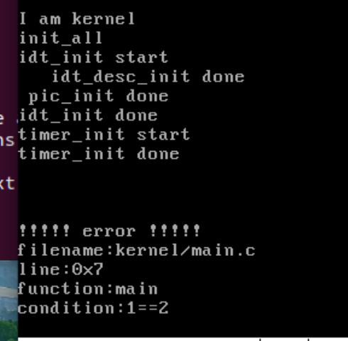
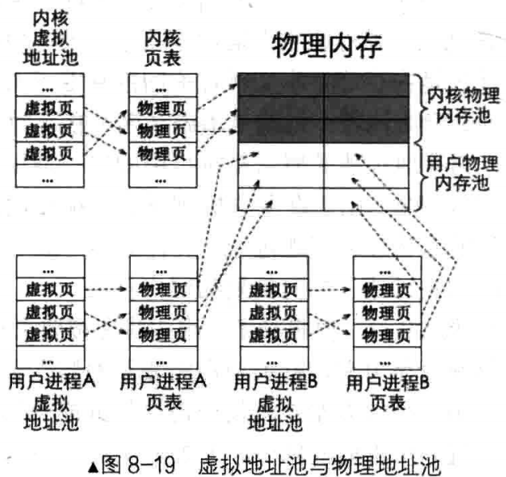
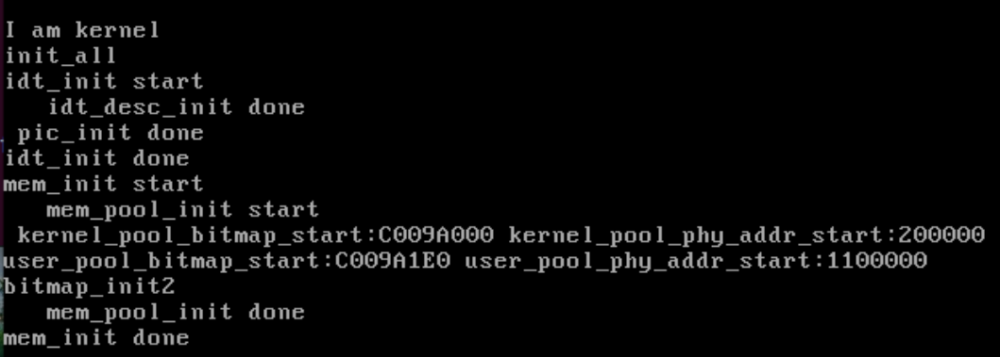
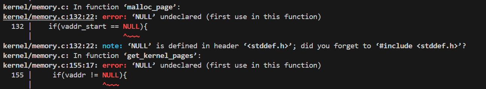
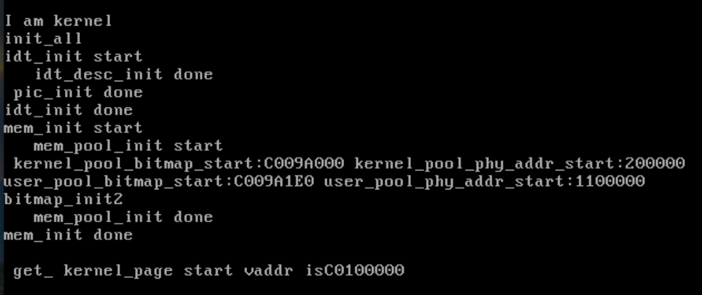
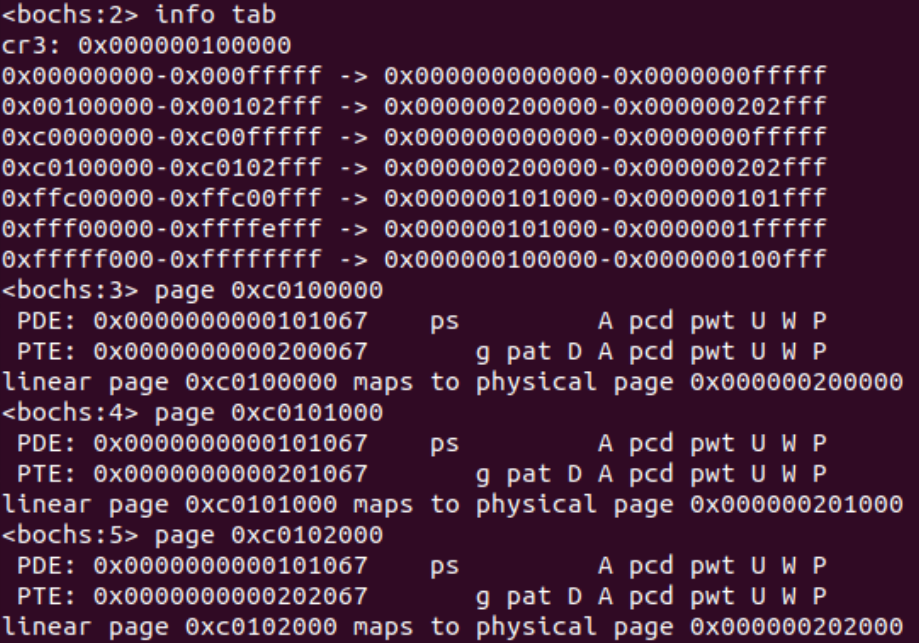
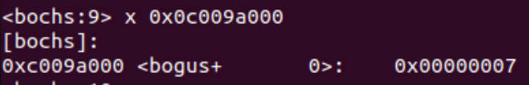

### 8.1 Makefile
基本语法：
```
目标文件:依赖文件1 依赖文件2 ···
[Tab]命令
```
执行make时，操作系统会判断依赖文件的mtime和目标文件的mtime（modify time：修改时间），如果依赖文件更新就执行该命令

执行指定目标文件代码：
```
make 目标文件
```

伪目标：
```
伪目标名:
	命令
```
为了防止伪目标名和目标文件名相同，需要用.PHONY声明
```
.PHONY:伪目标名1 伪目标名2 ···
```

make递推规则：
执行make某个目标文件时，若某依赖文件并未生成，但它是另一命令的目标文件，就会自动执行该命令

自定义变量和系统变量：
定义变量
```
变量名=值1 值2 ···
```
使用变量
```
$(变量名)
```
系统自带变量：


隐含规则：
对于某些目标和依赖文件是一对一的关系，如main.o和main.c以及依赖参数变量CFLAGS和CPPFLAGS，可以不写命令，make会自动推导

自动化变量：
$@:规则中的目标文件名集合
$<:规则中依赖文件中的第1个文件
$^:规则中所有依赖文件的集合
$?:规则中所有比目标文件 mtime 更新的依赖文件集合

模式规则：
%.c:以.c为结尾所有文件

### 8.2 实现assert断言
#### 8.2.1 实现开关中断函数
断言用于处理某些报错情况，报错时应该关中断。
实现关中断函数
```
;kernel/interrupt.c line 13
#define EFLAGS_IF   0x00000200  //eflags 寄存器if位为1
#define GET_EFLAGS(EFLAG_VAR) asm volatile("pushfl; popl %0":"=g"(EFLAG_VAR));
;line 126
/*获取当前中断状态*/
enum intr_status intr_get_status(void){
    uint32_t eflags = 0;
    GET_EFLAGS(eflags);
    return (EFLAGS_IF & eflags) ? INTR_ON : INTR_OFF;
}
/*设置中断状态*/
enum intr_status intr_set_status(enum intr_status status){
    return (status & INTR_ON) ? intr_enable():intr_disable();
}

/*开中断，返回之前的状态*/
enum intr_status intr_enable(){
    enum intr_status old_status;
    if(INTR_ON == intr_get_status()){
        old_status = INTR_ON;
    }else{
        old_status = INTR_OFF;
        asm volatile("sti");//关中断 cli 将IF置1
    }
    return old_status;
}
/*关闭中断*/
enum intr_status intr_disable(void){
    enum intr_status old_status;
    if(INTR_ON == intr_get_status()){
        old_status = INTR_ON;
        asm volatile("cli" : : : "memory");
    }else{
        old_status = INTR_OFF;
    }
    return old_status;
}
```
```
;kernel/interrupt.h
#ifndef __KERNEL_INTERRUPT_H
#define __KERNEL_INTERRUPT_H

#include "stdint.h"
typedef void* intr_handler;
enum intr_status{
    INTR_OFF,
    INTR_ON
};

void idt_init();

enum intr_status intr_get_status(void);
enum intr_status intr_set_status(enum intr_status);
enum intr_status intr_enable(void);
enum intr_status intr_disable(void);

#endif
```
#### 8.2.2 实现assert断言
```
;kernel/debug.h
#ifndef __KERNEL_DEBUG_H
#define __KERNEL_DEBUG_H

void panic_spin(char* filename, int line, const char* func, const char* condition); 
/************* __VA_ARGV__ *********
 * __VA_ARGS__ 是预处理器所支持的专用标识符
 * 代表所有与省略号相对应的参数
 * "..."表示定义的宏其参数可变。
 */
#define PANIC(...) panic_spin(__FILE__, __LINE__, __func__, __VA_ARGS__)
/*********************************************/
    #ifdef NDEBUG
        #define ASSERT(CONDITION) ((void)0)
    #else
        #define ASSERT(CONDITION) \
        if(CONDITION){}else{ \
            /*符号#让编译器将宏的参数转化为字符串字面量 */ \
            PANIC(#CONDITION);  \
        }
    #endif /*__NDEBUG*/
#endif /*__KERNEL_DEBUG_H*/
```
```
;kernel/debug.c
#include "debug.h"
#include "print.h"
#include "interrupt.h"

/*打印文件名、行号、函数名、条件并使程序悬停*/
void panic_spin(char *filename, int line, const char *func, const char *cons )
{
    intr_disable();//有时候会单独调用 panic_spin ， 所以在此处关中断
    put_str("\n\n\n!!!!! error !!!!!\n");
    put_str("filename:");put_str(filename);put_str("\n");
    put_str("line:0x");put_int(line);put_str("\n");
    put_str("function:");put_str((char*)func);put_str("\n");
    put_str("condition:");put_str((char*)cons);put_str("\n");
    while(1);
}
```
```
;kernel/main.c
#include "print.h"
#include "init.h"
#include "debug.h"
int main(void){
    put_str("I am kernel\n");
    init_all();
    ASSERT(1==2);
    //asm volatile("sti");

    while(1);
    return 0;
}
```
编写Makefile:
```
BUILD_DIR=./build
ENTRY_POINT=0xc0001500
HD60M_PATH=hd60M.img
AS=nasm
CC=gcc
LD=ld
LIB= -I lib/ -I lib/kernel/ -I lib/user/ -I kernel/ -I device/
ASFLAGS= -f elf
CFLAGS= -Wall $(LIB) -c -fno-builtin -W -Wstrict-prototypes -Wmissing-prototypes -m32 -fno-stack-protector # 注意最后这个要加
LDFLAGS= -Ttext $(ENTRY_POINT) -e main -Map $(BUILD_DIR)/kernel.map -m elf_i386
OBJS=$(BUILD_DIR)/main.o $(BUILD_DIR)/init.o $(BUILD_DIR)/interrupt.o $(BUILD_DIR)/timer.o $(BUILD_DIR)/kernel.o $(BUILD_DIR)/print.o $(BUILD_DIR)/debug.o

######################编译两个启动文件的代码#####################################
boot:$(BUILD_DIR)/mbr.o $(BUILD_DIR)/loader.o
$(BUILD_DIR)/mbr.o:boot/mbr.asm
	$(AS) -I include/ -o build/mbr.o boot/mbr.asm
	
$(BUILD_DIR)/loader.o:boot/loader.asm
	$(AS) -I include/ -o build/loader.o boot/loader.asm
	
######################编译C内核代码###################################################
$(BUILD_DIR)/main.o:kernel/main.c
	$(CC) $(CFLAGS) -o $@ $<	
# $@表示规则中目标文件名的集合这里就是$(BUILD_DIR)/main.o  $<表示规则中依赖文件的第一个，这里就是kernle/main.c 

$(BUILD_DIR)/init.o:kernel/init.c
	$(CC) $(CFLAGS) -o $@ $<

$(BUILD_DIR)/interrupt.o:kernel/interrupt.c
	$(CC) $(CFLAGS) -o $@ $<

$(BUILD_DIR)/timer.o:device/timer.c
	$(CC) $(CFLAGS) -o $@ $<

$(BUILD_DIR)/debug.o:kernel/debug.c
	$(CC) $(CFLAGS) -o $@ $<

###################编译汇编内核代码#####################################################
$(BUILD_DIR)/kernel.o:kernel/kernel.asm 
	$(AS) $(ASFLAGS) -o $@ $<

$(BUILD_DIR)/print.o:lib/kernel/print.asm
	$(AS) $(ASFLAGS) -o $@ $<

##################链接所有内核目标文件##################################################
$(BUILD_DIR)/kernel.bin:$(OBJS)
	$(LD) $(LDFLAGS) -o $@ $^
# $^表示规则中所有依赖文件的集合，如果有重复，会自动去重

.PHONY:mk_dir hd clean build all boot	#定义了6个伪目标
mk_dir:
	if [ ! -d $(BUILD_DIR) ];then mkdir $(BUILD_DIR);fi 
#判断build文件夹是否存在，如果不存在，则创建

hd:
	dd if=build/mbr.o of=$(HD60M_PATH) count=1 bs=512 conv=notrunc && \
	dd if=build/loader.o of=$(HD60M_PATH) count=4 bs=512 seek=2 conv=notrunc && \
	dd if=$(BUILD_DIR)/kernel.bin of=$(HD60M_PATH) bs=512 count=200 seek=9 conv=notrunc
	
clean:
	@cd $(BUILD_DIR) && rm -f ./* 
#-f, --force忽略不存在的文件，从不给出提示，执行make clean就会删除build下所有文件

build:$(BUILD_DIR)/kernel.bin
	
#执行build需要依赖kernel.bin，但是一开始没有，就会递归执行之前写好的语句编译kernel.bin

all:mk_dir boot build hd
#make all 就是依次执行mk_dir build hd
```


### 8.3 实现字符串操作函数
```
;lib/string.h
#ifndef __LIB_STRING_H
#define __LIB_STRING_H

#include "stdint.h"

/*将dst_起始的size个字节置为value*/
 void memset(void *dst_, uint8_t value, uint32_t size);

 /*将src_起始的size个字节复制到 dst_ */
 void memcpy(void *dst_, const void *src, uint32_t size);
 /*连续比较以地址a_和地址b_开头的size个字节.
    相等则返回 0, a>b return 1, a<b return -1;*/
int memcmp(const void *a_, const void *b_, uint32_t size);

/*src_ 复制到 dst_*/
char *strcpy(char *dst_, const char *src_);

/*返回字符串长度*/
uint32_t strlen(const char *str){;
/*比较两个字符串，若a_中的字符大于b_中的字符调用1，相等返回0，否则返回-1*/
int8_t strcmp(const char *a, const char *b);

/*左到右找str中首次出现的 ch 的地址*/
char *strchr(const char *str, const uint8_t ch);

/*从后往前找字符串str中首次出现的ch的地址*/
char *strrchr(const char *str, const uint8_t ch);

/*将字符串 src 拼接到dst_后,返回拼接的字符串地址*/
char *strcat(char *dst_, const char *str_);

/*在字符串str中查找字符ch出现的次数*/
uint32_t strchrs(const char *str, uint8_t ch);

#endif /*__LIB_STRING_H*/
```
```
;lib/string.c
#include "string.h"
#include "global.h"
#include "debug.h"

/*将dst_起始的size个字节置为value*/
 void memset(void *dst_, uint8_t value, uint32_t size)
 {
    ASSERT(dst_ != NULL);
    uint8_t *dst = (uint8_t*)dst_;
    while(size-- > 0){
        *dst++ = value;
    }
    return;
 }

 /*将src_起始的size个字节复制到 dst_ */
 void memcpy(void *dst_, const void *src, uint32_t size){
    ASSERT(dst_ != NULL && src_ != NULL);
    uint8_t *dst = dst_;
    const uint8_t *src = src_;
    while(size-- > 0){
        *dst++ = *src++;
    }
 }
 /*连续比较以地址a_和地址b_开头的size个字节.
    相等则返回 0, a>b return 1, a<b return -1;*/
int memcmp(const void *a_, const void *b_, uint32_t size)
{
    const char *a = a_;
    const char *b = b_;
    ASSERT(a != NULL || b != NULL);
    while(size-- > 0){
        if(*a != *b){
            return (*a > *b) ? 1: -1;
        }
        ++a;
        ++b;
    }
    return 0;
}

/*src_ 复制到 dst_*/
char *strcpy(char *dst_, const char *src_)
{
    ASSERT(dst_ != NULL && src_ != NULL);
    char *r = dst_;
    while((*dst_ ++ = *src_ ++));
    return r;
}

/*返回字符串长度*/
uint32_t strlen(const char *str){
    ASSERT(str != NULL);
    const char *p = str;
    while(*p++);
    return (p - str - 1);
}
/*比较两个字符串，若a_中的字符大于b_中的字符调用1，相等返回0，否则返回-1*/
int8_t strcmp(const char *a, const char *b)
{
    ASSERT(a != NULL && b != NULL);
    while(*a != 0 && *a == *b){
        ++a;
        ++b;
    }
    //if(*a < *b) return -1;
    //if(*a > *b) return 1; else return 0;
    return (*a < *b) ? -1 : (*a > *b);
}

/*左到右找str中首次出现的 ch 的地址*/
char *strchr(const char *str, const uint8_t ch)
{
    ASSERT(str != NULL);
    while(*str != 0){
        if(*str == ch){
            return (char *)str;//需要强制转化为返回值类型。
        }
        ++str;
    }
    return NULL;
}

/*从后往前找字符串str中首次出现的ch的地址*/
char *strrchr(const char *str, const uint8_t ch)
{
    ASSERT(str != NULL);
    const char *last_char = NULL;
    while(*str != 0){
        if(*str == ch){
            last_char = str;
        }
        ++str;

    }
    return (char *)last_char;
}

/*将字符串 src 拼接到dst_后,返回拼接的字符串地址*/
char *strcat(char *dst_, const char *str_)
{
    ASSERT(dst_ != NULL && src_ != NULL);
    char *str = dst_;
    while(*str++);
    --str;
    while((*str++ = *src_++));
    return dst_;
}

/*在字符串str中查找字符ch出现的次数*/
uint32_t strchrs(const char *str, uint8_t ch){
    ASSERT(str != NULL);
    uint32_t ch_cnt = 0;
    const char *p = str;
    while(*p != 0){
        if(*p == ch){
            ++ch_cnt;
        }
        ++p;
    }
    return ch_cnt;
}
```

### 8.4 位图及其函数实现
位图是管理内存资源的方式，用一bit标记内存4KB是否已被使用
```
;lib/kernel/bitmap.h
#ifndef __LIB_KERNEL_BITMAP_H
#define __LIB_KERNEL_BITMAP_H
#include "global.h"
#define BITMAP_MASK 1
struct bitmap{
    uint32_t btmp_bytes_len;
    /*遍历位图时候是以字节为单位，微操是位。
    所以此处的位图指针必须是单字节*/
    uint8_t *bits;
};
void bitmap_init(struct bitmap *btmp);
bool bitmap_scan_test(struct bitmap *btmp, uint32_t bit_idx);
int bitmap_scan(struct bitmap *btmp, uint32_t cnt);
void bitmap_set(struct bitmap *btmp, uint32_t bit_idx, int8_t value);
```
```
;lib/kernel/bitmap.c
#include "bitmap.h"
#include "stdint.h"
#include "string.h"
#include "print.h"
#include "interrupt.h"
#include "debug.h"

/*初始化 btmp 位图*/
void bitmap_init(struct bitmap *btmp)
{
    memset(btmp->bits, 0, btmp->btmp_bytes_len);
}

bool bitmap_scan_test(struct bitmap *btmp, uint32_t bit_idx)
{
    uint32_t byte_idx = bit_idx / 8;//向下取整用于数组索引。
    uint32_t bit_odd = bit_idx % 8; //取余用索引数组内的位
    return (btmp->bits[byte_idx] & (BITMAP_MASK << bit_odd));
}

int bitmap_scan(struct bitmap *btmp, uint32_t cnt)
{
    uint32_t idx_byte = 0;
    /*先字节比较*/
    while((0xff == btmp->bits[idx_byte]) && (idx_byte < btmp->btmp_bytes_len)){
        //该字节无空位，去下一个字节
        ++idx_byte;
    }
    ASSERT(idx_byte < btmp->btmp_bytes_len);
    if(idx_byte == btmp->btmp_bytes_len){ //找不到可用空间
        return -1;
    }

    //某字节有空位，则依次查找
    int idx_bit = 0;
    while((uint8_t)(BITMAP_MASK << idx_bit & btmp->bits [idx_byte]){
        ++idx_bit;
    }

    int bit_idx_start = idx_byte * 8 + idx_bit;
    if(cnt == 1){
        return bit_idx_start;
    }
    uint32_t bit_left = (btmp->btmp_bytes_len * 8 - bit_idx_start);
    //记录还有多少位可以判断
    uint32_t next_bit = bit_idx-start + 1;
    uint32_t count = 1;

    bit_idx_start = -1;
    while (bit_left -- > 0){
        if(!(bitmap_scan_test(btmp, next_bit))){
            count++;
        }else{
            count = 0;
        }
        if(count == cnt){
            bit_idx_start = next_bit - cnt + 1;
            break;
        }
        next_bit++;
    }
    return bit_idx_start;
}
/*将位图bit_idx设置为value*/
void bitmap_set(struct bitmap *btmp, uint32_t bit_idx, int8_t value)
{
    ASSERT((value == 0) || (value == 1));
    uint32_t byte_idx = bit_idx / 8;
    uint32_t bit_odd = bit_idx % 8;

    if(value){
        btmp->bits[byte_idx] != (BITMAP_MASK << bit_odd);
    }else{
        btmp->bits[byte_idx] &= (BITMAP_MASK << bit_odd);
    }
}
```

### 8.5 内存管理系统
#### 8.5.1 
对每个任务（内核、用户程序）来说来说需要维护一个内存池供给程序动态分配空间，当需要申请内存时，操作系统从该任务本身虚拟地址分配地址给该申请内存，然后再从物理内存分配映射给得到的虚拟内存，并建立好页表映射关系。

```
;kernel/memory.h
#ifndef __KERNEL_MEMORY_H
#define __KERNEL_MEMORY_H

#include "stdint.h"
#include "bitmap.h"

/*虚拟地址池，用于虚拟地址管理*/
struct virtual_addr{
    struct bitmap vaddr_bitmap; // 虚拟地址用到的位图结构
    uint32_t vaddr_start;       // 虚拟地址起始地址
};
extern struct pool kernel_pool, user_pool;
void mem_init(void);

#endif
```
```
;kernel/memory.c
#include "memory.h"
#include "stdint.h"
#include "print.h"

#define PG_SIZE 4096

/*************** 位图地址 ******************
 * 因为0xc009f00 是内核主线程栈顶, 0xc009e000 是内核主线程的 pcb
 * 一个页框大小的位图可表示 128MB 内存，位图位置安排在地址 0xc009a000,
 * 这样本系统最大支持 4个页框的位图，即 512 MB
*/
#define MEM_BITMAP_BASE 0xc009a000
  /* 0xc0000000 是内核从虚拟地址 3G 起,
  0x100000 指跨过低端 1MB 内存，使虚拟地址在逻辑上连续。*/
#define K_HEAP_START 0xc0100000
/* 内存池结构，生成两个实例，用于管理内核和用户内存池*/
struct pool{
    struct bitmap pool_bitmap;  //本内存池用到的位图结构，用于管理物理内存
    uint32_t phy_addr_start;    // 本内存池所管理物理内存的起始地址
    uint32_t pool_size;         // 本内存池字节容量
};
struct pool kernel_pool, user_pool; // 生成内核内存池和用户内存池
struct virtual_addr kernel_vaddr; // 此结构用来给内核分配虚拟地址

/*初始化内存池*/
static void mem_pool_init(uint32_t all_mem)
{
    put_str("   mem_pool_init start\n");
    uint32_t page_table_size = PG_SIZE * 256;
    /*页表大小 = 页目录表（1页） + 第0和第768页目录框指向同一个页表(第1个页表)+
    第 769~1022个页目录项共指向 254 个页表(254页)，共 256 个页框*/

    uint32_t used_mem = page_table_size + 0x100000;
    //0x100000 为低端 1MB 内存。
    uint32_t free_mem = all_mem - used_mem;
    uint16_t all_free_pages = free_mem / PG_SIZE;
    /*1页为4KB，不管总内存是不是 4k 的倍数，
     *对于以页为单位的内存分配策略，不足一页的内存不用考虑了*/
    uint16_t kernel_free_pages = all_free_pages / 2; 
    uint16_t user_free_pages = all_free_pages - kernel_free_pages;
    /* 为简化位图操作，余数不处理，坏处是这样做会丢内存。
     好处是不用做内存的越界检查，因为位图表示的内存少于实际物理内存*/
    uint32_t kbm_length = kernel_free_pages / 8; 
    // Kernel BitMap 的长度，位图中的一位表示一页，以字节为单位
    uint32_t ubm_length = user_free_pages / 8;
    // User BitMap 的长度
    //Kernel pool start，内核内存池的起始地址。
    uint32_t kp_start = used_mem;
    //User Pool start,  用户内存池的起始地址
    uint32_t up_start = kp_start + kernel_free_pages * PG_SIZE;

    kernel_pool.phy_addr_start = kp_start;
    user_pool.phy_addr_start = up_start;

    kernel_pool.pool_size = kernel_free_pages * PG_SIZE;
    user_pool.pool_size = user_free_pages * PG_SIZE;

    kernel_pool.pool_bitmap.btmp_bytes_len = kbm_length;
    user_pool.pool_bitmap.btmp_bytes_len = ubm_length;

     /********* 内核内存池和用户内存池位图 ***********
      * 位图是全局的数据，长度不固定。
      * 全局或静态的数组需要在编译时知道其长度，
      * 而我们需要根据总内存大小算出需要多少字节，
      * 所以改为指定一块内存来生成位图。
      ***********************************************/

     //内核使用的最高 0xc009f000,这是主线程的栈地址
     //(内核的大小预计为70KB左右)
     //32MB内存占有的位图为 2KB
     //内核内存池的位图先定在 MEM_BITMAP_BASE (0xc009a000) 处
     kernel_pool.pool_bitmap.bits = (void*)MEM_BITMAP_BASE;
     /* 用户内存池的位图紧跟在内核内存池位图之后 */
     user_pool.pool_bitmap.bits = (void*)(MEM_BITMAP_BASE + kbm_length);
     /********************输出内存池信息**********************/ 
    put_str(" kernel_pool_bitmap_start:");
    put_int((int)kernel_pool.pool_bitmap.bits); 
    put_str(" kernel_pool_phy_addr_start:"); 
    put_int(kernel_pool.phy_addr_start);
    put_str("\n"); 
    put_str("user_pool_bitmap_start:");
    put_int((int)user_pool.pool_bitmap.bits);
    put_str(" user_pool_phy_addr_start:");
    put_int(user_pool.phy_addr_start);
    put_str("\n");

    /* 将位图置于 0*/
    bitmap_init(&kernel_pool.pool_bitmap);
    bitmap_init(&user_pool.pool_bitmap); 
    put_str("bitmap_init2\n");
    /* 下面初始化内核虚拟地址的位图，按实际物理内存大小生成数组。*/ 
    kernel_vaddr.vaddr_bitmap.btmp_bytes_len = kbm_length; 
    // 用于维护内核堆的虚拟地址，所以要和内核内存池大小一致
    /* 位图的数组指向一块未使用的内存，目前定位在内核内存池和用户内存池之外*/
    kernel_vaddr.vaddr_bitmap.bits = (void*)(MEM_BITMAP_BASE + kbm_length + ubm_length);
    kernel_vaddr.vaddr_start = K_HEAP_START;
    bitmap_init(&kernel_vaddr.vaddr_bitmap);
    put_str("   mem_pool_init done\n");
}

/*内存管理部分初始化入口*/
void mem_init()
{
    put_str("mem_init start\n");
    uint32_t mem_bytes_total = (*(uint32_t *)(0xb00));
    mem_pool_init(mem_bytes_total);// 初始化内存池
    put_str("mem_init done\n");
}
```
为什么内存位图地址选择0xc009a00？
对于某个程序，我们都有PCB或TCB去管理，而PCB必须占用完整的一页，而PCB的末地址+1的位置就是它的栈地址位置，main线程一直在内存中，而栈顶sp指针的地址是0xc009f000，因此main的PCB在0xc00e000的位置，在低端1MB的内存中可用内存是0x7e00-0x9fbff，这样设置的好处还可以充分使用0x9f000后的0xc00地址。

物理内存的大小为32MB，它的位图为1024B仅占1/4页，作者使用4页去管理512MB的内存，把他们设置在PCB后，也就是0xc009e000-0x4000=0xc09a000的位置

堆的起始地址为0xc0100000，其下面0xc0000000-0xc00fffff映射到低端1MB的内存

为什么内存位图选择低端1MB以下？
管理内存的数据结构必然在内存中，若我们还大费周章去分配它的位置，还要考虑它所在的内存位置对应的位图位不可用，这过于复杂，因此直接位于低端1MB，因为内核占用这一块，就不用再考虑是否占用了。

```
;kernel/init.c
#include "init.h"
#include "print.h"
#include "interrupt.h"
#include "../device/timer.h"
#include "memory.h"

/*负责初始化所有模块*/
void init_all()
{
    put_str("init_all\n");
    idt_init(); //初始化中断
    //timer_init();
    mem_init();
}
```
```
;kernel/main.c
#include "print.h"
#include "init.h"
#include "debug.h"
int main(void){
    put_str("I am kernel\n");
    init_all();
    //ASSERT(1==2);
    //asm volatile("sti");

    while(1);
    return 0;
}
```
```
;makefile
#定义一大堆变量，实质就是将需要多次重复用到的语句定义一个变量方便使用与替换
BUILD_DIR=./build
ENTRY_POINT=0xc0001500
HD60M_PATH=hd60M.img
#只需要把hd60m.img路径改成自己环境的路径，整个代码直接make all就完全写入了，能够运行成功
AS=nasm
CC=gcc
LD=ld
LIB= -I lib/ -I lib/kernel/ -I lib/user/ -I kernel/ -I device/
ASFLAGS= -f elf
CFLAGS= -Wall $(LIB) -c -fno-builtin -W -Wstrict-prototypes -Wmissing-prototypes -m32 -fno-stack-protector # 注意最后这个要加
#-Wall warning all的意思，产生尽可能多警告信息，-fno-builtin不要采用内部函数，
#-W 会显示警告，但是只显示编译器认为会出现错误的警告
#-Wstrict-prototypes 要求函数声明必须有参数类型，否则发出警告。-Wmissing-prototypes 必须要有函数声明，否则发出警告

LDFLAGS= -Ttext $(ENTRY_POINT) -e main -Map $(BUILD_DIR)/kernel.map -m elf_i386
#-Map,生成map文件，就是通过编译器编译之后，生成的程序、数据及IO空间信息的一种映射文件
#里面包含函数大小，入口地址等一些重要信息

OBJS=$(BUILD_DIR)/main.o $(BUILD_DIR)/init.o $(BUILD_DIR)/interrupt.o $(BUILD_DIR)/timer.o $(BUILD_DIR)/kernel.o $(BUILD_DIR)/print.o $(BUILD_DIR)/debug.o \
	$(BUILD_DIR)/string.o $(BUILD_DIR)/bitmap.o $(BUILD_DIR)/memory.o

######################编译两个启动文件的代码#####################################
boot:$(BUILD_DIR)/mbr.o $(BUILD_DIR)/loader.o
$(BUILD_DIR)/mbr.o:boot/mbr.asm
	$(AS) -I include/ -o build/mbr.o boot/mbr.asm
	
$(BUILD_DIR)/loader.o:boot/loader.asm
	$(AS) -I include/ -o build/loader.o boot/loader.asm
	
######################编译C内核代码###################################################
$(BUILD_DIR)/main.o:kernel/main.c
	$(CC) $(CFLAGS) -o $@ $<	
# $@表示规则中目标文件名的集合这里就是$(BUILD_DIR)/main.o  $<表示规则中依赖文件的第一个，这里就是kernle/main.c 

$(BUILD_DIR)/init.o:kernel/init.c
	$(CC) $(CFLAGS) -o $@ $<

$(BUILD_DIR)/interrupt.o:kernel/interrupt.c
	$(CC) $(CFLAGS) -o $@ $<

$(BUILD_DIR)/timer.o:device/timer.c
	$(CC) $(CFLAGS) -o $@ $<

$(BUILD_DIR)/debug.o:kernel/debug.c
	$(CC) $(CFLAGS) -o $@ $<

$(BUILD_DIR)/string.o:lib/string.c
	$(CC) $(CFLAGS) -o $@ $<

$(BUILD_DIR)/bitmap.o:lib/kernel/bitmap.c
	$(CC) $(CFLAGS) -o $@ $<

$(BUILD_DIR)/memory.o:kernel/memory.c
	$(CC) $(CFLAGS) -o $@ $<

###################编译汇编内核代码#####################################################
$(BUILD_DIR)/kernel.o:kernel/kernel.asm 
	$(AS) $(ASFLAGS) -o $@ $<

$(BUILD_DIR)/print.o:lib/kernel/print.asm
	$(AS) $(ASFLAGS) -o $@ $<

##################链接所有内核目标文件##################################################
$(BUILD_DIR)/kernel.bin:$(OBJS)
	$(LD) $(LDFLAGS) -o $@ $^
# $^表示规则中所有依赖文件的集合，如果有重复，会自动去重

.PHONY:mk_dir hd clean build all boot	#定义了6个伪目标
mk_dir:
	if [ ! -d $(BUILD_DIR) ];then mkdir $(BUILD_DIR);fi 
#判断build文件夹是否存在，如果不存在，则创建

hd:
	dd if=build/mbr.o of=$(HD60M_PATH) count=1 bs=512 conv=notrunc && \
	dd if=build/loader.o of=$(HD60M_PATH) count=4 bs=512 seek=2 conv=notrunc && \
	dd if=$(BUILD_DIR)/kernel.bin of=$(HD60M_PATH) bs=512 count=200 seek=9 conv=notrunc
	
clean:
	@cd $(BUILD_DIR) && rm -f ./* 
#-f, --force忽略不存在的文件，从不给出提示，执行make clean就会删除build下所有文件

build:$(BUILD_DIR)/kernel.bin
	
#执行build需要依赖kernel.bin，但是一开始没有，就会递归执行之前写好的语句编译kernel.bin

all:mk_dir boot build hd
#make all 就是依次执行mk_dir build hd
```


#### 8.5.2 分配页内存
```
;memory.h
#ifndef __KERNEL_MEMORY_H
#define __KERNEL_MEMORY_H

#include "stdint.h"
#include "bitmap.h"

 /* 内存池标记，用于判断用哪个内存池 */ 
 enum pool_flags{
    PF_KERNEL = 1,  // 内核内存池
    PF_USER = 2    // 用户内存池
 };
#define PG_P_1      1   // 页表项或页目录项存在属性位
#define PG_P_0      0   // 页表项或页目录项存在属性位
#define PG_RW_R     0   // R/W 属性位值，读/执行
#define PG_RW_W     2   // R/W 属性位值，读/写/执行
#define PG_US_S     0   // U/S 属性位值，系统级
#define PG_US_U     4   // U/S 属性位值，用户级

/*虚拟地址池，用于虚拟地址管理*/
struct virtual_addr{
    struct bitmap vaddr_bitmap; // 虚拟地址用到的位图结构
    uint32_t vaddr_start;       // 虚拟地址起始地址
};
extern struct pool kernel_pool, user_pool;
void mem_init(void);
void *get_kernel_pages(uint32_t pg_cnt);

#endif
```
增加了enum来枚举是用户还是内核内存池，添加了页属性标识
```
;memory.c line 1-9
#include "memory.h"
#include "stdint.h"
#include "print.h"
#include "bitmap.h"
#include "global.h"
#include "debug.h"
#include "string.h"
#define PDE_IDX(addr) ((addr & 0xffc00000) >> 22) //高10位
#define PTE_IDX(addr) ((addr & 0x003ff000) >> 12) //中10位
```
定义宏取虚拟地址的高10位中10位，用于定位pde和pte
```
static void *vaddr_get(enum pool_flags pf, uint32_t pg_cnt)
{
    int vaddr_start = 0, bit_idx_start = -1;
    uint32_t cnt = 0;
    if(pf == PF_KERNEL){
        
        bit_idx_start = bitmap_scan(&kernel_vaddr.vaddr_bitmap, pg_cnt);
        if(bit_idx_start == -1){
            return NULL;
        }
        while(cnt < pg_cnt){
            bitmap_set(&kernel_vaddr.vaddr_bitmap, bit_idx_start + cnt++, 1);
        }
        vaddr_start = kernel_vaddr.vaddr_start + bit_idx_start * PG_SIZE;
    }else{
        //用户内存池,之后实现用户进程再补充
    }
    return (void*)vaddr_start;
}
 /* 得到虚拟地址 vaddr 对应的 pte 指针*/
 uint32_t *pte_ptr(uint32_t vaddr){
    /* 先访问到页表自己 + \
     * 再用页目录项 pde（页目录内页表的索引）作为 pte 的索引访问到页表 + \
     * 再用 pte 的索引作为页内偏移*/
    uint32_t *pte = (uint32_t *)(0xffc00000 + \
    ((vaddr & 0xffc00000) >> 10) + PTE_IDX(vaddr) * 4);
    return pte;
 }
 /*得到虚拟地址 vaddr 对应的 pde 的指针*/
 uint32_t *pde_ptr(uint32_t vaddr){
    /*0xfffff 用来访问到页表本身所在的地址*/
    uint32_t *pde = (uint32_t *)((0xfffff000) + PDE_IDX(vaddr) * 4);
    return pde;
 }
/* 在 m_pool 指向的物理内存池中分配 1 个物理页，
* 成功则返回页框的物理地址，失败则返回 NULL */
static void *palloc(struct pool *m_pool){
    /*扫描或设置位图要保证原子操作*/
    int bit_idx = bitmap_scan(&m_pool->pool_bitmap, 1);//找到一个物理页面
    if(bit_idx == -1){
        return NULL;
    }
    bitmap_set(&m_pool->pool_bitmap, bit_idx, 1);//将此位 bit_idx 置为1
    uint32_t page_phyaddr = ((bit_idx * PG_SIZE) + m_pool->phy_addr_start);
    return (void *)page_phyaddr;
}
```
vaddr_get作用是在pf标识的内存池里申请pg_cnt个虚拟页，成功返回初始地址，失败返回null
pte_ptr作用是得到vaddr 所在 pte 的虚拟地址，同理pde_ptr
palloc作用是在 m_pool 指向的物理内存池中分配1物理页，成功时返回页框的物理地址，失败返回 NULL

处理器处理 32 位地址的3个步骤：
1、 读出高10位的pde索引，得到页表物理地址
2、 处理中间10位的pte索引，得到物理页地址
3、 低 12 位作为页内偏移，用页基址+页偏移就是真正的物理地址
那么如何拼凑vaddr（满足上述的虚拟地址）？
1、 得到页目录表地址：由于之前设置最后一个页目录项保存的正是页目录表物理地址，因此用0x3ff左移到高十位得到页目录表地址0xffc00000
2、 找到页表：为得到页目录项我们将vaddr&0xffc00000得到高十位再右移十位，得到的就是页目录项索引
3、 找到pte：0xffc00000 + ((vaddr & 0xffc00000)> 10) + PTE_IDX(vaddr) * 4 得到完整地址
```
;memory.c line 82-106
static void page_table_add(void *_vaddr, void *_page_phyaddr){
    uint32_t vaddr = (uint32_t)_vaddr, page_phyaddr = (uint32_t)_page_phyaddr;
    uint32_t *pde = pde_ptr(vaddr);
    uint32_t *pte = pte_ptr(vaddr);
     /************************ 注意 *************************
      *  执行*pte，会访问到空的 pde。所以确保 pde 创建完成后才能执行*pte，
      *  否则会引发 page_fault。因此在*pde 为 0 时，
      * pte 只能出现在下面 else 语句块中的*pde 后面。
      * *****************************************************/
     /* 先在页目录内判断目录项的 P 位，若为 1，则表示该表已存在 */ 
     if(*pde & 0x00000001){
        // 页目录项和页表项的第 0 位为 P，此处判断目录项是否存在
        ASSERT(!(*pte & 0x00000001));
        if(!(*pte & 0x00000001)){
            // 只要是创建页表，pte 就应该不存在，多判断一下放心
            *pte = (page_phyaddr | PG_US_U | PG_RW_W | PG_P_1);
            // US=1,RW=1,P=1
        }else{
            //目前应该不会执行到这，因为上面的 ASSERT 会先执行
            PANIC("pte repeat");
            *pte = (page_phyaddr | PG_US_U | PG_RW_W | PG_P_1);
            //US=1,RW=1,P=1
        }
     }else{
        // 页目录项不存在，所以要先创建页目录再创建页表项
        /* 页表中用到的页框一律从内核空间分配 */ 
        uint32_t pde_phyaddr = (uint32_t)palloc(&kernel_pool);
        *pte = (pde_phyaddr | PG_US_U | PG_RW_W | PG_P_1);
        /* 分配到的物理页地址 pde_phyaddr 对应的物理内存清 0，
         * 避免里面的陈旧数据变成了页表项，从而让页表混乱。
         * 访问到 pde 对应的物理地址，用 pte 取高 20 位便可。
         *  因为 pte 基于该 pde 对应的物理地址内再寻址，
         *  把低 12 位置 0 便是该 pde 对应的物理页的起始*/ 
        memset((void*)((int)pte & 0xfffff000), 0, PG_SIZE);
        ASSERT(!(*pte & 0x00000001));
        *pte = (page_phyaddr | PG_US_U | PG_RW_W | PG_P_1);
        //US=1, RW=1, P=1
     }
}

/* 分配 pg_cnt 个页空间，成功则返回起始虚拟地址，失败时返回 NULL */ 
void* malloc_page(enum pool_flags pf, uint32_t pg_cnt) {
    ASSERT(pg_cnt > 0 && pg_cnt < 3840);
     /*********** malloc_page 的原理是三个动作的合成: *********** 
     1 通过 vaddr_get 在虚拟内存池中申请虚拟地址
    2 通过 palloc 在物理内存池中申请物理页
    3 通过 page_table_add 将以上得到的虚拟地址和物理地址在页表中完成映射
    ********************************************************************/ 
   void* vaddr_start = vaddr_get(pf, pg_cnt);

   if(vaddr_start == NULL){
        put_str("vaddr_start is NULL!!!\n");
        return NULL;
   }
   uint32_t vaddr = (uint32_t)vaddr_start, cnt = pg_cnt;
   struct pool *mem_pool = (pf & PF_KERNEL) ? &kernel_pool : &user_pool;
   /* 因为虚拟地址是连续的，但物理地址可以是不连续的，所以逐个做映射*/ 
   while(cnt-- > 0){
        void *page_phyaddr = palloc(mem_pool);
        if(page_phyaddr == NULL){
            //失败时要将曾经已申请的虚拟地址和
            //物理页全部回滚，在将来完成内存回收时再补充
            return NULL;
        }
        page_table_add((void*)vaddr, page_phyaddr);//在页表中做映射
        vaddr += PG_SIZE;       //下一个虚拟页
   }
   return vaddr_start;
}
/* 从内核物理内存池中申请 1 页内存，成功则返回其虚拟地址，失败则返回 NULL */
void *get_kernel_pages(uint32_t pg_cnt)
{
    void *vaddr = malloc_page(PF_KERNEL, pg_cnt);
    if(vaddr != NULL){
        // 若分配的地址不为空，将页框清 0 后返回
        memset(vaddr, 0, pg_cnt * PG_SIZE);
    }
    return vaddr;
}
```
malloc_page申请虚拟地址函数流程 ：
1、 通过 vaddr_get 在虚拟内存池中申请虚拟地址
2、 通过 palloc 在物理内存池中申请物理页
3、 通过 page_table_add 将以上两步得到的虚拟地址和物理地址在页表中完成映射

```
;main.c
#include "print.h"
#include "init.h"
#include "memory.h"
int main(void){
    put_str("I am kernel\n");
    init_all();
    
    void* addr =get_kernel_pages(3); 
    put_str ("\n get_ kernel_page start vaddr is" ) ; 
    put_int ( (uint32_t) addr); 
    put_str ("\n ") ;
    
    while(1);
    return 0;
}
```
c中没有bool和NULL，需要添加stdbool.h和stddef.h头文件




