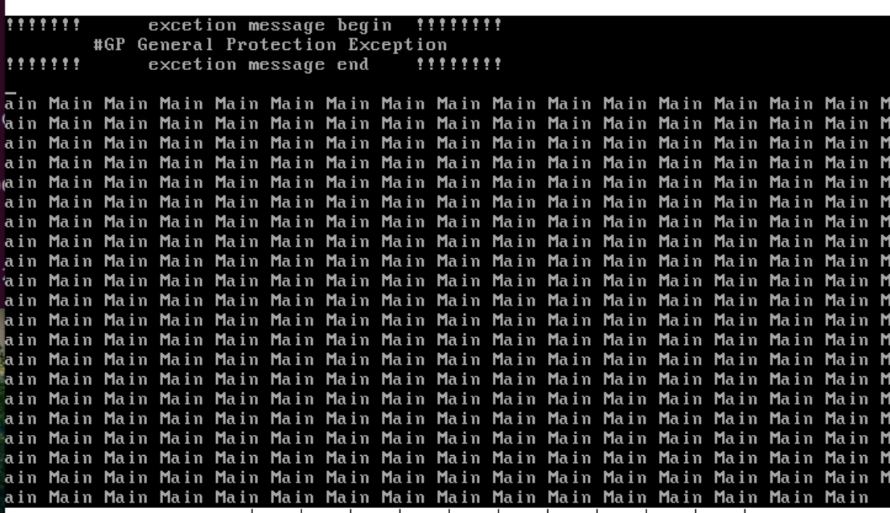

### 9.1 实现内核线程
#### 9.1.2 什么是线程？为什么需要线程？
在以前，CPU只能执行完一个程序再去执行另一个程序，在程序中往往有许多时间是被浪费的（例如：等待外设设备打印完成，此时的CPU在空等），CPU是很快的，为了提高CPU的利用率，我们可以利用这段空等的时间去执行另一个程序，于是引入了进程去描述运行中的程序，进程包括了一些该程序需要用到的环境数据栈等。此时CPU的效率得到了提升，但是我们只能从一个程序切换到另一个程序，但实际上程序的执行还能划分成更小的单位，它的执行流可以再被细分为一段程序或是仅仅是一段函数，这样得到的效率更高，另一方面，在程序中常常要共享信息，比如都要共用同一个栈，在切换进程的时候我们常常需要保存上下文，但对于同一个进程的不痛线程，我们可以切换少量必要的空间，让这些线程共享同一个空间，这样不仅提升了CPU效率（并发率）还减少了切换环境的开销，因此引入线程这一机制。

#### 9.1.3 程序、进程、线程的区别与关系？
程序是一段静态的、存储在硬件中指令集合
进程是执行中的程序，它包括了正在使用的资源
线程可以认为是在进程的基础上的二次并发
进程和程序都是动态的 并发的 独立的，而程序是静态的
作者认为进程=线程+资源，但我觉得线程中也有资源的切换

#### 9.1.4 进程线程的状态
就绪态：可以随时准备运行
阻塞态：需要等待外界条件（外设）而不能立即执行
运行态：正处于CPU中执行
状态主要为了让调度器抉择谁上CPU谁下CPU

#### 9.1.5 进程的身份标识——PCB
操作系统为每个进程创建的一个用来记录进程状态、PID、优先级等信息的数据结构

PCB的格式不定，取决于操作系统的复杂度，上图只是基本内容
寄存器映射、栈和栈指针用于存储和进程有关的环境
pid用于标识pcb
优先级决定调度选择的优先
时间片记录执行时间，时间到便下处理机

#### 9.1.6 实现线程的两种方式

1、在用户空间实现
也就是在程序中手动实现线程调度器，并手动把程序分成多个线程自主调用实现。
优点：
（1）手动实现，可以对某线程加权
（2）无需陷入内核、避免保存环境的开销
缺点：
（1）并非真正的并发，一个阻塞，全体阻塞，一个运行，其余无法运行
（2）短暂的提速不如线程实现在内核的提速
2、在内核空间实现
即由内核提供原生的线程机制
优点：（1）提速（2）共享

### 9.2 在内核空间实现线程
PCB的定义：
```
;thread/thread.h
#ifndef __THREAD_THREAD_H
#define __THREAD_THREAD_H
#include "stdint.h"

/* 自定义通用函数类型，它将在很多线程函数中作为形参类型 */
typedef void thread_func(void*);

 /* 进程或线程的状态 */ 
enum task_status{
    TASK_RUNNING,
    TASK_READY,
    TASK_BLOCKED,
    TASK_WAITING,
    TASK_HANGING,
    TASK_DIED
};

   /*中断栈 intr_stack 
    * 此结构用于中断发生时保护程序（线程或进程）的上下文环境: 
    * 进程或线程被外部中断或软中断打断时，会按照此结构压入上下文
    * 寄存器,intr_exit 中的出栈操作是此结构的逆操作
    * 此栈在线程自己的内核栈中位置固定，所在页的最顶端*/

struct intr_stack{
    uint32_t vec_no;    // kernel.S 宏 VECTOR 中 push %1 压入的中断号
    uint32_t edi;
    uint32_t esi;
    uint32_t ebp;
    uint32_t esp_dummy;
    // 虽然 pushad 把 esp 也压入，但 esp 是不断变化的，所以会被 popad 忽略
    uint32_t ebx;
    uint32_t edx;
    uint32_t ecx;
    uint32_t eax;
    uint32_t gs;
    uint32_t fs;
    uint32_t es;
    uint32_t ds;
    /* 以下由 cpu 从低特权级进入高特权级时压入 */
    uint32_t err_code;// err_code 会被压入在 eip 之后
    void (*eip)(void);
    uint32_t cs;
    uint32_t eflags;
    void *esp;
    uint32_t ss;
};

 /*********** 线程栈 thread_stack ***********
  * 线程自己的栈，用于存储线程中待执行的函数
  * 此结构在线程自己的内核栈中位置不固定，
  * 仅用在 switch_to 时保存线程环境。
  * 实际位置取决于实际运行情况。
  */
 struct thread_stack{
    uint32_t ebp;
    uint32_t ebx;
    uint32_t edi;
    uint32_t esi;
    /* 线程第一次执行时，eip 指向待调用的函数 kernel_thread
    其他时候，eip 是指向 switch_to 的返回地址*/
    void (*eip)(thread_func *func, void *func_arg);
 /***** 以下仅供第一次被调度上 cpu 时使用 ****/
 /* 参数 unused_ret 只为占位置充数为返回地址 */
    void (*unused_retaddr);
    thread_func *function;// 由 kernel_thread 所调用的函数名
    void* func_arg; // 由 kernel_thread 所调用的函数所需的参数
 };

 /*进程或线程的pcb，进程控制块*/
 struct task_struct{
    uint32_t *self_kstack;  // 各内核线程都用自己的内核栈
    enum task_status status;
    uint8_t priority;// 线程优先级
    char name[16];
    uint32_t stack_magic;//栈的边界标记，用于检测栈的溢出
 };

/*函数声明*/
void thread_create(struct task_struct* pthread, thread_func function, void* func_arg);
void init_thread(struct task_struct* pthread, char* name, int prio);
struct task_struct* thread_start(char* name, int prio, thread_func function, void* func_arg);
#endif
```
eip指向线程上处理机时指向的程序的地址
线程栈结构涉及ABI（应用程序二进制接口）
>ABI：All registers on the Intel386 global and thus visible to both a calling and a called function. Registers %ebp, %ebx, %edi, %esi, and %esp “ belong” to the calling function. In other words, a called function must preserve these registers' values for its caller. Remaining registers “ belong” to the called function. If a calling function wants to prese such a register value across a function call, it must save the value in its local stack frame.
>也就是说被调用者需要保护好这五个寄存器，但esp的值会由调用约定来保证


void thread_create(struct task_struct* pthread, thread_func function, void* func_arg);
void init_thread(struct task_struct* pthread, char* name, int prio);
struct task_struct* thread_start(char* name, int prio, thread_func function, void* func_arg);
这三个是模仿call进入thread_start执行的栈内布局构建的，call进入就会压入参数与返回地址，因为我们是ret进入kernel_thread执行的要想让kernel_thread正常执行，就必须人为给它造返回地址，参数
```
;thread/thread.c
#include "thread.h"
#include "stdint.h"
#include "string.h"
#include "global.h"
#include "memory.h"

#define PG_SIZE 4096

/* 由kernel_thread去执行function(func_arg) , 这个函数就是线程中去开启我们要运行的函数*/
static void kernel_thread(thread_func* function, void* func_arg) {
   function(func_arg); 
}

/*用于根据传入的线程的pcb地址、要运行的函数地址、函数的参数地址来初始化线程栈中的运行信息，核心就是填入要运行的函数地址与参数 */
void thread_create(struct task_struct* pthread, thread_func function, void* func_arg) {
   /* 先预留中断使用栈的空间,可见thread.h中定义的结构 */
   //pthread->self_kstack -= sizeof(struct intr_stack);  //-=结果是sizeof(struct intr_stack)的4倍
   //self_kstack类型为uint32_t*，也就是一个明确指向uint32_t类型值的地址，那么加减操作，都是会是sizeof(uint32_t) = 4 的倍数
   pthread->self_kstack = (uint32_t*)((int)(pthread->self_kstack) - sizeof(struct intr_stack));

   /* 再留出线程栈空间,可见thread.h中定义 */
   //pthread->self_kstack -= sizeof(struct thread_stack);
   pthread->self_kstack = (uint32_t*)((int)(pthread->self_kstack) - sizeof(struct thread_stack));
   struct thread_stack* kthread_stack = (struct thread_stack*)pthread->self_kstack;     //我们已经留出了线程栈的空间，现在将栈顶变成一个线程栈结构体
                                                                                         //指针，方便我们提前布置数据达到我们想要的目的
   kthread_stack->eip = kernel_thread;      //我们将线程的栈顶指向这里，并ret，就能直接跳入线程启动器开始执行。
                                            //为什么这里我不能直接填传入进来的func，这也是函数地址啊，为什么还非要经过一个启动器呢？其实是可以不经过线程启动器的

    //因为用不着，所以不用初始化这个返回地址kthread_stack->unused_retaddr
   kthread_stack->function = function;      //将线程启动器（thread_start）需要运行的函数地址放入线程栈中
   kthread_stack->func_arg = func_arg;      //将线程启动器（thread_start）需要运行的函数所需要的参数地址放入线程栈中
   kthread_stack->ebp = kthread_stack->ebx = kthread_stack->esi = kthread_stack->edi = 0;
}

/* 初始化线程基本信息 , pcb中存储的是线程的管理信息，此函数用于根据传入的pcb的地址，线程的名字等来初始化线程的管理信息*/
void init_thread(struct task_struct* pthread, char* name, int prio) {
   memset(pthread, 0, sizeof(*pthread));                                //把pcb初始化为0
   strcpy(pthread->name, name);                                         //将传入的线程的名字填入线程的pcb中
   pthread->status = TASK_RUNNING;                                      //这个函数是创建线程的一部分，自然线程的状态就是运行态
   pthread->priority = prio;            
                                                                        /* self_kstack是线程自己在内核态下使用的栈顶地址 */
   pthread->self_kstack = (uint32_t*)((uint32_t)pthread + PG_SIZE);     //本操作系统比较简单，线程不会太大，就将线程栈顶定义为pcb地址
                                                                        //+4096的地方，这样就留了一页给线程的信息（包含管理信息与运行信息）空间
   pthread->stack_magic = 0x19870916;	                                // /定义的边界数字，随便选的数字来判断线程的栈是否已经生长到覆盖pcb信息了              
}

/* 创建一优先级为prio的线程,线程名为name,线程所执行的函数是function(func_arg) */
struct task_struct* thread_start(char* name, int prio, thread_func function, void* func_arg) {
/* pcb都位于内核空间,包括用户进程的pcb也是在内核空间 */
   struct task_struct* thread = get_kernel_pages(1);    //为线程的pcb申请4K空间的起始地址

   init_thread(thread, name, prio);                     //初始化线程的pcb
   thread_create(thread, function, func_arg);           //初始化线程的线程栈

            //我们task_struct->self_kstack指向thread_stack的起始位置，然后pop升栈，
            //到了通过线程启动器来的地址，ret进入去运行真正的实际函数
            //通过ret指令进入，原因：1、函数地址与参数可以放入栈中统一管理；2、ret指令可以直接从栈顶取地址跳入执行
   asm volatile ("movl %0, %%esp; pop %%ebp; pop %%ebx; pop %%edi; pop %%esi; ret" : : "g" (thread->self_kstack) : "memory");
   return thread;
}
```
thread_start 以传入的参数作为PCB的内容创建一个PCB：（1）请求一页内存get_kernel_pages(1) （2）初始化PCB内容init_thread （3）初始化线程的函数和线程栈thread_create （4）利用ret指令跳到目标执行
```
;kernel/main.c
#include "print.h"
#include "init.h"
#include "thread.h"

void k_thread_a(void*);

int main(void) {
   put_str("I am kernel\n");
   init_all();

   thread_start("k_thread_a", 31, k_thread_a, "argA ");

   while(1);
   return 0;
}

/* 在线程中运行的函数 */
void k_thread_a(void* arg) {     
/* 用void*来通用表示参数,被调用的函数知道自己需要什么类型的参数,自己转换再用 */
   char* para = arg;
   while(1) {
      int i = 9999999;
      while(i--);
      put_str(para);
   }
}
```
使用该main测试thread
```
#makefile
# LIB 加 -I thread/
#添加$(BUILD_DIR)/thread.o
OBJS=$(BUILD_DIR)/main.o $(BUILD_DIR)/init.o \
	$(BUILD_DIR)/interrupt.o $(BUILD_DIR)/timer.o $(BUILD_DIR)/kernel.o \
	$(BUILD_DIR)/print.o $(BUILD_DIR)/debug.o $(BUILD_DIR)/string.o $(BUILD_DIR)/bitmap.o \
	$(BUILD_DIR)/memory.o $(BUILD_DIR)/thread.o
#顺序最好是调用在前，实现在后
#添加编译
$(BUILD_DIR)/thread.o:thread/thread.c
	$(CC) $(CFLAGS) -o $@ $<
```


### 9.3 核心数据结构，双向链表
预定义宏1用于获取一个结构体成员在结构体的偏移量
预定义宏2用于已知结构体成员获取结构体起始地址
链表是内核的数据结构，属于临界区资源（公共资源），对临界区的访问就有资源竞争问题，链表中用关中断来实现锁的功能，避免多个文件同时读写破坏文件内容一致性
```
;lib/kernel/list.h
#ifndef __LIB_KERNEL_LIST_H
#define __LIB_KERNEL_LIST_H
#include "global.h"

#define offset(struct_type, member) (int)(&((struct_type *)0)->member)
#define elem2entry(struct_type, struct_member_name, elem_ptr) \ 
    (struct_type *)((int)elem_ptr -  offset(struct_type, struct_member_name))

/********** 定义链表结点成员结构 *********** 
*结点中不需要数据成元，只要求前驱和后继结点指针*/ 
struct list_elem
{
    struct list_elem* prev; // 前躯结点
    struct list_elem* next; // 后继结点
};


/* 链表结构，用来实现队列 */
struct list{
    /* head 是队首，是固定不变的，不是第 1 个元素，第 1 个元素为 head.next */ 
    struct list_elem head; 
    /* tail 是队尾，同样是固定不变的 */ 
    struct list_elem tail;
};

/* 自定义函数类型 function，用于在 list_traversal 中做回调函数 */ 

typedef bool (function)(struct list_elem*, int arg);

void list_init (struct list*); 
void list_insert_before(struct list_elem* before, struct list_elem* elem); 
void list_push(struct list* plist, struct list_elem* elem); 
void list_iterate(struct list* plist); 
void list_append(struct list* plist, struct list_elem* elem); 
void list_remove(struct list_elem* pelem); 
struct list_elem* list_pop(struct list* plist); 
bool list_empty(struct list* plist); 
uint32_t list_len(struct list* plist); 
struct list_elem* list_traversal(struct list* plist, function func, int arg); 
bool elem_find(struct list* plist, struct list_elem* obj_elem); 
#endif 
```
```
#include "list.h"
#include "interrupt.h"

/* 初始化双向链表 list */ 
void list_init(struct list* list){
    list->head.prev = NULL;
    list->head.next = &list->tail;
    list->tail.prev = &list->head;
    list->tail.next = NULL;
}

/* 把链表元素 elem 插入在元素 before 之前 */ 
void list_insert_before(struct list_elem* before, struct list_elem* elem) {
    enum intr_status old_status = intr_disable();
    /* 将 before 前驱元素的后继元素更新为 elem，暂时使 before 脱离链表*/ 
    before->prev->next = elem;
    /* 更新 elem 自己的前驱结点为 before 的前驱，
     * 更新 elem 自己的后继结点为 before，于是 before 又回到链表 */ 
    elem->prev = before->prev;
    elem->next = before;
    /*更新 before 的前驱结点为 elem*/
    before->prev = elem;
    intr_set_status(old_status);
}

/* 添加元素到列表队首，类似栈 push 操作 */
void list_push(struct list* plist, struct list_elem* elem) {
    list_insert_before(plist->head.next, elem);//在队头插入 elem
}

/* 追加元素到链表队尾，类似队列的先进先出操作 */
void list_append(struct list* plist, struct list_elem* elem) {
    list_insert_before(&plist->tail, elem); // 在队尾的前面插入
}

/* 使元素 pelem 脱离链表 */
void list_remove(struct list_elem* pelem) { 
    enum intr_status old_status = intr_disable();
    pelem->prev->next = pelem->next;
    pelem->next->prev = pelem->prev;

    intr_set_status(old_status);
}

 /* 将链表第一个元素弹出并返回，类似栈的 pop 操作 */ 
struct list_elem* list_pop(struct list* plist) { 
    struct list_elem* elem = plist->head.next; 
    list_remove(elem); 
    return elem; 
} 

/* 从链表中查找元素 obj_elem，成功时返回 true，失败时返回 false */ 
bool elem_find(struct list* plist, struct list_elem* obj_elem) { 
    struct list_elem* elem = plist->head.next; 
    while (elem != &plist->tail) { 
        if (elem == obj_elem) { 
            return true; 
        } 
        elem = elem->next; 
    } 
    return false; 
}

/* 把列表 plist 中的每个元素 elem 和 arg 传给回调函数 func，
* arg 给 func 用来判断 elem 是否符合条件．
* 本函数的功能是遍历列表内所有元素，逐个判断是否有符合条件的元素。
* 找到符合条件的元素返回元素指针，否则返回 NULL */ 
struct list_elem* list_traversal(struct list* plist, function func, int arg) { 
    struct list_elem* elem = plist->head.next; 
    /* 如果队列为空，就必然没有符合条件的结点，故直接返回 NULL */ 
    if(list_empty(plist)){
        return NULL;
    }
    while(elem != &plist->tail){
        if(func(elem, arg)){
            // func 返回 ture，则认为该元素在回调函数中符合条件，命中，故停止继续遍历
            return elem;
        }
        // 若回调函数 func 返回 true，则继续遍历
        elem = elem->next;
    }
    return NULL;
}

/*返回链表长度*/
uint32_t list_len(struct list* plist){
    struct list_elem *elem = plist->head.next;
    uint32_t length = 0;
    while(elem != &plist->tail){
        ++length;
        elem = elem->next;
    }
    return length;
}

 /* 判断链表是否为空，空时返回 true，否则返回 false */
bool list_empty(struct list* plist) { // 判断队列是否为空
    return ( (plist->head.next == &plist->tail) ? true : false );
}
```

### 9.4 多线程调度
#### 9.4.1 基础
#### 9.4.2 任务调度器和任务切换
这段代码太多太杂，总结下核心，然后给出代码：
实现多线程的调度核心要点：
1、从哪找切换的线程，找谁？线程队列创建、优先级
2、初始是谁？main主线程的创建
3、什么时候切换？epalse_ticks统计，时钟中断触发
4、如何切换？切换机制、优先级

thread.h:
枚举线程状态
创建PCB结构以及PCB成员结构
声明函数
```
#ifndef __THREAD_THREAD_H
#define __THREAD_THREAD_H
#include "stdint.h"
#include "list.h"

                                //定义一种叫thread_fun的函数类型，该类型返回值是空，参数是一个地址(这个地址用来指向自己的参数)。
                                //这样定义，这个类型就能够具有很大的通用性，很多函数都是这个类型
typedef void thread_func(void*);

                                /* 进程或线程的状态 */
enum task_status {
   TASK_RUNNING,
   TASK_READY,
   TASK_BLOCKED,
   TASK_WAITING,
   TASK_HANGING,
   TASK_DIED
};

                                /***********   中断栈intr_stack   ***********
                                 * 此结构用于中断发生时保护程序(线程或进程)的上下文环境:
                                 * 进程或线程被外部中断或软中断打断时,会按照此结构压入上下文
                                 * 寄存器,  intr_exit中的出栈操作是此结构的逆操作
                                 * 此栈在线程自己的内核栈中位置固定,所在页的最顶端
                                ********************************************/
struct intr_stack {
    uint32_t vec_no;	        // kernel.S 宏VECTOR中push %1压入的中断号
    uint32_t edi;
    uint32_t esi;
    uint32_t ebp;
    uint32_t esp_dummy;	        // 虽然pushad把esp也压入,但esp是不断变化的,所以会被popad忽略
    uint32_t ebx;
    uint32_t edx;
    uint32_t ecx;
    uint32_t eax;
    uint32_t gs;
    uint32_t fs;
    uint32_t es;
    uint32_t ds;

                                /* 以下由cpu从低特权级进入高特权级时压入 */
    uint32_t err_code;		    // err_code会被压入在eip之后
    void (*eip) (void);
    uint32_t cs;
    uint32_t eflags;
    void* esp;
    uint32_t ss;
};

                                /***********  线程栈thread_stack  ***********
                                 * 线程自己的栈,用于存储线程中待执行的函数
                                 * 此结构在线程自己的内核栈中位置不固定,
                                 * 用在switch_to时保存线程环境。
                                 * 实际位置取决于实际运行情况。
                                 ******************************************/
struct thread_stack {
   uint32_t ebp;
   uint32_t ebx;
   uint32_t edi;
   uint32_t esi;

                                    //这个位置会放一个名叫eip，返回void的函数指针(*epi的*决定了这是个指针)，
                                    //该函数传入的参数是一个thread_func类型的函数指针与函数的参数地址
   void (*eip) (thread_func* func, void* func_arg);

                                     //以下三条是模仿call进入thread_start执行的栈内布局构建的，call进入就会压入参数与返回地址，因为我们是ret进入kernel_thread执行的
                                    //要想让kernel_thread正常执行，就必须人为给它造返回地址，参数
   void (*unused_retaddr);
   thread_func* function;           // Kernel_thread运行所需要的函数地址
   void* func_arg;                  // Kernel_thread运行所需要的参数地址
};

                                    /* 进程或线程的pcb,程序控制块, 此结构体用于存储线程的管理信息*/
struct task_struct {
   uint32_t* self_kstack;	        // 用于存储线程的栈顶位置，栈顶放着线程要用到的运行信息
   enum task_status status;
   uint8_t priority;		        // 线程优先级
   char name[16];                   //用于存储自己的线程的名字

   uint8_t ticks;	                 //线程允许上处理器运行还剩下的滴答值，因为priority不能改变，所以要在其之外另行定义一个值来倒计时
   uint32_t elapsed_ticks;          //此任务自上cpu运行后至今占用了多少cpu嘀嗒数, 也就是此任务执行了多久*/
   struct list_elem general_tag;		//general_tag的作用是用于线程在一般的队列(如就绪队列或者等待队列)中的结点
   struct list_elem all_list_tag;   //all_list_tag的作用是用于线程队列thread_all_list（这个队列用于管理所有线程）中的结点
   uint32_t* pgdir;              // 进程自己页表的虚拟地址

   uint32_t stack_magic;	       //如果线程的栈无限生长，总会覆盖地pcb的信息，那么需要定义个边界数来检测是否栈已经到了PCB的边界
};

void thread_create(struct task_struct* pthread, thread_func function, void* func_arg);
void init_thread(struct task_struct* pthread, char* name, int prio);
struct task_struct* thread_start(char* name, int prio, thread_func function, void* func_arg);

struct task_struct* running_thread(void);
void schedule(void);
void thread_init(void);
#endif
```

thread.c：
running_thread：获取当前pcb的起始地址
kernel_thread：开中断后该线程对应的函数
thread_create：创建PCB
init_thread：初始化PCB成员信息
thread_start：运行一个线程 调用前两个函数，并把该线程挂到就绪队列和全部线程队列
make_main_thread：创建main的PCB，它是电脑开机后的主体，内核需要负责它的创建
schedule：调度函数，若当前线程仅是时间片到了则重新设置优先级，下CPU重新挂入就绪队列，若不是则什么都不做，最后调用switch_to切换线程
```
extern void switch_to(struct task_struct* cur, struct task_struct* next);

/* 获取当前线程pcb指针 */
struct task_struct* running_thread() {
   uint32_t esp; 
   asm ("mov %%esp, %0" : "=g" (esp));
  /* 取esp整数部分即pcb起始地址 */
   return (struct task_struct*)(esp & 0xfffff000);
}

/* 由kernel_thread去执行function(func_arg) , 这个函数就是线程中去开启我们要运行的函数*/
static void kernel_thread(thread_func* function, void* func_arg) {
   /* 执行function前要开中断,避免后面的时钟中断被屏蔽,而无法调度其它线程 */
   intr_enable();
   function(func_arg); 
}

/*用于根据传入的线程的pcb地址、要运行的函数地址、函数的参数地址来初始化线程栈中的运行信息，核心就是填入要运行的函数地址与参数 */
void thread_create(struct task_struct* pthread, thread_func function, void* func_arg) {
   /* 先预留中断使用栈的空间,可见thread.h中定义的结构 */
   //pthread->self_kstack -= sizeof(struct intr_stack);  //-=结果是sizeof(struct intr_stack)的4倍
   //self_kstack类型为uint32_t*，也就是一个明确指向uint32_t类型值的地址，那么加减操作，都是会是sizeof(uint32_t) = 4 的倍数
   pthread->self_kstack = (uint32_t*)((int)(pthread->self_kstack) - sizeof(struct intr_stack));

   /* 再留出线程栈空间,可见thread.h中定义 */
   //pthread->self_kstack -= sizeof(struct thread_stack);
   pthread->self_kstack = (uint32_t*)((int)(pthread->self_kstack) - sizeof(struct thread_stack));
   struct thread_stack* kthread_stack = (struct thread_stack*)pthread->self_kstack;     //我们已经留出了线程栈的空间，现在将栈顶变成一个线程栈结构体
                                                                                         //指针，方便我们提前布置数据达到我们想要的目的
   kthread_stack->eip = kernel_thread;      //我们将线程的栈顶指向这里，并ret，就能直接跳入线程启动器开始执行。
                                            //为什么这里我不能直接填传入进来的func，这也是函数地址啊，为什么还非要经过一个启动器呢？其实是可以不经过线程启动器的

    //因为用不着，所以不用初始化这个返回地址kthread_stack->unused_retaddr
   kthread_stack->function = function;      //将线程启动器（thread_start）需要运行的函数地址放入线程栈中
   kthread_stack->func_arg = func_arg;      //将线程启动器（thread_start）需要运行的函数所需要的参数地址放入线程栈中
   kthread_stack->ebp = kthread_stack->ebx = kthread_stack->esi = kthread_stack->edi = 0;
}

/* 初始化线程基本信息 , pcb中存储的是线程的管理信息，此函数用于根据传入的pcb的地址，线程的名字等来初始化线程的管理信息*/
void init_thread(struct task_struct* pthread, char* name, int prio) {
   memset(pthread, 0, sizeof(*pthread));                                //把pcb初始化为0
   strcpy(pthread->name, name);                                         //将传入的线程的名字填入线程的pcb中

   if(pthread == main_thread){
      pthread->status = TASK_RUNNING;     //由于把main函数也封装成一个线程,并且它一直是运行的,故将其直接设为TASK_RUNNING */  
   } 
   else{
      pthread->status = TASK_READY;
   }
   pthread->priority = prio;            
                                                                        /* self_kstack是线程自己在内核态下使用的栈顶地址 */
   pthread->ticks = prio;
   pthread->elapsed_ticks = 0;
   pthread->pgdir = NULL;	//线程没有自己的地址空间，进程的pcb这一项才有用，指向自己的页表虚拟地址	
   pthread->self_kstack = (uint32_t*)((uint32_t)pthread + PG_SIZE);     //本操作系统比较简单，线程不会太大，就将线程栈顶定义为pcb地址
                                                                        //+4096的地方，这样就留了一页给线程的信息（包含管理信息与运行信息）空间
   pthread->stack_magic = 0x19870916;	                                // /定义的边界数字，随便选的数字来判断线程的栈是否已经生长到覆盖pcb信息了              
}

/* 创建一优先级为prio的线程,线程名为name,线程所执行的函数是function(func_arg) */
struct task_struct* thread_start(char* name, int prio, thread_func function, void* func_arg) {
/* pcb都位于内核空间,包括用户进程的pcb也是在内核空间 */
   struct task_struct* thread = get_kernel_pages(1);    //为线程的pcb申请4K空间的起始地址

   init_thread(thread, name, prio);                     //初始化线程的pcb
   thread_create(thread, function, func_arg);           //初始化线程的线程栈

/* 确保之前不在队列中 */
   ASSERT(!elem_find(&thread_ready_list, &thread->general_tag));
   /* 加入就绪线程队列 */
   list_append(&thread_ready_list, &thread->general_tag);

   /* 确保之前不在队列中 */
   ASSERT(!elem_find(&thread_all_list, &thread->all_list_tag));
   /* 加入全部线程队列 */
   list_append(&thread_all_list, &thread->all_list_tag);

   return thread;
}

/* 将kernel中的main函数完善为主线程 */
static void make_main_thread(void) {
/* 因为main线程早已运行,咱们在loader.S中进入内核时的mov esp,0xc009f000,
就是为其预留了tcb,地址为0xc009e000,因此不需要通过get_kernel_page另分配一页*/
   main_thread = running_thread();
   init_thread(main_thread, "main", 31);

/* main函数是当前线程,当前线程不在thread_ready_list中,
 * 所以只将其加在thread_all_list中. */
   ASSERT(!elem_find(&thread_all_list, &main_thread->all_list_tag));
   list_append(&thread_all_list, &main_thread->all_list_tag);
}

/* 实现任务调度 */
void schedule() {
   ASSERT(intr_get_status() == INTR_OFF);
   struct task_struct* cur = running_thread(); 
   if (cur->status == TASK_RUNNING) { // 若此线程只是cpu时间片到了,将其加入到就绪队列尾
      ASSERT(!elem_find(&thread_ready_list, &cur->general_tag));
      list_append(&thread_ready_list, &cur->general_tag);
      cur->ticks = cur->priority;     // 重新将当前线程的ticks再重置为其priority;
      cur->status = TASK_READY;
   } 
   else { 
      /* 若此线程需要某事件发生后才能继续上cpu运行,
      不需要将其加入队列,因为当前线程不在就绪队列中。*/
   }

   ASSERT(!list_empty(&thread_ready_list));
   thread_tag = NULL;	  // thread_tag清空
/* 将thread_ready_list队列中的第一个就绪线程弹出,准备将其调度上cpu. */
   thread_tag = list_pop(&thread_ready_list);   
   struct task_struct* next = elem2entry(struct task_struct, general_tag, thread_tag);
   next->status = TASK_RUNNING;
   switch_to(cur, next);   
}
```

switch.asm:
保护上一线程环境，切换下一线程：
```
[bits 32]
section .text
global switch_to
switch_to:
   ;栈中此处是返回地址	       
   push esi                      	;这4条就是对应压入线程栈中预留的ABI标准要求保存的，esp会保存在其他地方
   push edi
   push ebx
   push ebp

   mov eax, [esp + 20]		      	; 得到栈中的参数cur, cur = [esp+20]
   mov [eax], esp                	; 保存栈顶指针esp. task_struct的self_kstack字段,
				 					; self_kstack在task_struct中的偏移为0,
				 					; 所以直接往thread开头处存4字节便可。
									;------------------  以上是备份当前线程的环境，下面是恢复下一个线程的环境  ----------------
   mov eax, [esp + 24]		 		; 得到栈中的参数next, next = [esp+24]
   mov esp, [eax]		 			; pcb的第一个成员是self_kstack成员,用来记录0级栈顶指针,
				 					; 用来上cpu时恢复0级栈,0级栈中保存了进程或线程所有信息,包括3级栈指针
   pop ebp
   pop ebx
   pop edi
   pop esi
   ret				 				; 返回到上面switch_to下面的那句注释的返回地址,
				 					; 未由中断进入,第一次执行时会返回到kernel_thread
```

timer.c:
由于中断需要在IDT中注册，所以在初始化中增加注册时钟中断的函数
增加中断处理函数，当中断发生时，由中断处理函数调用schedule进行切换线程
```
uint32_t ticks;          // ticks是内核自中断开启以来总共的嘀嗒数

/* 时钟的中断处理函数 */
static void intr_timer_handler(void) {
   struct task_struct* cur_thread = running_thread();

   ASSERT(cur_thread->stack_magic == 0x19870916);         // 检查栈是否溢出

   cur_thread->elapsed_ticks++;	  // 记录此线程占用的cpu时间嘀
   ticks++;	  //从内核第一次处理时间中断后开始至今的滴哒数,内核态和用户态总共的嘀哒数

   if (cur_thread->ticks == 0) {	  // 若进程时间片用完就开始调度新的进程上cpu
      schedule(); 
   } 
   else {				  // 将当前进程的时间片-1
      cur_thread->ticks--;
   }
}
/* 初始化PIT8253 */
void timer_init() {
   put_str("timer_init start\n");
   /* 设置8253的定时周期,也就是发中断的周期 */
   frequency_set(CONTRER0_PORT, COUNTER0_NO, READ_WRITE_LATCH, COUNTER_MODE, COUNTER0_VALUE);
   register_handler(0x20, intr_timer_handler);
   put_str("timer_init done\n");
}
```

interrupt.c:
实现上述注册函数和修改通用中断处理函数
```
static void general_intr_handler(uint8_t vec_nr) {
   if (vec_nr == 0x27 || vec_nr == 0x2f) {	//伪中断向量，无需处理。详见书p337
      return;		
   }
    /* 将光标置为0,从屏幕左上角清出一片打印异常信息的区域,方便阅读 */
   set_cursor(0);
   int cursor_pos = 0;
   while(cursor_pos < 320){
      put_char(' ');
      cursor_pos++;
   }
   set_cursor(0);	      // 重置光标为屏幕左上角
   put_str("!!!!!!!      excetion message begin  !!!!!!!!\n");
   set_cursor(88);	   // 从第2行第8个字符开始打印
   put_str(intr_name[vec_nr]);
   if (vec_nr == 14) {	  // 若为Pagefault,将缺失的地址打印出来并悬停
      int page_fault_vaddr = 0; 
      asm ("movl %%cr2, %0" : "=r" (page_fault_vaddr));	  // cr2是存放造成page_fault的地址
      put_str("\npage fault addr is ");put_int(page_fault_vaddr); 
   }
   put_str("\n!!!!!!!      excetion message end    !!!!!!!!\n");
  // 能进入中断处理程序就表示已经处在关中断情况下,
  // 不会出现调度进程的情况。故下面的死循环不会再被中断。
   while(1);
}

/* 在中断处理程序数组第vector_no个元素中注册安装中断处理程序function */
void register_handler(uint8_t vector_no, intr_handler function) {
/* idt_table数组中的函数是在进入中断后根据中断向量号调用的,
 * 见kernel/kernel.S的call [idt_table + %1*4] */
   idt_table[vector_no] = function; 
}
```

由于触发了GP异常，前半段会是argA，argB大概是argA的1/4，但由于光标越界，所以触发了全是Main

GP异常的原因是：在页表中我们设置了第0个和最后一个页表都指向同一个页表，当我们访问最后一个页表时就会触发一般保护性异常
